# 14.2 专用体积渲染

本节来源：《Real-Time Rendering, Fourth Edition》书页600—604（PDF物理页621—625）；已核对PDF物理页626的14.3节起始边界。包含全部下级小节及原页页首的本节图14.11。

本节介绍以基础且有限的方式渲染体积效果的算法。有些人甚至会说，这些是老派技巧，往往依赖临时设计的模型。之所以仍然使用它们，是因为它们依旧很有效。

## 14.2.1 大尺度雾

雾可以近似为一种基于深度的效果。最基本的形式是根据到相机的距离，将雾的颜色通过alpha混合叠加到场景上，通常称为“深度雾”。这种效果向观看者提供视觉线索。首先，它可以提高真实感并强化戏剧效果，如图14.11所示。其次，它是一种重要的深度线索，帮助场景观看者判断物体有多远，见图14.12。第三，它可以用作一种遮挡剔除方式。如果物体因为距离太远而被雾完全遮住，就可以放心地跳过这些物体的渲染，从而提高应用程序的性能。

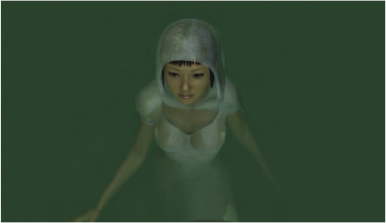

图14.11：利用雾强化氛围。（图片由NVIDIA Corporation提供。）

表示雾量的一种方式，是用区间[0, 1]内的f表示透射率，即f = 0.1意味着背景表面有10%可见。假设表面的输入颜色为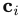，雾的颜色为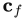，那么最终颜色由下式确定：


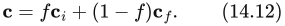


f的值可以用许多不同方式计算。可以使用下式，使雾线性增加：


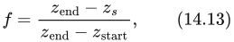


其中，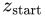和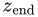是用户参数，决定雾开始和结束的位置（即完全被雾覆盖的位置）；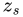是从观察者到待计算雾的表面的线性深度。一种物理上准确的雾透射率计算方式，是使其随距离呈指数变化，从而遵循描述透射率的比尔–朗伯定律（第14.1.2节）。使用下式即可实现这一效果：


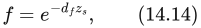


其中，标量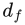是控制雾密度的用户参数。这种传统的大尺度雾，是对大气内部光散射与吸收一般模拟的粗略近似（第14.4.1节），但在当今游戏中仍能产生很好的效果，见图14.12。

> 译注：原文此处说透射率随距离“increase exponentially”（指数增加），但式（14.14）在正雾密度下给出的是透射率随距离指数衰减。上文译为“呈指数变化”，此处明确保留这一原文表述与公式之间的疑点。

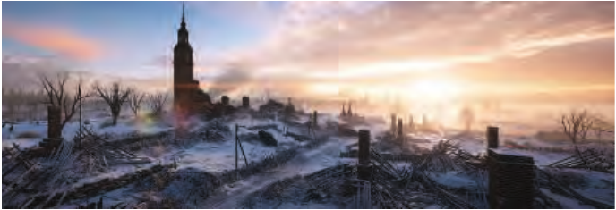

图14.12：在这张DICE游戏《战地1》的关卡图像中，雾被用来呈现游玩区域的复杂性。深度雾用来表现景物的宏大尺度。右侧地面处可见的高度雾，突出了从山谷中耸立起来的大量建筑。（由DICE提供，© 2018 Electronic Arts Inc.）

旧版OpenGL和DirectX API就是这样提供硬件雾功能的。对于移动设备等硬件上的较简单用例，这些模型仍然值得考虑。许多当今的游戏依赖更高级的后处理来实现雾和光散射等大气效果。透视视图中的雾存在一个问题：深度缓冲区的值是以非线性方式计算的（第23.7节）。可以利用逆投影矩阵的数学运算，将非线性的深度缓冲区值转换回线性深度 [1377]。随后就可以用像素着色器，通过一次全屏通道应用雾，从而实现更高级的结果，例如随高度变化的雾或水下着色。

高度雾表示单个具有参数化高度和厚度的参与介质薄层。对屏幕上的每个像素，密度和散射光都作为观察射线在命中表面之前穿过该薄层的距离的函数来计算。Wenzel [1871]提出了一种闭式解，用于在薄层内参与介质呈指数衰减的情况下计算f。这样做会使薄层边缘附近的雾平滑过渡。图14.12左侧的背景雾就体现了这一点。

深度雾和高度雾可以有许多变体。颜色可以是单一颜色，可以通过观察向量对立方体贴图采样来读取，甚至可以是复杂大气散射的结果，并逐像素应用相函数，以产生随方向变化的颜色[743]。还可以用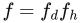将深度雾透射率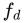与高度雾透射率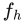组合起来，使场景中的这两种雾交织在一起。

深度雾和高度雾都是大尺度的雾效果。人们可能希望渲染更局部的现象，例如洞穴内或墓地中几座墓穴周围彼此分离的雾区。可以用椭球或盒子等形状，在所需位置添加局部雾[1871]。这些雾元素利用各自的包围盒，按照从后往前的顺序渲染。在像素着色器中，计算观察向量与每个形状的前交点和后交点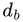。采用体积深度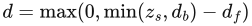，其中是表示最近不透明表面的线性深度，就可以计算透射率（第14.1.2节），覆盖率为α = 1.0 − 。随后，要叠加的散射光量就可以计算为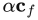。为了支持根据网格计算的更多样化形状，Oat和Scheuermann [1308]给出了一种巧妙的单通道方法，同时计算体积中最近的进入点与最远的离开点。他们将到表面的距离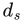存入一个通道，并将1 − 存入另一个通道。将alpha混合模式设为保存遇到的最小值后，体积渲染结束时，第一个通道就会保存最近值，第二个通道则保存最远值，后者编码为1 − d，因此可以恢复d。

水是一种参与介质，因此也表现出同一类基于深度的颜色衰减。近岸海水每米的透射率约为(0.3, 0.73, 0.63) [261]，所以利用式（14.23）可以恢复出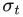 = (1.2, 0.31, 0.46)。当用不透明表面渲染深色水体时，可以在相机位于水面以下时启用雾的逻辑，而在水面以上时将其关闭。Wenzel [1871]提出了更高级的解决方案。如果相机在水下，就对散射和透射率进行积分，直到碰到实体或水面。如果相机在水面上方，则仅在水体顶面到海床实体几何之间的距离范围内进行这些积分。

## 14.2.2 简单体积光照

参与介质内的光散射可能很难计算。所幸有许多高效技术，能在很多情况下令人信服地近似这种散射。

获得体积效果的最简单方法，是渲染透明网格并将其混合到帧缓冲区上。我们将其称为泼溅法（splatting，第13.9节）。为了渲染穿过窗户、穿过茂密森林或由聚光灯产生的光柱，一种解决方案是使用与相机对齐的粒子，每个粒子带有一张纹理。每个带纹理的四边形都沿光柱方向拉伸，同时始终面向相机（圆柱约束）。

网格泼溅法的缺点是，累积大量透明网格会增加所需的内存带宽，很可能造成瓶颈，而且面向相机的带纹理四边形有时会显露出来。为解决这个问题，人们提出了利用光的单次散射闭式解的后处理技术。假设相函数在空间上均一且在球面上均匀，就可以在介质恒定的前提下，沿一条路径以正确的透射率对散射光进行积分。结果如图14.13所示。下面的GLSL着色器代码片段展示了这一技术的一种实现示例[1098]：

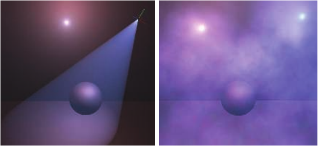

图14.13：利用书页603所示代码片段中的解析积分，计算光源产生的体积光散射。假设介质均匀时，可以将它作为后处理效果应用（左）；也可以应用于粒子，假设每个粒子都是具有深度的体积（右）。（图片由Miles Macklin [1098]提供。）

```glsl
float inScattering(
vec3 rayStart, vec3 rayDir,
vec3 lightPos, float rayDistance)
{
    // 计算系数。
    vec3 q = rayStart - lightPos;
    float b = dot(rayDir, q);
    float c = dot(q, q);
    float s = 1.0f / sqrt(c - b*b);

    // 提取部分公共因子。
    float x = s * rayDistance;
    float y = s * b;
    return s * atan((x) / (1.0 + (x + y) * y));
}
```

其中，rayStart是射线起点的位置，rayDir是射线的归一化方向，rayDistance是沿射线的积分距离，lightPos是光源位置。Sun等人[1722]的方案还考虑了散射系数。它还描述了一个事实应如何影响从朗伯表面和Phong表面反弹的漫反射与镜面反射辐亮度：光在命中任何表面之前，可能已沿非直线路径发生了散射。为了考虑透射率和相函数，可以采用一种需要更多ALU运算的方案[1364]。这些模型都能有效完成各自的任务，但无法考虑深度图产生的阴影，也无法考虑非均匀参与介质。

可以依靠一种称为泛光（bloom）的技术，在屏幕空间中近似光散射[539, 1741]。将帧缓冲区模糊后，取其中一小部分比例加回自身[44]，会使每个明亮物体的辐亮度向周围扩散。这项技术通常用于近似相机镜头的不完美之处，但在某些环境中，它也能很好地近似短距离、无遮挡的散射。第12.3节更详细地介绍了泛光。

Dobashi等人[359]提出了一种渲染大尺度大气效果的方法，使用一系列平面对体积进行采样。这些平面垂直于观察方向，并从后往前渲染。Mitchell [1219]也提出用同样的方法渲染聚光灯光柱，并利用阴影贴图，使不透明物体投射体积阴影。第14.3.1节详细介绍通过泼溅切片来渲染体积的方法。

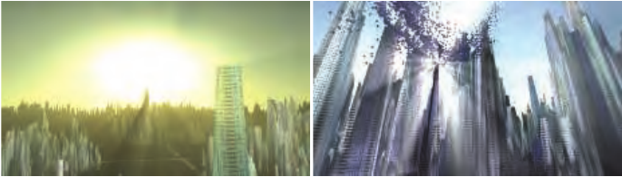

图14.14：使用屏幕空间后处理渲染的光柱。（图片由Kenny Mitchell [1225]提供。）

Mitchell [1225]以及Rohleder和Jamrozik [1507]提出了另一种在屏幕空间中工作的方法，见图14.14。它可以用来渲染太阳等远处光源产生的光柱。首先，在一个清为黑色的缓冲区中，于远平面上的太阳周围渲染一个模拟的明亮物体，并用深度缓冲测试接受未被遮挡的像素。其次，对图像施加定向模糊，使此前累积的辐亮度从太阳向外扩散。可以使用可分离滤波技术（第12.1节），分两个通道执行，每个通道使用n个样本，从而获得与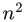个样本相同的模糊结果，但渲染速度更快[1681]。最后，将最终模糊后的缓冲区加到场景缓冲区上。该技术效率很高，虽然只有屏幕上可见的光源才能产生光柱，但它能够以很小的代价带来显著的视觉效果。

