# 14.7 头发与皮毛

来源：《Real-Time Rendering, Fourth Edition》，书页 640—648（PDF 物理页 661—669）。本节从 14.7 标题开始，至 14.8 标题之前结束，包含全部下级小节；技术陈述保留原书出版时的语境。

毛发是从哺乳动物真皮层生长出来的蛋白质丝状物。对于人类，毛发分布在身体的不同部位，包括头发、胡须、眉毛和睫毛等不同类型。其他哺乳动物通常覆盖着皮毛（浓密、长度有限的毛发），而皮毛的性质往往随动物身体部位的不同而变化。毛发可以是直的、波浪状的或卷曲的，各自具有不同的强度和粗糙度。毛发天然的颜色可以是黑色、棕色、红色、金色、灰色或白色，也可以染成彩虹中的各种颜色，只是染色效果不尽相同。

头发与皮毛的结构基本相同。它们由三层构成 [1052, 1128]，如图 14.47 所示：

- 最外层是毛小皮（cuticle），构成纤维的表面。这个表面并不光滑，而是由相互重叠的鳞片组成；鳞片相对于毛发方向倾斜约 α = 3°，使法线朝毛根方向倾斜。
- 中间层是皮质（cortex），其中含有赋予纤维颜色的黑色素 [346]。其中一种色素是真黑色素（eumelanin），产生棕色，其系数为 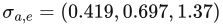；另一种是褐黑色素（pheomelanin），产生红发，其系数为 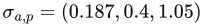。
- 内层是髓质（medulla）。在人类头发中，它很小，建模时常被忽略 [1128]。然而，对于动物皮毛，它占据毛发体积的比例更大，因此更为重要 [1052]。

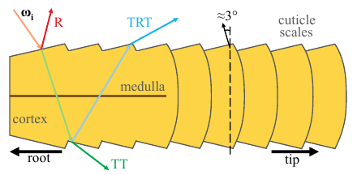

图 14.47：一根毛发的纵剖面，展示了构成它的不同材料，以及沿方向 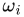 入射的光所产生的各个光照分量。图内标注：root 为毛根，tip 为毛尖，cortex 为皮质，medulla 为髓质，cuticle scales 为毛小皮鳞片。

可以把毛发纤维看成类似粒子的东西，即对体积的一种离散化，只不过使用曲线代替了点。毛发纤维与光的相互作用由双向散射分布函数（BSDF）描述。它与 BRDF 对应，但光的积分范围是整个球面，而不只是半球面。BSDF 汇总了毛发纤维内部、穿越各个层次时发生的全部相互作用。第 14.7.2 节将详细介绍它。光在纤维内部散射，也会在许多纤维之间反弹；由此产生的多重散射现象会形成复杂的有色辐亮度。此外，纤维吸收光的程度取决于其材料和色素，因此，表现毛发体积内部出现的体积自阴影也十分重要。本节介绍较新的技术如何使我们能够渲染胡须等短毛、头发，以及最后的皮毛。

## 14.7.1 几何与 Alpha

可以利用顶点着色器代码，围绕美术人员绘制的毛发引导曲线挤出毛发四边形，将毛发渲染为沿引导线延伸的四边形带。每条四边形带都依照沿皮肤指定的朝向，跟随与其对应的毛发引导曲线，表示一簇毛发 [863, 1228, 1560]。这种方法非常适合胡须，或较短且大多静止的毛发。它也很高效，因为较大的四边形能够产生更大的视觉覆盖范围，因此覆盖整个头部所需的带状物更少，从而提高性能。如果需要更多细节，例如通过物理模拟驱动的细长头发，就可以使用更窄的四边形带，并渲染数千条。在这种情况下，最好还使用沿毛发曲线切线的圆柱约束，使生成的四边形朝向观察方向 [36]。即使毛发模拟只使用少数几条引导线，也可以通过插值周围引导线的属性来实例化新的发丝 [1954]。

所有这些元素都可以作为采用 alpha 混合的几何体来渲染。如果使用这种方式，就需要保证头发的渲染顺序正确，以避免透明度伪影（第 5.5 节）。为缓解这个问题，可以使用预先排序的索引缓冲区，先渲染靠近头部的发丝，最后渲染外层发丝。这对短而没有动画的头发很有效，但不适用于长而相互交错、具有动画的发丝。使用 alpha 测试，可以依靠深度测试解决排序问题。不过，对于高频几何和纹理，这可能产生严重的锯齿问题。可以采用 MSAA，并逐样本执行 alpha 测试 [1228]，代价是额外的样本和内存带宽。也可以采用任意一种顺序无关透明度方法，例如第 5.5 节讨论的那些方法。例如，TressFX [36] 存储最近的 k = 8 个片元，并在像素着色器中更新它们，只保持前七层有序，从而实现多层 alpha 混合 [1532]。

另一个问题是，在使用 mipmap 缩小 alpha 纹理时，会产生 alpha 测试伪影（第 6.6 节）。解决这个问题的两种办法是采用更智能的 alpha mipmap 生成方法，或者使用更高级的哈希 alpha 测试 [1933]。渲染细长发丝时，还可以根据它的像素覆盖率修改毛发的不透明度 [36]。

胡须、睫毛和眉毛等小范围毛发，比整个头部的完整头发体积更容易渲染。睫毛和眉毛甚至可以采用蒙皮几何体，以配合头部和眼睑的运动。这些小部件上的毛发表面可以使用不透明 BRDF 材质来计算光照。也可以使用下一小节介绍的 BSDF 为发丝着色。

## 14.7.2 头发

Kajiya 和 Kay [847] 开发了一种 BRDF 模型，用来渲染由有组织排列、无限细小的圆柱纤维组成的体积。第 9.10.3 节讨论过这个模型。它最初是为了渲染毛茸茸的物体而开发的，方法是在表示表面上方密度的体积纹理中进行光线步进。该 BRDF 用于表示光与体积相互作用时的镜面和漫反射响应，也可以用于头发。

Marschner 等人 [1128] 的开创性工作测量了人类毛发纤维中的光散射，并根据这些观测提出了一个模型。他们观察到单根发丝中不同的散射分量，图 14.47 展示了所有这些分量。首先，R 分量表示光在毛小皮的空气与纤维交界面处发生的反射，产生一个向毛根偏移的白色镜面峰值。其次，TT 分量表示光穿过毛发纤维的过程：第一次从空气透射进入毛发材料，第二次从毛发透射回空气。最后，第三个 TRT 分量表示光透射进入纤维，被纤维另一侧反射，随后再次透射到毛发材料之外的传播过程。变量名中的“R”表示一次内部反射。TRT 分量呈现为相对于 R 发生偏移的次级镜面高光；由于光在纤维材料内部传播时受到吸收，因此这个分量带有颜色。

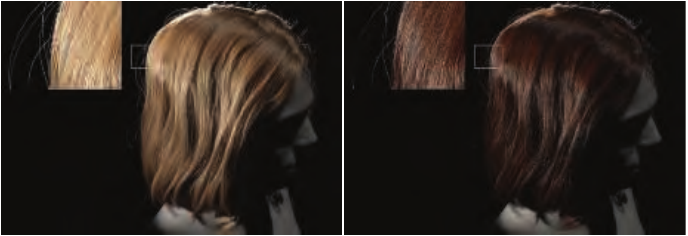

图 14.48：通过路径追踪生成的金发（左）和棕发（右）参考图，其中渲染了由纤维横截面偏心率产生的镜面闪光。（图片由 d’Eon 等人提供 [346]。）

在视觉上，R 分量表现为头发上的无色镜面反射。当一团头发受到背面照明时，TT 分量表现为明亮的高光。TRT 分量对于渲染逼真的头发至关重要，因为它会在具有偏心率的发丝上产生闪光；也就是说，现实中的毛发横截面并非完美的圆，而更接近椭圆。闪光对于真实感十分重要，因为它使头发不会显得整齐划一。见图 14.48。

Marschner 等人 [1128] 提出了用于建模 R、TT 和 TRT 分量的函数，将它们作为毛发 BSDF 的组成部分，用来表示毛发纤维对光的响应。该模型正确考虑了透射与反射事件中的菲涅耳效应，但忽略了其他更复杂的光路，例如 TRRT、TRRRT 以及更长的路径。

然而，这个原始模型并不满足能量守恒。d’Eon 等人 [346] 对此进行了研究和修正。他们重新表述了 BSDF 的各个分量，通过更充分地考虑粗糙度与镜面反射锥的收缩，使其满足能量守恒。同时，这些分量也被扩展为包含 TR*T 等更长的路径。透射率还通过实测的黑色素消光系数进行控制。与 Marschner 等人 [1128] 的工作类似，他们的模型能够忠实地渲染具有偏心率的发丝上的闪光。Chiang 等人 [262] 提出了另一个能量守恒模型。该模型对粗糙度和多重散射颜色提供了更便于美术人员直观创作的参数化方式，使他们无需调整高斯方差或黑色素浓度系数。

美术人员可能希望为角色头发的镜面项设计特定外观，例如改变粗糙度参数。对于基于物理、满足能量守恒且保持能量的模型，头发体积深处的散射光也会随之改变。为了提供更多艺术控制，可以把最初的几种散射路径（R、TT、TRT）与多重散射部分分离 [1525]。实现方法是维护第二套 BSDF 参数，并仅将其用于多重散射路径。此外，BSDF 的 R、TT 和 TRT 分量随后可以用简单的数学形状来表示，让美术人员能够理解和调整，进一步完善外观。根据入射和出射方向对 BSDF 进行归一化，仍可使整套模型满足能量守恒。

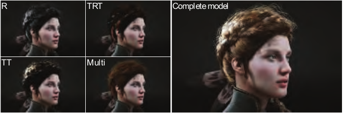

图 14.49：包含 R、TT、TRT 以及多重散射分量的实时头发渲染。图内 Multi 表示多重散射，Complete model 表示完整模型。（图片由 Epic Games, Inc. 提供 [863, 1802]。）

以上介绍的每个 BSDF 模型都很复杂，求值代价高昂，主要用于电影制作的路径追踪环境。幸运的是，它们也存在实时版本。Scheuermann 提出了一种特设的 BSDF 模型，易于实现、渲染速度快，并且用于以大型四边形带渲染的头发时，外观很有说服力 [1560]。更进一步，可以将 BSDF 存入以入射和出射方向为索引参数的查找表（LUT）纹理，从而实时使用 Marschner 模型 [1128, 1274]。不过，这种方法可能使具有空间变化外观的头发难以渲染。为避免这个问题，一个较新的基于物理的实时模型 [863] 使用简化的数学形式近似已有工作中的分量，取得了令人信服的结果。见图 14.49。然而，所有这些实时头发渲染模型与离线结果相比，质量上仍有差距。简化算法通常不具备高级的体积阴影或多重散射。这些效果对于吸收较弱的头发，例如金发，尤其重要。

对于体积阴影，较新的解决方案 [36, 863] 依赖一个透射率值：沿光照方向，从最先遇到的毛发到当前纤维的距离记为 d，根据恒定的吸收系数  进行计算。这种方法实用且直接，因为它依赖任何引擎中都具备的常规阴影贴图。然而，它无法表示发丝聚成簇时产生的局部密度变化，而这一点对受到明亮照明的头发尤其重要。见图 14.50。为解决这个问题，可以使用体积阴影表示（第 7.8 节）。

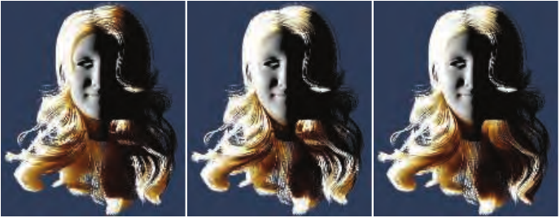

图 14.50：左：使用相对于第一个遮挡物的深度差，并采用恒定的消光系数，会产生过于平滑的体积阴影。中：使用深度阴影贴图 [1953]，能够获得更多透射率变化，与头发体积内部发丝聚簇的方式相吻合。右：将深度阴影贴图与 PCSS 结合，可以根据到第一个遮挡物的距离，获得更柔和的体积阴影（更多细节见第 7.6 节）。（图像使用 USC-HairSalon 提供的头发模型渲染 [781]。）

在渲染头发时，多重散射是一项求值代价高昂的项。适合实时实现的解决方案并不多。Karis [863] 提出了一种近似多重散射的方法。这个特设模型使用伪造法线（类似弯曲法线）、包裹式漫反射光照，并在毛发基色与光照相乘之前，先将基色提升到一个与深度有关的幂次，以近似光经过许多发丝散射之后的颜色饱和度。

Zinke 等人 [1972] 提出了一种更高级的双重散射技术。见图 14.51。之所以称为“双重”，是因为它根据两个因子评估散射光的量。首先，将着色像素与光源位置之间遇到的每根发丝的 BSDF 组合起来，求得全局透射率因子 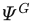。因此， 给出了着色位置的入射辐亮度应当乘以的透射率。可以在 GPU 上通过统计一条光路上的毛发数量，并计算发丝的平均朝向，来求得这个值；后者会影响 BSDF，进而也影响透射率。可以利用深度不透明度映射 [1953] 或占用图 [1646] 来累积这些数据。其次，局部散射分量 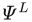 近似如下事实：到达着色位置的透射辐亮度，会在当前发丝周围的毛发纤维中散射，并对辐亮度产生贡献。这两项以 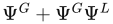 的形式相加，再通过该像素处发丝的 BSDF 计算，以累积光源贡献。这项技术代价更高，但它是对头发体积内部光多重散射现象的一种精确实时近似。它还可以与本章介绍的任意一种 BSDF 配合使用。

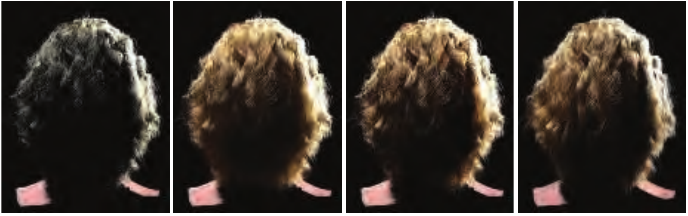

图 14.51：前两幅图展示用路径追踪渲染的头发参考结果：先仅包含三个毛发散射分量（R、TT、TRT），然后加入多重散射。后两幅图展示采用双重散射近似的结果：先用路径追踪渲染，再在 GPU 上实时渲染。（图片由 Arno Zinke 和 Cem Yuksel 提供 [1953]。）

对于具有动画的半透明材料，环境光照也是一个求值复杂的输入。常见做法是直接从球谐表示中采样辐照度。还可以根据头发静止姿态计算无方向性的预积分环境光遮蔽，用它对光照加权 [1560]。Karis 使用与多重散射相同的伪造法线，提出了一种环境光照的特设模型 [863]。

若要了解更多信息，可以在线获取 Yuksel 和 Tariq [1954] 提供的一套全面的实时头发渲染课程。在阅读研究论文、了解更多细节之前，这套课程会带你全面了解头发渲染的诸多领域，包括模拟、碰撞、几何、BSDF、多重散射以及体积阴影。头发在实时应用中已经可以呈现令人信服的效果。不过，要更好地近似基于物理的环境光照和毛发中的多重散射，仍然需要大量研究。

## 14.7.3 皮毛

与头发相比，皮毛通常被看作短而呈半有序排列的毛发，一般出现在动物身上。体积纹理这一概念与使用多层纹理进行体积渲染的方法相关；它是一种由多层二维半透明纹理表示的体积描述 [1203]。

例如，Lengyel 等人 [1031] 使用一组八张纹理来表示表面上的皮毛。每张纹理表示一组毛发在距表面某个给定距离处的切片。模型被渲染八次，每一次都使用顶点着色器程序，沿顶点法线将每个三角形稍微向外移动。这样，每个后续模型都表示表面上方的不同高度。以这种方式创建的嵌套模型称为壳层（shells）。这种渲染技术在物体轮廓边缘处会失效，因为层与层散开后，毛发会断裂成点。为了掩盖这种伪影，还会沿轮廓边缘生成鳍片（fins），并在鳍片上应用另一种毛发纹理来表示皮毛。见图 14.52，以及书页 855 的图 19.28。沿轮廓挤出鳍片的思路也可以用于增加其他类型模型的视觉复杂度。例如，Kharlamov 等人 [887] 使用鳍片与浮雕映射，为树木网格提供复杂的轮廓。

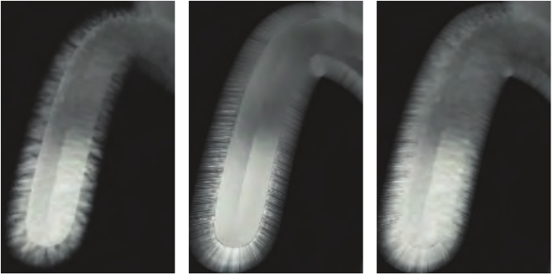

图 14.52：使用体积纹理的皮毛。模型渲染八次，每一遍都让表面向外扩张少许。左图是八遍渲染的结果，注意轮廓处毛发的断裂。中图展示鳍片渲染。右图是同时使用鳍片和壳层的最终渲染结果。（图片来自 NVIDIA SDK 10 [1300] 的“Fur—Shells and Fins”示例，由 NVIDIA Corporation 提供。）

几何着色器的引入，使得在带有皮毛的表面上真正挤出折线毛发成为可能。《Lost Planet》使用了这项技术 [1428]。先渲染一个表面，并在每个像素保存皮毛颜色、长度和角度。几何着色器随后处理这幅图像，将每个像素变成一条半透明折线。通过为每个被覆盖的像素创建一根毛发，可以自动维持细节层次。皮毛分两遍渲染。首先渲染在屏幕空间中指向下方的皮毛，按屏幕从下到上的顺序排列。这样就能按照从后到前的顺序正确执行混合。在第二遍中，将其余指向上方的皮毛按照从上到下的顺序渲染，同样可以正确混合。随着 GPU 的发展，新的技术逐渐变得可行，并具有实际效益。

也可以使用前面几节介绍的技术。毛发可以渲染为从蒙皮表面上挤出的四边形几何体，例如《Star Wars Battlefront》游戏中的丘巴卡，或 TressFX 的 Rat 演示 [36]。

在把毛发渲染成细丝时，Ling-Qi 等人 [1052] 已经证明，将毛发模拟为均匀圆柱体是不够的。对于动物皮毛，相对于毛发半径，其髓质更暗、也更大。这会减弱光散射的影响。因此，他们提出了一个双圆柱纤维 BSDF 模型，能够模拟更广泛的头发与皮毛 [1052]。它考虑了 TttT、TrRrT、TttRttT 等更详细的路径，其中小写字母表示与髓质的相互作用。这种复杂方法能够产生更逼真的视觉效果，尤其适合模拟更粗糙的皮毛和精细的散射效果。这类皮毛渲染技术涉及大量毛发实例的光栅化，因此任何有助于缩短渲染时间的方法都值得采用。Ryu [1523] 提出，根据运动幅度和距离减少所渲染的毛发实例数量，以此作为细节层次方案。该方法已用于离线电影渲染，看起来也很容易应用于实时程序。

