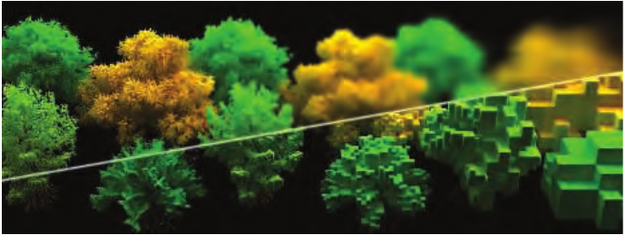

# 14.8 统一方法

来源：《Real-Time Rendering》第4版，书页648—649（PDF物理页669—670）。正文位于书页648，图14.53及图注位于书页649；章末“延伸阅读与资源”另存。

如今，体积渲染已经发展到了实时应用能够负担其开销的阶段。未来又可能实现什么呢？

在本章开头，我们曾说过“一切皆为散射”。考察参与介质材质时，可以通过采用较大的散射系数  来得到不透明介质。再结合一种复杂的各向异性相函数，让它决定漫反射与镜面反射响应，就能形成不透明的表面材质。由此看来，是否存在一种方法，可以统一固体材质与体积材质的表示呢？

截至本书写作时，体积材质与不透明材质的渲染仍彼此分离，因为GPU当前的计算能力迫使我们针对不同使用情形采用各自高效的专门方法。我们用网格表示不透明表面，用进行alpha混合的网格表示透明材质，用粒子公告板表示烟雾体，并用光线步进实现参与介质中的某些体积光照效果。

正如Dupuy等人[397]所暗示的那样，或许可以用一种统一的表示方式来表示固体与参与介质。一种可能的表示方法是采用对称GGX（symmetrical GGX，SGGX）[710]，它是第9.8.1节介绍的GGX法线分布函数的扩展。在这种情况下，用于表示体积内具有朝向的薄片粒子的微薄片理论，取代了用于表示表面法线分布的微表面理论。从某种意义上说，与网格相比，细节层次会变得更加实用，因为它可以简单地转化为对材质属性进行体积滤波。这有望使大型且细节丰富的世界获得更一致的光照与表示，同时保持光照、形状，以及作用于背景的遮挡或透射率。例如，如图14.53所示，使用经过体积滤波的树木表示来渲染森林，可以消除可见的树木网格LOD切换，对细薄几何体进行平滑滤波，避免树枝引起的走样；与此同时，考虑到每个体素内实际包含的树木几何体，还能为背景提供正确的遮挡值。

图14.53：上部为使用SGGX渲染的森林，细节层次从左向右逐渐降低。下部显示未经滤波的原始体素。（图片由Eric Heitz等人[710]提供。）
