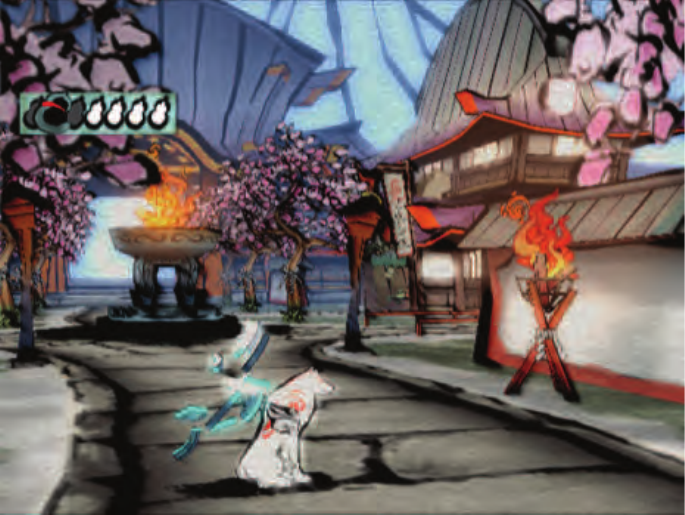
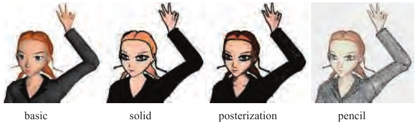

# 15.1 卡通着色

来源：原书第652—654页（PDF第673—675页），从15.1节标题起，至15.2节标题之前；包括图15.2、图15.3及完整图注。

正如改变字体会给文字带来不同的感觉，不同的渲染风格也有各自的情绪、含义与表达语汇。有一种特定的NPR形式获得了大量关注，即赛璐珞渲染（cel rendering），也称卡通渲染（toon rendering）。由于这种风格与卡通动画联系在一起，它带有幻想与童年的意味。在最简单的形式中，物体由实线勾画，实线将不同纯色的区域分隔开来。这种风格之所以流行，其中一个原因就是McCloud在其经典著作《理解漫画》（Understanding Comics）[1157]中所说的“通过简化来强化”。通过简化并去除杂乱内容，可以强化与表达目的有关的信息所产生的效果。对于卡通角色而言，采用简洁风格绘制的角色能够让更广泛的观众产生认同感。

几十年来，计算机图形学一直使用卡通渲染风格，将三维模型与二维赛璐珞动画融合起来。与其他NPR风格相比，这种风格容易定义，因此很适合由计算机自动生成。许多电子游戏都使用它取得了良好的效果[250, 1224, 1761]。见图15.2。

图15.2 游戏《大神》（Okami）中的一个实时NPR渲染示例。（图片由Capcom Entertainment, Inc.提供。）

物体的外轮廓通常渲染为黑色，以强化卡通外观。如何寻找并渲染这些外轮廓，将在下一节讨论。卡通表面着色有几种不同的方法。最常见的两种方法是用纯色（不受光照影响）填充网格区域，或者采用双色调方法，分别表示受光区域与阴影区域。双色调方法有时也称为硬着色（hard shading），用像素着色器实现起来很简单：当着色法线与光源方向的点积大于某个值时，使用较浅的颜色；否则使用较深的色调。当光照更加复杂时，另一种方法是对最终图像本身进行量化。这一过程也称为色调分离（posterization），即将连续的数值范围转换成少数几个色调，各色调之间发生突变。见图15.3。对RGB值进行量化可能会造成令人不悦的色相偏移，因为各个独立通道的变化方式与其他通道并无紧密关联。更好的选择是在保持色相的颜色空间中进行处理，例如HSV、HSL或Y′CbCr。另一种做法是定义一维函数或纹理，将强度级别重新映射到特定的明暗色调或颜色。还可以使用量化或其他滤波器对纹理进行预处理。第665页的图15.16展示了另一个采用更多颜色级别的例子。

图15.3 对最左侧的基础渲染，依次应用纯色填充、色调分离和铅笔着色技术。图中从左至右的标签为：基础渲染（basic）、纯色填充（solid）、色调分离（posterization）、铅笔着色（pencil）。（Jade2模型由Quidam制作，由wismo发布[1449]，采用知识共享署名2.5许可协议。）

Barla等人[104]使用二维映射代替一维明暗纹理，从而加入依赖视点的效果。第二个维度通过表面的深度或朝向来访问。例如，这使物体在距离较远或快速运动时，其对比度能够平滑地减弱。游戏《军团要塞2》（Team Fortress 2）将这一算法与多种其他着色方程及绘制的纹理结合使用，形成卡通风格与写实风格的融合[1224]。卡通着色器的变体也可以用于其他目的，例如在将表面或地形上的特征可视化时夸大对比度[1520]。
