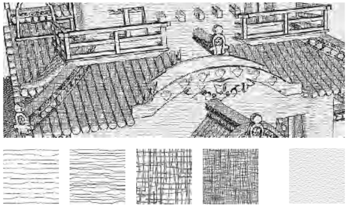
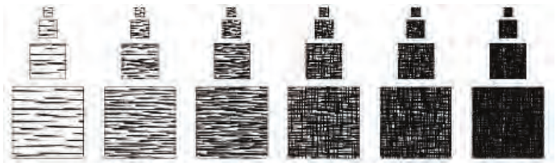
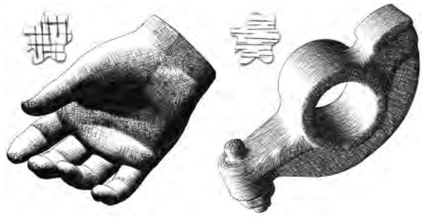
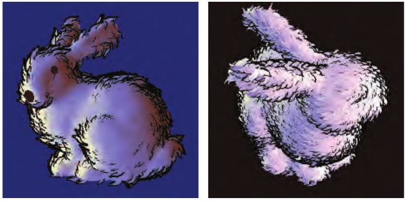

# 15.3 笔触式表面风格化

来源：《Real-Time Rendering》第 4 版，书页 669—673（PDF 物理页 690—694）。本节从 15.3 标题开始，至 15.4 标题之前结束，包含图 15.20—15.23。

尽管卡通渲染是一种人们经常尝试模拟的流行风格，但可应用于表面的其他风格还有无穷多种。这些效果可以从修改写实纹理 [905, 969, 973]，一直延伸到让算法逐帧以程序化方式生成几何装饰 [853, 1126]。本节将简要综述与实时渲染有关的技术。

Lake 等人 [966] 讨论了利用漫反射着色项来选择表面所用纹理的方法。随着漫反射项变暗，就使用视觉上更暗的纹理。纹理采用屏幕空间坐标进行映射，以营造手绘外观。为了进一步强化素描感，还在屏幕空间中为所有表面应用一张纸张纹理。见图 15.20。这类算法的一大问题是“淋浴门效应”（shower door effect）：在动画中，物体看起来仿佛是隔着带有图案的玻璃观看的，给人的感觉就像物体在纹理中游动。Breslav 等人 [196] 通过确定哪一种图像变换最能匹配底层模型上某些位置的运动，来维持纹理的二维外观。这样既能保留填充图案基于屏幕的特性，又能使它与物体之间建立更紧密的联系。

图 15.20．使用一组纹理、纸张纹理以及轮廓边渲染生成的图像。（经英特尔公司的 Adam Lake 和 Carl Marshall 许可转载，版权归英特尔公司所有，2002 年。）

一个显而易见的解决办法是：将纹理直接应用到表面上。难点在于，基于笔触的纹理必须保持相对均匀的笔触粗细和密度，才能显得可信。如果纹理被放大，笔触就会显得过粗；如果纹理被缩小，笔触要么被模糊掉，要么变得纤细且充满噪声，具体取决于是否使用 mipmapping。Praun 等人 [1442] 提出了一种实时方法，用于生成笔触纹理的 mipmap，并将其平滑地应用到表面上。这样，当物体距离发生变化时，就能维持屏幕上的笔触密度。第一步是构造要使用的纹理，称为色调艺术贴图（tonal art maps，TAM）。其做法是在各个 mipmap 层级中绘制笔触，见图 15.21。

图 15.21．色调艺术贴图（TAM）。笔触被绘制到各个 mipmap 层级中。每个 mipmap 层级都包含其左侧和上方纹理中的全部笔触。这样，mip 层级之间以及相邻纹理之间的插值就是平滑的。（图片由普林斯顿大学 Emil Praun 提供。）

Klein 等人 [905] 在他们的“艺术贴图”（art maps）中采用了相关思路，以维持非真实感渲染（NPR）纹理的笔触尺寸。准备好这些纹理后，通过在每个顶点所需的色调之间进行插值来渲染模型。这项技术能够生成具有手绘感的图像 [1441]，见图 15.22。

图 15.22．使用色调艺术贴图（TAM）渲染的两个模型。小样展示了渲染各模型时所用的搭接纹理图案。（图片由普林斯顿大学 Emil Praun 提供。）

Webb 等人 [1858] 提出了两种能够改善结果的 TAM 扩展方法：一种使用体纹理，从而允许使用颜色；另一种采用阈值判定方案，以改善抗锯齿效果。Nuebel [1291] 给出了一种相关的炭笔画渲染方法。他使用的噪声纹理也沿一个轴从暗变亮。利用强度值沿该轴访问纹理。Lee 等人 [1009] 使用 TAM 及其他技术，生成了效果出色、看起来像铅笔绘制的图像。

对于笔触，除了已经讨论的操作之外，还有许多其他可能的操作。为了产生素描效果，可以让边缘发生抖动 [317, 972, 1009]，或者使其延伸超出原来的位置，书页 651 上图 15.1 的右上图和下排中图展示了这种效果。

Girshick 等人 [538] 讨论了沿表面主曲率方向线渲染笔触的方法。也就是说，对于表面上任意一个给定点，都存在一个第一主方向切向量，它指向曲率最大的方向。第二主方向则是与第一个向量垂直的切向量，给出表面弯曲最小的方向。这些方向线对于感知曲面十分重要。它们还有一个优点：对于静态模型，只需生成一次，因为这类笔触与光照和着色无关。Hertzmann 和 Zorin [726] 讨论了如何整理和平滑主方向。大量研究与开发工作探索了如何利用这些方向及其他数据，将纹理应用于任意表面、驱动仿真动画，以及用于其他应用。可从 Vaxman 等人 [1814] 的报告入手了解。

嫁接元素（graftals）[372, 853, 1126] 的思想是，可以按需向表面添加几何体或贴花纹理，以产生特定效果。它们可以由所需的细节层次、表面相对于观察者的朝向，或其他因素来控制。这些元素也可用于模拟钢笔或画笔笔触。图 15.23 给出了一个例子。几何嫁接元素是程序化建模的一种形式 [407]。

图 15.23．使用两种不同的嫁接元素风格渲染斯坦福兔子。（图片由犹他大学 Bruce Gooch 和 Matt Kaplan 提供。）

本章仅仅浅尝了 NPR 研究已经探索过的几个方向。若要了解更多信息，可参阅章末的“延伸阅读与资源”部分。在这一领域，通常很少存在、甚至根本不存在可用作真值基准的、物理上正确的根本答案。这既带来了问题，也使我们摆脱了束缚。各种技术需要在速度、质量以及实现成本之间进行权衡。在交互式渲染速率所要求的严格时间限制下，大多数方案都会在某些条件下表现不佳，甚至失效。判断哪些方法在你的应用中效果良好，或者已经足够好，正是这个领域充满魅力的挑战所在。

我们此前的大部分篇幅都集中在一个特定主题上，即轮廓边检测与渲染。最后，我们将把注意力转向线条和文字。这两种非真实感图元使用频繁，也各有自身的难点，因此值得单独讨论。
