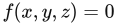

# 16.1 三维数据的来源

来源：原书第682—683页（PDF第703—704页）。范围从16.1节标题起，到16.2节标题前止。

创建或生成多边形模型有以下几种方式：

- 直接输入几何描述。
- 编写生成这类数据的程序。这称为程序化建模。
- 将其他形式的数据转换为表面或体积，例如，将蛋白质数据转换成一组球体和圆柱体。
- 使用建模程序构建或雕刻物体。
- 根据同一物体的一张或多张照片重建其表面，这称为摄影测量。
- 使用三维扫描仪、数字化仪或其他传感设备，在真实模型的不同位置进行采样。
- 生成等值面，用于表示某一空间体积内数值相同的位置，例如医学计算机轴向断层扫描（CAT）或磁共振成像（MRI）的数据，或在大气中测得的气压、温度样本。
- 组合使用上述技术。

在建模领域，建模器主要分为两类：基于实体的建模器和基于表面的建模器。基于实体的建模器通常用于计算机辅助设计（CAD）领域，往往侧重于提供与实际机械加工过程相对应的建模工具，例如切削、钻孔和刨削。在内部，它们具有一个计算引擎，能够严密地处理物体底层的拓扑边界。为了进行显示和分析，这类建模器配备了面片生成器（faceter）。面片生成器是一种软件，它将模型的内部表示转换为可供显示的三角形。例如，数据库中可能使用一个中心点和一个半径来表示球体，而面片生成器可以将其转换为任意数量的三角形或四边形，以表示该球体。有时候，最好的渲染加速方法恰恰是最简单的方法：使用面片生成器时降低所要求的视觉精度，就能通过生成更少的三角形来提高速度并节省存储空间。

在CAD工作中，一个重要的考虑因素是：所使用的面片生成器是否专为图形渲染而设计。例如，用于有限元法（FEM）的面片生成器，其目标是将表面划分为面积近乎相等的三角形。这类曲面细分结果非常适合进行简化，因为其中包含大量对图形显示没有用处的数据。同样，一些面片生成器生成的三角形集合非常适合通过3D打印制造现实物体，但它们缺少顶点法线，而且往往不适合快速图形显示。

Blender或Maya等建模器并不以一种内置的实体性概念为基础，而是通过表面来定义物体。与实体建模器一样，这些基于表面的系统可能使用内部表示和面片生成器来显示样条曲面或细分曲面等物体（第17章）。它们也可能允许直接操作表面，例如添加或删除三角形或顶点。这样，用户便可以手动减少模型的三角形数量。

还有其他类型的建模器，例如隐式曲面创建系统（包括具有“团块状”外观的元球系统）[67, 558]，它们使用混合、权重和场等概念。这些建模器通过生成由某个函数方程  的解所定义的曲面，来创建有机形态。然后，使用移动立方体（marching cubes）等多边形化技术，生成用于显示的三角形集合（第17.3节）。

点云非常适合应用简化技术。这类数据通常按规则间隔采样，因此，许多样本对所形成表面的视觉感知影响微乎其微。研究人员已经花费数十年时间研究过滤缺陷数据以及从点云重建网格的技术[137]。有关这一领域的更多内容，请参见第13.9节。

对于由扫描数据生成的网格，可以执行各种清理操作或更高层次的操作。例如，分割技术会分析多边形模型，并尝试识别其中不同的组成部分[1612]。这样做有助于创建动画、应用纹理贴图、匹配形状以及进行其他操作。

还有许多其他方式可以生成用于表面表示的多边形数据。关键在于理解这些数据是如何创建的，以及创建它们的目的。很多时候，生成数据并不是专门为了高效的图形显示。此外，三维数据文件格式种类繁多，任意两种格式之间的转换往往不是无损操作。了解输入数据可能具有哪些局限、可能出现哪些问题，是本章的一个主要主题。
