# 16.2 曲面细分与三角剖分

来源：《Real-Time Rendering》第4版，书页 683—690（PDF 物理页 704—711）。本节从 16.2 标题起，至 16.3 标题前止，包含 16.2.1、16.2.2 及图 16.1—16.9。

曲面细分是把一个表面分割成一组多边形的过程。这里我们着重讨论多边形表面的细分；曲面本身的细分将在第 17.6 节讨论。进行多边形细分可以有多种原因。最常见的原因是，所有图形 API 和硬件都针对三角形进行了优化。三角形几乎就像原子：任何表面都可以由它们构成并加以渲染。把复杂多边形转换成三角形的过程称为三角剖分。

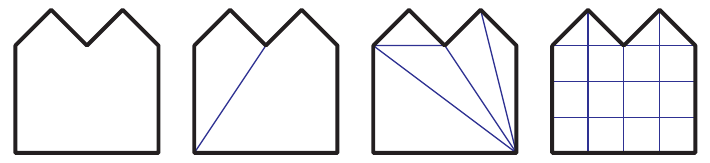

**图 16.1** 各种类型的细分。最左边的多边形没有细分；接下来一个被划分为凸区域；再下一个进行了三角剖分；最右边的则进行了均匀网格划分。

对多边形进行细分时，可能有几个不同的目标。例如，即将使用的算法可能只能处理凸多边形。这种细分称为凸划分。也可能需要把表面细分为网格，以便使用全局光照技术，在每个顶点处存储阴影或相互反射的效果 [400]。图 16.1 展示了这些不同细分方式的例子。与图形显示无关的细分原因包括：要求任何三角形都不能大于某个给定面积，或者要求三角形各顶点处的角都大于某个最小角度。Delaunay 三角剖分要求，每个三角形的三个顶点所确定的圆都不包含其余任何顶点，从而使最小角最大化。虽然这类限制通常属于有限元分析等非图形应用的要求，但它们也可以改善表面的外观。细长三角形往往值得避免，因为在相距很远的顶点之间进行插值可能产生伪影。它们的光栅化效率也可能较低 [530]。

大多数细分算法在二维空间中工作。它们假设多边形的所有点都位于同一平面上。然而，有些模型创建系统可能生成严重翘曲、并不共面的多边形面片。这个问题的一种常见情形是，几乎沿边缘方向观察一个翘曲四边形；它可能形成所谓的沙漏形或蝴蝶结形四边形。见图 16.2。虽然对这个特定多边形只需创建一条对角边就能进行三角剖分，但更复杂的翘曲多边形并不那么容易处理。

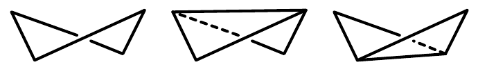

**图 16.2** 沿边缘方向观察翘曲四边形，会形成一个定义不明确的蝴蝶结形或沙漏形图形；图中还显示了两种可能的三角剖分。

如果可能出现翘曲多边形，一种快速的修正措施是，把顶点投影到一个垂直于多边形近似法线的平面上。通常通过计算多边形在三个相互正交的 xy、xz 和 yz 平面上的投影面积来求出这个平面的法线。也就是说，舍去 x 坐标后得到的多边形在 yz 平面上的面积，就是 x 分量的值；在 xz 平面上的面积给出 y 分量，在 xy 平面上的面积给出 z 分量。这种计算平均法线的方法称为 Newell 公式 [1505, 1738]。

投影到这个平面上的多边形仍可能存在自相交问题，即两条或更多条边互相交叉。此时就需要更精细、计算代价更高的方法。Zou 等人 [1978] 讨论了以最小化所得细分的表面积或二面角为目标的既有工作，并提出了将一组中的几个非平面多边形一起优化的算法。

Schneider 和 Eberly [1574]、Held [714]、O’Rourke [1339] 以及 de Berg 等人 [135] 分别概述了多种三角剖分方法。最基本的三角剖分算法会检查多边形上任意给定两点之间的每一条线段，看它是否与多边形的任意一条边相交或重叠。如果是，就不能用这条线段分割多边形，于是继续检查下一对可能的点。否则，就用这条线段把多边形分成两部分，再以同样的方法对这些新多边形进行三角剖分。这种方法极其缓慢，复杂度为 O()。

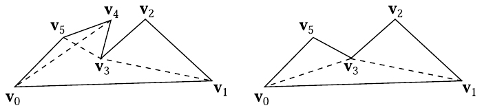

**图 16.3** 切耳法。图中多边形在 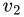、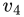 和 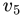 处有潜在的耳。右图移除了  处的耳。随后重新检查相邻顶点 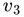 和 ，看它们现在是否构成耳； 构成了耳。

更高效的方法是切耳法（ear clipping）；把它分成两个过程实施时，其复杂度为 O()。首先遍历一次多边形以找出耳：考察所有顶点索引为 i、(i + 1)、(i + 2) 的三角形（索引对 n 取模），检查连接 i 与 (i + 2) 的线段是否不与任何多边形边相交。如果不相交，则 (i + 1) 处的三角形构成一个耳。见图 16.3。依次从多边形中移除每个可用的耳，并重新检查顶点 i 和 (i + 2) 处的三角形，看它们现在是否成为耳。最终所有耳都被移除，多边形也就完成了三角剖分。其他更复杂的三角剖分方法可以达到 O(n log n)，其中一些在典型情况下实际上可以达到 O(n)。Schneider 和 Eberly [1574] 给出了切耳法以及其他更快三角剖分方法的伪代码。

与三角剖分相比，把多边形划分成凸区域在存储开销和后续计算代价两方面都可能更有效率。Schorn 和 Fisher [1576] 给出了稳健的凸性测试代码。凸多边形很容易表示为三角形扇或三角形带，第 16.4 节会对此展开讨论。有些凹多边形也可以作为三角形扇处理（这类多边形称为星形多边形），但检测它们需要更多工作 [1339, 1444]。Schneider 和 Eberly [1574] 给出了两种凸划分方法：一种快速但粗糙的方法，以及一种最优方法。

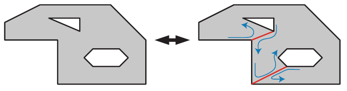

**图 16.4** 将具有三个轮廓的多边形转换成单轮廓多边形。连接边以红色显示。多边形内部的蓝色箭头表示遍历顶点以形成单一环路的顺序。

多边形并不总是由单一轮廓组成。图 16.4 显示了一个由三个轮廓组成的多边形，也称为环路（loops）或轮廓线（contours）。通过在环路之间谨慎地生成连接边（也称锁孔边或桥接边），总能把这样的表示转换成单轮廓多边形。Eberly [403] 讨论了如何寻找用来定义这类边的互相可见顶点。这个转换过程也可以反向进行，以恢复各个独立环路。

编写稳健而通用的三角剖分器是一项艰巨工作。各种细微错误、病态情形和精度问题，会使编写万无一失的代码变得出乎意料地棘手。巧妙避开三角剖分问题的一种方法，是使用图形加速器本身直接渲染复杂多边形。把多边形作为三角形扇渲染到模板缓冲中。这样，应当填充的区域会被绘制奇数次，而凹陷和孔洞会被绘制偶数次。对模板缓冲使用反转模式，第一遍结束时就只有应填充区域被标记。见图 16.5。在第二遍中再次渲染三角形扇，使用模板缓冲只允许绘制应填充的区域。通过绘制每个环路形成的三角形，这种方法甚至可以渲染具有多个轮廓的多边形。主要缺点是，每个多边形都必须用两遍进行渲染，模板缓冲每帧都要清除，而且无法直接使用深度缓冲。这项技术可用于显示某些用户交互，例如显示即时绘制的复杂选择区域的内部。

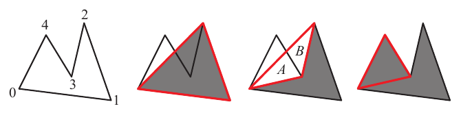

**图 16.5** 通过光栅化进行三角剖分，利用奇偶性判断哪些区域可见。左侧多边形以顶点 0 为起点、由三个三角形组成的扇形绘制到模板缓冲中。第一个三角形 [0, 1, 2]（中左）填充其覆盖区域，其中包括多边形外部的空间。三角形 [0, 2, 3]（中右）填充其覆盖区域，使 A 和 B 区域的绘制次数变成偶数，从而将它们清空。三角形 [0, 3, 4]（右）填充多边形的其余部分。

## 16.2.1 着色问题

有时收到的数据是四边形网格，必须转换成三角形才能显示。极少数情况下，四边形是凹的，此时只有一种三角剖分方式。否则，可以选择两条对角线中的任意一条将它分割。花一点时间选择更好的对角线，有时能够显著改善视觉效果。

有几种不同的方法可以决定如何分割四边形。关键思想是尽量减小新边两端顶点之间的差异。对于顶点不带附加数据的平面四边形，通常最好选择最短的对角线。对于每个顶点存储一种颜色的简单烘焙全局光照结果，应选择两端颜色差异较小的对角线 [17]。见图 16.6。根据某种启发式规则连接差异最小的两个角，这个想法通常有助于尽量减少伪影。

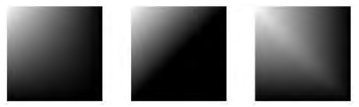

**图 16.6** 左图作为四边形进行渲染；中图是连接右上角与左下角形成的两个三角形；右图显示使用另一条对角线时的结果。中图的视觉效果优于右图。

有时三角形无法恰当地表达设计者的意图。如果给一个扭曲四边形应用纹理，沿任何一条对角线分割都无法保留设计意图。不过，对未经三角剖分的四边形做简单的水平插值，也就是从左边到右边插值，同样行不通。图 16.7 展示了这个问题。问题产生的原因在于，应用到表面上的图像在显示时需要发生扭曲。一个三角形只有三个纹理坐标，因此它能确定一个仿射变换，却不能确定这种扭曲。三角形上的基本 (u, v) 纹理至多只能发生剪切，而不能发生扭曲。Woo 等人 [1901] 进一步讨论了这个问题。有几种可能的解决办法：

- 预先扭曲纹理，再使用新的纹理坐标重新应用这张新图像。
- 将表面细分成更精细的网格。这只能减轻问题。
- 使用投影纹理，在运行时即时扭曲纹理 [691, 1470]。这样会产生一个不理想的效果：纹理在表面上的间距不均匀。
- 使用双线性映射方案 [691]。通过为每个顶点增加数据即可实现。

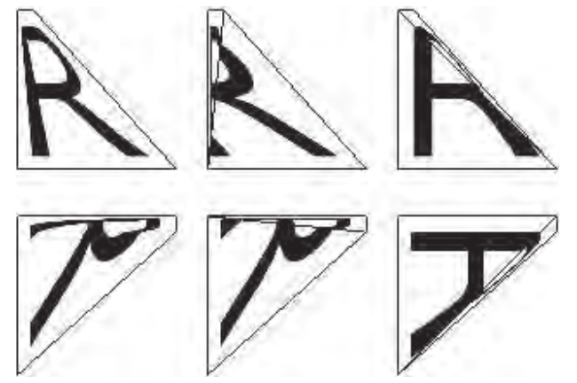

**图 16.7** 左上图显示设计者的意图：将字母“R”的正方形纹理贴图应用到一个变形四边形上。右侧两图显示两种三角剖分及其差异。下排将所有多边形旋转；未经三角剖分的四边形改变了外观。

虽然纹理畸变听起来像是一种病态情形，但只要应用的纹理数据与底层四边形的比例不匹配，它就会在某种程度上发生，也就是说，几乎任何曲面上都会出现。一个极端情形出现在一种常见图元上：圆锥。为圆锥应用纹理并将其面片化时，圆锥尖端处的三角形顶点具有不同的法线。这些顶点法线不被相邻三角形共享，因此会出现着色不连续 [647]。

## 16.2.2 边缘裂缝与 T 形顶点

第 17 章将详细讨论的曲面，通常会细分成网格以供渲染。这种细分沿着定义表面的样条曲线逐步采样，从而计算顶点位置和法线。使用简单的步进方法时，样条曲面相接之处可能出现问题。在共享边上，两个表面的点必须重合。由于模型本身的特点，有时它们会恰好重合；但往往如果不够谨慎，为一条样条曲线生成的点就会与相邻曲线生成的点不匹配。这种现象称为边缘裂缝，观察者能够从缝隙中看到表面的另一侧，因此可能产生令人不适的视觉伪影。即使观察者无法透过裂缝看到后方，着色插值方式的差异通常也会使接缝可见。

修复这些裂缝的过程称为边缘缝合。目标是确保沿共享（曲）边的所有顶点都由两个样条曲面共享，从而不出现裂缝。见图 16.8。第 17.6.2 节讨论如何使用自适应曲面细分避免样条曲面出现裂缝。

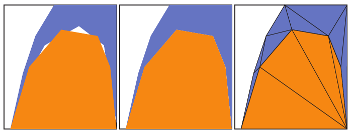

**图 16.8** 左图显示两个表面相接之处的裂缝。中图通过匹配边缘上的点修复了裂缝。右图显示修正后的网格。

连接平面表面时会遇到一个相关问题：T 形顶点。只要两个模型的边相接，却没有共享这些边上的所有顶点，就可能出现这类问题。虽然理论上这些边应该完美相接，但如果渲染器表示屏幕顶点位置的精度不够，就可能出现裂缝。现代图形硬件使用亚像素寻址 [985] 来帮助避免这个问题。

更明显、且并非由精度引起的问题，是可能出现的着色伪影 [114]。图 16.9 展示了这个问题；可以通过找出这样的边，并确保与毗邻面共享公共顶点来修复。另一个问题是，使用简单的三角形扇算法存在生成退化（零面积）三角形的风险。例如，在图中，假设把右上方的四边形 **abcd** 三角剖分为三角形 **abc** 和 **acd**。三角形 **abc** 是退化三角形，因此点 **b** 是一个 T 形顶点。Lengyel [1023] 讨论了如何寻找这样的顶点，并提供了正确地对凸多边形重新进行三角剖分的代码。Cignoni 等人 [267] 描述了一种在已知 T 形顶点位置时，避免创建退化（零面积）三角形的方法。他们的算法复杂度为 O(n)，并保证最多生成一个三角形带和一个三角形扇。

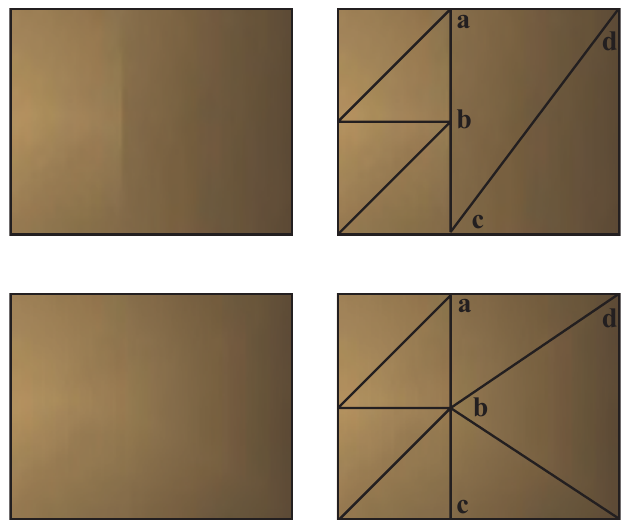

**图 16.9** 上排展示了一个表面的底层网格及其着色不连续。顶点 **b** 是一个 T 形顶点，因为它属于左侧的三角形，却不是三角形 **acd** 的组成部分。一种解决办法是把这个 T 形顶点加入该三角形，创建三角形 **abd** 和 **bcd**（未示出）。细长三角形更容易引起其他着色问题，因此重新进行三角剖分通常是更好的办法，下排显示了这种做法。
