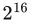
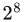
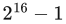
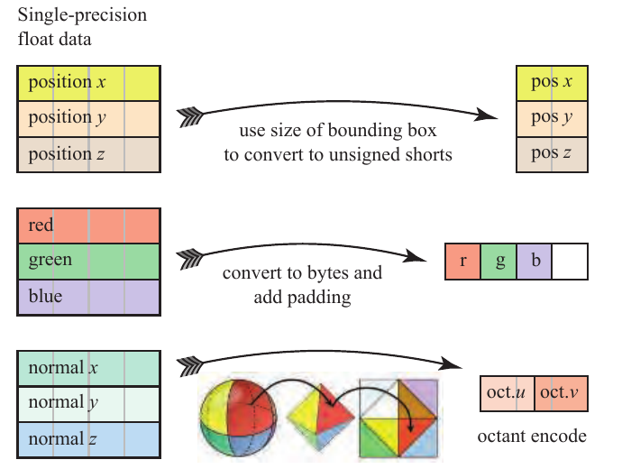

# 16.6 压缩与精度

来源：《Real-Time Rendering》第4版，书页712—715（PDF物理页733—736）；从16.6节标题起，至“延伸阅读与资源”标题前。本节没有下级小节。

三角形网格数据可以采用多种方式压缩，并由此获得类似的收益。正如PNG和JPEG图像文件格式对纹理采用无损和有损压缩一样，人们也为三角形网格数据的压缩开发了多种算法和格式。

压缩以编码和解码所花费的时间为代价，尽量减少数据存储占用的空间。传输更小的数据表示所节省的时间，必须超过解压数据额外花费的时间。在互联网上传输时，下载速度较慢意味着可以采用更复杂的算法。网格的连接关系可以使用TFAN [1116]进行压缩和高效解码；该方法已被MPEG-4采用。Open3DGC、OpenCTM和Draco等编码器生成的模型文件，其大小可以降至仅采用gzip压缩时的四分之一，甚至更小 [1335]。这些方案中的解压原本就被设计成一次性操作，速度相对较慢，每秒只能处理几百万个三角形，但节省的数据传输时间足以抵偿这项开销，而且可能绰绰有余。Maglo等人 [1099]对相关算法作了全面综述。这里，我们重点讨论直接涉及GPU本身的压缩技术。

本章的很大一部分篇幅都在介绍尽量减少三角形网格存储空间的各种方法。这样做的主要动机是提高渲染效率。在多个三角形之间复用顶点数据，而不是重复存储，可以减少缓存未命中。删除视觉影响很小的三角形，既能减少顶点处理，也能节省内存。内存占用更小，意味着带宽开销更低、缓存利用更好。此外，GPU可在内存中存储的数据量也有限，因此，数据缩减技术可以增加能够显示的三角形数量。

顶点数据可以采用固定码率压缩，其原因与压缩纹理时类似（第6.2.6节）。这里所说的**固定码率压缩**，指最终压缩后存储大小已知的方法。如果每个顶点都采用自包含的压缩表示，就可以在GPU上解码。Calver [221]介绍了多种利用顶点着色器进行解压的方案。Zarge [1961]指出，数据压缩还有助于使顶点格式与缓存行对齐。Purnomo等人 [1448]将简化与顶点量化技术结合起来，利用图像空间度量，针对给定的目标网格大小优化网格。

索引缓冲区的格式中就存在一种简单的压缩方式。索引缓冲区由无符号整数数组组成，这些整数给出顶点在顶点缓冲区数组中的位置。如果顶点缓冲区中的顶点数小于或等于，那么索引缓冲区就可以使用无符号短整数，而不是无符号长整数。某些API支持对顶点数少于的网格使用无符号字节，但这样可能造成代价高昂的对齐问题，因此通常会避免使用。值得注意的是，OpenGL ES 2.0、未启用扩展的WebGL 1.0，以及某些较老的台式机和笔记本电脑GPU，都存在不支持无符号长整数索引缓冲区的限制，因此必须使用无符号短整数。

另一个压缩机会在于三角形网格数据本身。举一个基本例子，有些三角形网格会为每个顶点存储一个或多个颜色，用来表示烘焙好的光照、仿真结果或其他信息。在典型显示器上，一个颜色由红、绿、蓝三个各占8位的分量表示，因此可以在顶点记录中用三个无符号字节存储这些数据，而不必使用三个浮点数。GPU的顶点着色器可以把这个字段转换成独立的数值，随后在遍历三角形时对它们进行插值。不过，在许多架构上都需要谨慎处理。例如，Apple建议在iOS上把3字节数据字段填充到4字节，以避免额外处理 [66]。参见图16.23中间的示意图。

另一种压缩方法是完全不存储颜色。例如，如果颜色数据表示温度结果，就可以把温度本身存成一个数值，再将其转换为一维纹理的索引，从中取得颜色。更进一步，如果不需要温度值本身，那么只用一个无符号字节就能引用这张颜色纹理。

即使存储温度本身，也可能只需要精确到小数点后几位。一个浮点数的总精度为24位，略多于7位十进制有效数字。请注意，16位就能提供接近5位十进制有效数字的精度。温度值的范围很可能足够小，以至于不需要浮点格式的指数部分。以最小值作为偏移量，以最大值减去最小值作为缩放量，就能把这些数值均匀分布到一个有限的范围内。例如，如果数值范围是28.51至197.12，那么可以把一个无符号短整数值转换为温度：先将它除以，再将结果乘以缩放因子（197.12 − 28.51），最后加上偏移量28.51。只要存储数据集的缩放与偏移因子，并将它们传给顶点着色器程序，数据集本身就只需原来一半的存储空间。这种变换称为**标量量化** [1099]。

**图16.23** 顶点数据的典型固定码率压缩方法。（八分体转换示意图出自Cigolle等人 [269]，由Morgan McGuire惠允提供。）

图内标签译文：左侧为“单精度浮点数据”；上排为位置x、y、z，使用包围盒的尺寸转换为无符号短整数；中排为红、绿、蓝，转换为字节并添加填充；下排为法线x、y、z，采用八分体编码，得到oct.u和oct.v两个分量。

顶点位置数据通常很适合采用这种缩减方法。单个网格在空间中覆盖的区域很小，因此，为整个场景设置缩放和偏移向量（或一个4 × 4矩阵），便可以节省大量空间，而不会明显损失保真度。对于某些场景，可以为每个对象分别生成缩放和偏移，从而提高每个模型的精度。不过，这样做可能在独立网格接触的地方产生裂缝 [1381]。原本处于相同世界位置、但分别属于不同模型的顶点，经过缩放和偏移后，可能落在略有不同的位置。当所有模型相对于整个场景都比较小时，一种解决办法是对所有模型使用相同的缩放量，并使偏移量对齐；这样可以多获得几位精度 [1010]。

有时，即使用浮点数存储顶点数据，也不足以避免精度问题。一个经典例子是在地球上空渲染航天飞机。航天飞机模型本身可能精细到毫米尺度，但它距地表超过100,000米，尺度差异达到8个十进制数量级。当相对于地球计算航天飞机的世界空间位置时，所生成的顶点位置就需要更高的精度。如果不采取修正措施，当观察者在航天飞机附近移动时，航天飞机就会在屏幕上抖动。虽然航天飞机是这种问题的极端例子，但大型多人游戏世界如果始终使用同一个坐标系，也会受到同样的影响。位于边缘区域的对象会损失足够多的精度，使问题变得可见：动画对象会跳动，各个顶点会在不同时间突然跳到另一个位置，而相机只要稍微移动，阴影贴图的纹素就会跳变。一种解决方法是重新组织变换流水线，使每个以原点为中心的对象所用的世界平移和相机平移先合并起来，从而让它们在很大程度上相互抵消 [1379, 1381]。另一种方法是将世界分区，并将原点重新定义到每个分区的中心；这时的难点就变成了如何从一个分区移动到另一个分区。Ohlarik [1316]以及Cozzi和Ring [299]深入讨论了这些问题及其解决方法。

其他顶点数据也可能有专门适用的压缩技术。纹理坐标通常限制在[0.0, 1.0]范围内，因此一般可以安全地缩减为无符号短整数，隐含的偏移量为0，缩放除数为。纹理坐标通常成对出现，恰好可以存进两个无符号短整数 [1381]；根据精度要求，甚至只需要3字节 [88]。

与其他坐标集合不同，法线通常经过归一化，因此所有归一化法线的集合构成一个球面。正因如此，研究者研究了从球面到平面的变换，以便高效压缩法线。Cigolle等人 [269]分析了各种算法的优点与权衡，并提供了代码示例。他们得出的结论是，八分体投影和球面投影最为实用，既能尽量减小误差，又能高效编码和解码。Pranckevičius [1432]和Pesce [1394]讨论了为延迟着色（第20.1节）生成G缓冲区时的法线压缩。

其他数据也可能具有可用来减少存储的性质。例如，法线向量、切线向量和副切线向量通常用于法线映射。当这三个向量两两垂直（没有倾斜），且坐标系的手性一致时，就可以只存储其中两个向量，再用叉积推导出第三个。还有更紧凑的办法：只用一个4字节四元数，其中将一个手性位与7位的w分量一起保存，就能够表示这组基所形成的旋转矩阵 [494, 1114, 1154, 1381, 1639]。为了获得更高精度，可以省略四元数四个分量中最大的那个，将另外三个分量各用10位存储。剩下的2位用于指明四个分量中哪个没有存储。由于四元数各分量的平方和为1，因此可以从另外三个分量推导出第四个 [498]。Doghramachi等人 [363]采用一种存储旋转轴和旋转角度的切线／副切线／法线方案。它同样占用4字节，但与四元数存储相比，解码时所需的着色器指令大约只有一半。

图16.23汇总了一些固定码率压缩方法。
