# 17.5 细分曲面

来源：原书第 756—767 页，对应 PDF 第 777—788 页；范围从 17.5 标题开始，到 17.6 标题之前，包含全部下级小节。

细分曲面是一种强大的方法，可以从具有任意拓扑结构的网格定义光滑、连续、没有裂缝的曲面。与本章其他所有曲面一样，细分曲面也提供无限的细节层次。也就是说，你可以生成任意多的三角形或多边形，而原始曲面表示依然紧凑。图 17.41 展示了曲面细分的例子。另一个优点是，细分规则简单，易于实现。其缺点是，曲面连续性的分析在数学上往往很复杂。不过，这类分析通常只有希望创建新细分方案的人才会感兴趣，超出了本书范围。相关细节请参阅 Warren 和 Weimer 的著作 [1847]，以及 SIGGRAPH 关于细分的课程 [1977]。

一般来说，曲面（以及曲线）的细分可以看作分为两个阶段的过程 [915]。从称为**控制网格**或**控制笼**的多边形网格出发，第一个阶段称为**细化阶段**，它创建新顶点，并重新连接，生成更小的新三角形。第二个阶段称为**平滑阶段**，通常为网格中的部分或全部顶点计算新位置。图 17.42 展示了这一过程。正是这两个阶段的具体细节决定了一种细分方案的特征。在第一阶段，多边形可以按照不同方式分割；在第二阶段，细分规则的选择会带来不同特性，例如连续性的级别，以及曲面是逼近型还是插值型。这些性质已在 17.4 节介绍。

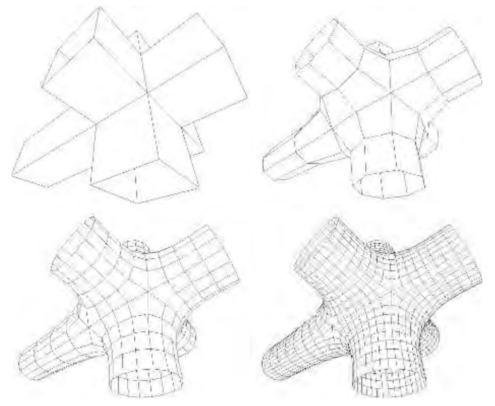

**图 17.41** 左上图显示控制网格，即原始网格，它是描述最终细分曲面的唯一几何数据。后续图像分别进行了 1 次、2 次和 3 次细分。可以看到，生成的多边形越来越多，曲面也越来越光滑。这里使用的是 17.5.2 节介绍的 Catmull-Clark 方案。

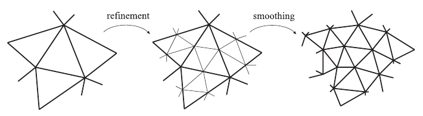

**图 17.42** 将细分视为细化与平滑。细化阶段创建新顶点并重新连接，生成新三角形；平滑阶段为顶点计算新位置。

细分方案可以按以下特征分类：平稳或非平稳，均匀或非均匀，以及基于三角形或基于多边形。平稳方案在每个细分步骤使用相同的细分规则，而非平稳方案可能根据当前处理的步骤改变规则。下文介绍的方案都是平稳的。均匀方案对每个顶点或边使用相同规则，而非均匀方案可能对不同顶点或边采用不同规则。例如，曲面边界上的边通常使用另一套规则。基于三角形的方案只处理三角形，因此也只生成三角形；基于多边形的方案则处理任意多边形。

下面将介绍几种不同的细分方案。随后介绍两种扩展细分曲面用途的技术，以及细分法线、纹理坐标和颜色的方法。最后还将介绍一些实用的细分与渲染算法。

## 17.5.1 Loop 细分

Loop 方法 [767, 1067] 是第一个针对三角形的细分方案。它与 17.4 节最后一种方案类似，是逼近型的：更新每个已有顶点，并为每条边创建一个新顶点。该方案的连接关系见图 17.43。可以看到，每个三角形被细分为 4 个新三角形，因此经过 n 次细分之后，一个三角形就被细分为 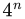 个三角形。

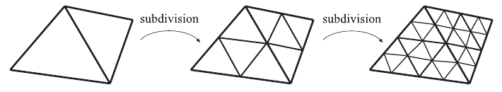

**图 17.43** Loop 方法等方案在两次细分中的连接关系。每个三角形生成 4 个新三角形。

首先，考虑一个已有顶点 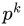，其中 k 是细分次数。这意味着 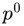 是控制网格中的顶点。

经过一次细分， 变成 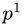。一般地， →  → 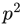 → ⋯ → p∞，其中 p∞ 是极限点。如果  有 n 个相邻顶点 ，i ∈ {0, 1, …, n − 1}，就称  的**价数**为 n。上述记号见图 17.44。此外，价数为 6 的顶点称为**规则顶点**或**普通顶点**，否则称为**不规则顶点**或**非普通顶点**。

下面给出 Loop 方案的细分规则。第一个公式将已有顶点  更新为 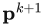；第二个公式在  与每个  之间创建新顶点 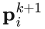。这里 n 仍是  的价数：

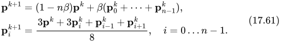

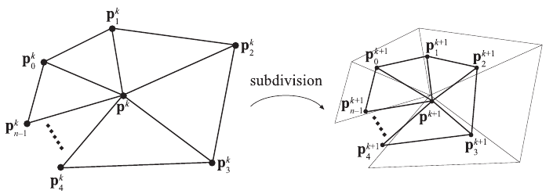

**图 17.44** Loop 细分方案使用的记号。左侧邻域经过细分成为右侧邻域。中心点  被更新并替换为 ；对于  与  之间的每条边，创建一个新点（，i ∈ 1, …, n）。

> 译注：此图注原文的索引写作 i ∈ 1, …, n，而正文及图内采用从 0 到 n − 1 的索引；这里保留原文差异。

注意，这里假设索引按模 n 计算，因此当 i = n − 1 时，i + 1 使用索引 0；同样，当 i = 0 时，i − 1 使用索引 n − 1。这些细分规则很容易用**掩模**（mask，也称 stencil）可视化，见图 17.45。其主要用途是，仅用一幅简单示意图，就能传达几乎完整的细分方案。注意，两种掩模中的权重之和都等于 1。这是所有细分方案都具有的特征，其理由是新点应当位于参与加权的点的邻域中。在式（17.61）中，常数 β 实际上是 n 的函数，定义为

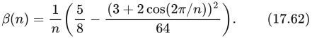

Loop 提出的 β 函数 [1067] 使曲面在每个规则顶点处具有  连续性，而在其他位置，即所有不规则顶点处，具有 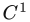 连续性 [1976]。由于细分过程中只生成规则顶点，因此曲面仅在控制网格原有不规则顶点所在的位置为  连续。图 17.46 展示了用 Loop 方案细分网格的例子。Warren 和 Weimer [1847] 给出了式（17.62）的一个变体，可避免使用三角函数：

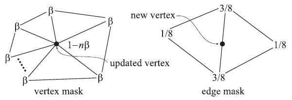

**图 17.45** Loop 细分方案的掩模（黑色圆点指示被更新或生成的顶点）。掩模显示参与计算的每个顶点的权重。例如，更新已有顶点时，该顶点使用权重 1 − nβ，所有相邻顶点使用权重 β；这些相邻顶点称为一环邻域（1-ring）。

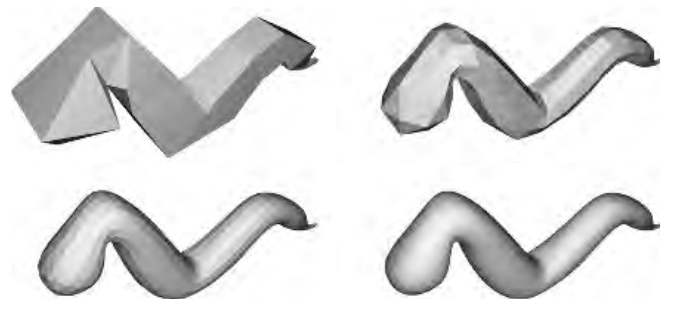

**图 17.46** 使用 Loop 细分方案对一条蠕虫进行三次细分。

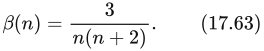

对于规则价数，这会得到  曲面，其他位置为 。得到的曲面与常规 Loop 曲面很难区分。对于不闭合的网格，不能使用上述细分规则，而必须针对边界采用特殊规则。Loop 方案可以采用式（17.60）的反射规则。17.5.3 节也将讨论这一点。

经过无限次细分之后的曲面称为**极限曲面**。极限曲面上的点与极限切向量可以用闭式表达式计算。顶点的极限位置可使用式（17.61）第一行的公式计算 [767, 1977]，只需将 β(n) 替换为

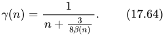

顶点  的两个极限切向量，可以通过对其直接相邻顶点，也就是一环邻域（1-ring 或 1-neighborhood）加权来计算，如下所示 [767, 1067]：

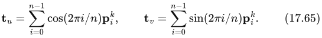

法线于是为 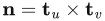。注意，这通常比 16.3 节所述方法的开销更小 [1977]，后者需要计算相邻三角形的法线。更重要的是，这种方法给出了该点的精确法线。

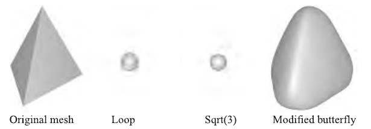

**图 17.47** 分别用 Loop、√3 和改进蝶形（modified butterfly，MB）方案，对一个四面体细分 5 次 [1975]。Loop 和 √3 方案 [915] 都是逼近型的，而 MB 是插值型的；后者意味着初始顶点位于最终曲面上。由于逼近型方案在游戏和离线渲染中应用广泛，本书只介绍这一类方案。

逼近型细分方案的一个主要优点是，生成的曲面往往具有较好的**光顺性**。粗略地说，光顺性与曲线或曲面弯曲得有多平滑有关 [1239]。光顺性越高，曲线或曲面就越平滑。另一个优点是，逼近型方案比插值型方案收敛更快。然而，这意味着形状经常会收缩。这种现象在较小的凸网格上最明显，例如图 17.47 所示的四面体。减轻这一效应的一种办法是在控制网格中使用更多顶点，也就是说，建模时必须仔细处理。Maillot 和 Stam 提出了组合细分方案的框架，使收缩可以受到控制 [1106]。Loop 曲面具有一项有时非常有用的特征：它包含在原始控制点的凸包内 [1976]。

Loop 细分方案生成一种广义的三方向四次箱样条。注1 因此，对于完全由规则顶点组成的网格，实际上可以将曲面描述为某类样条曲面。然而，对于不规则情形，这种描述就不适用了。能够从任意顶点网格生成光滑曲面，是细分方案的一大优势。关于使用 Loop 方案的细分曲面的不同扩展，另见 17.5.3 和 17.5.4 节。

**注1：** 这些样条曲面超出了本书范围。请参阅 Warren 的著作 [1847]、SIGGRAPH 课程 [1977] 或 Loop 的学位论文 [1067]。

## 17.5.2 Catmull-Clark 细分

能够处理多边形网格（而不仅仅是三角形）的两种最著名细分方案，是 Catmull-Clark [239] 和 Doo-Sabin [370]。注2 这里只简要介绍前者。Catmull-Clark 曲面曾用于 Pixar 的短片《棋逢敌手》（Geri’s Game）[347]、《玩具总动员 2》，以及 Pixar 此后的所有长篇电影。这种细分方案也常用于制作游戏模型，可能是最流行的一种。正如 DeRose 等人 [347] 指出的，Catmull-Clark 曲面倾向于生成更对称的曲面。例如，长方体会得到对称的类椭球曲面，这符合直觉。相比之下，基于三角形的细分方案会把立方体的每个面看作两个三角形，因此得到的结果取决于如何分割正方形。

**注2：** 巧合的是，这两种方案发表在同一期刊的同一期中。

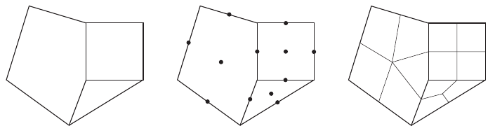

**图 17.48** Catmull-Clark 细分的基本思想。每个多边形生成一个新点，每条边也生成一个新点，然后按照右图所示方式连接它们。图中未显示原始点的加权过程。

Catmull-Clark 曲面的基本思想见图 17.48，实际细分例子见第 757 页的图 17.41。可以看到，该方案只生成有 4 个顶点的面。事实上，第一次细分之后，只会生成价数为 4 的顶点，因此这类顶点称为普通顶点或规则顶点（相比之下，三角形方案的规则价数为 6）。

沿用 Halstead 等人 [655] 的记号，考虑一个顶点 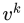，以及它周围的 n 个边点 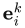，其中 i = 0, …, n − 1，见图 17.49。现在，对每个面计算一个新面点 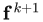，取面重心，也就是该面各点的平均值。由此得到以下细分规则 [239, 655, 1977]：

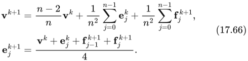

可以看到，顶点 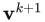 通过对当前考虑的顶点、边点的平均值以及新生成面点的平均值进行加权计算。另一方面，新边点由当前考虑的顶点、边点，以及与该边相邻的两个新面点取平均得到。

Catmull-Clark 曲面描述一种广义双三次 B 样条曲面。因此，对于完全由规则顶点组成的网格，实际上可以将曲面描述为双三次 B 样条曲面（17.2.6 节）[1977]。但对于不规则网格，这样的描述就不成立；能够用细分曲面处理这些情形，是该方案的优势之一。极限位置和切向量也可以计算，甚至可以用显式公式在任意参数值处计算 [1687]。Halstead 等人 [655] 介绍了另一种计算极限点和法线的方法。

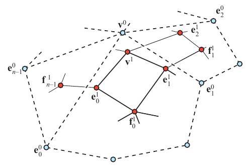

**图 17.49** 细分之前，有蓝色顶点及相应的边和面。经过一次 Catmull-Clark 细分之后，得到红色顶点，所有新面都是四边形。（插图据 Halstead 等人 [655]。）

关于利用 GPU 渲染 Catmull-Clark 细分曲面的一组高效技术，见 17.6.3 节。

## 17.5.3 分片光滑细分

从某种意义上说，曲面可能显得乏味，因为它们缺少细节。改善这类曲面的两种方式是使用凹凸贴图或位移贴图（17.5.4 节）。这里介绍第三种方式：**分片光滑细分**。其基本思想是改变细分规则，以便使用尖褶端点（dart）、角点（corner）和折痕（crease）。这扩大了能够建模和表示的曲面种类。Hoppe 等人 [767] 最早针对 Loop 细分曲面介绍了这种方法。标准 Loop 细分曲面与分片光滑细分的比较见图 17.50。

为了能在曲面上实际使用这些特征，首先标记希望保持锐利的边，以便知道哪些地方需要使用不同的细分方式。与某顶点相接的锐边数记为 s。顶点据此分类为：光滑点（s = 0）、尖褶端点（s = 1）、折痕点（s = 2）和角点（s > 2）。因此，折痕是曲面上的一条曲线，跨越该曲线的连续性为 。尖褶端点是一个非边界顶点，折痕在此终止并平滑地融入曲面。最后，角点是 3 条或更多折痕汇合的顶点。将每条边界边标记为锐边，就可以定义边界。

对不同顶点类型进行分类后，Hoppe 等人使用一张表来确定不同组合应采用哪种掩模。他们还展示了如何计算极限曲面上的点和极限切向量。Biermann 等人 [142] 提出了若干改进的细分规则。例如，当非普通顶点位于边界上时，原先的规则可能产生缝隙，而新规则避免了这一问题。此外，他们的规则允许指定顶点处的法线，得到的曲面会相应调整，使该点具有指定法线。DeRose 等人 [347] 提出了创建柔和折痕的技术。他们允许先将一条边按锐边细分若干次（包括小数次数），此后再使用标准细分。

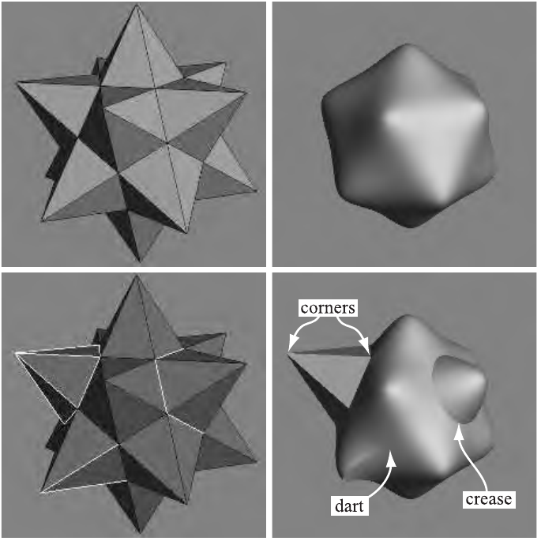

**图 17.50** 上排显示一个控制网格，以及使用标准 Loop 细分方案得到的极限曲面。下排显示使用 Loop 方案的分片光滑细分。左下图显示控制网格，其中被标记为锐边的边以浅灰色表示。右下图显示所得曲面，并标出了角点、尖褶端点和折痕。（图片由 Hugues Hoppe 提供。）

## 17.5.4 位移细分

凹凸映射（6.7 节）是在原本光滑的曲面上添加细节的一种方式。不过，这只是改变每个像素处的法线或局部遮蔽、制造视觉错觉的技巧。无论是否使用凹凸映射，物体轮廓看起来都一样。凹凸映射的自然扩展是**位移映射** [287]，它会实际移动曲面。这通常沿法线方向进行。因此，若曲面点为 p，其归一化法线为 n，那么位移后曲面上的点为

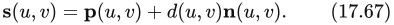

标量 d 是点 p 处的位移量。位移也可以取向量值 [938]。

本节介绍**位移细分曲面** [1006]。总体思想是：用一个粗控制网格描述位移曲面，先将其细分为光滑曲面，再利用标量场沿法线进行位移。在位移细分曲面的语境下，式（17.67）中的 p 是（粗控制网格所对应的）细分曲面上的极限点，n 是 p 处的归一化法线，计算为

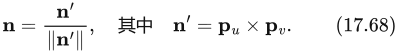

在式（17.68）中，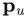 和 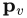 是细分曲面的一阶导数，因此它们描述了 p 处的两个切向量。Lee 等人 [1006] 对粗控制网格使用 Loop 细分曲面，其切向量可以通过式（17.65）计算。注意，这里的记号略有不同：我们使用  和 ，而不是 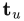 和 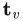。式（17.67）描述了所得曲面上经过位移的位置，但为了正确渲染，还需要位移细分曲面上的法线 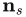。它按以下解析方式计算 [1006]：

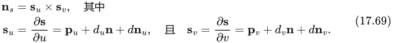

为简化计算，Blinn [160] 建议：若位移较小，可以忽略第三项。否则，可以使用以下表达式计算 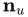（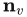 的计算类似）[1006]：

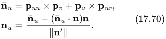

注意，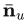 并非什么新记号，只是计算中的一个“临时”变量。对于普通顶点（价数 n = 6），一阶和二阶导数尤其简单，其掩模见图 17.51。对于非普通顶点（价数 n ≠ 6），省略式（17.69）第一行和第二行中的第三项。图 17.52 展示了在 Loop 细分中使用位移映射的例子。

> 译注：原文这里写“式（17.69）第一行和第二行中的第三项”。结合公式可知，它指的是两个导数展开式各自的第三项，即位移量与法线导数的乘积；原书版面把两个导数展开式排在同一行。

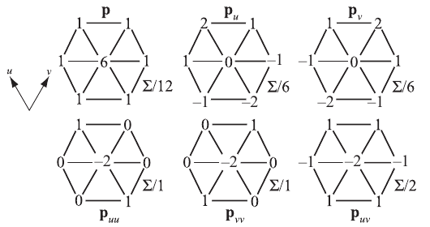

**图 17.51** Loop 细分方案中普通顶点的掩模。注意，使用这些掩模之后，所得加权和还应按图示进行除法。（插图据 Lee 等人 [1006]。）

当位移曲面距离观察者很远时，可以采用标准凹凸映射来制造位移的错觉，从而节省几何处理。一些凹凸映射方案需要顶点处的切线空间坐标系，可以使用 (b, t, n)，其中 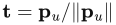，b = n × t。

Nießner 和 Loop [1281] 提出了与上述 Lee 等人方法类似的技术，但他们使用 Catmull-Clark 曲面，并直接求值位移函数的导数，因此速度更快。他们还利用硬件曲面细分流水线（3.6 节）进行快速曲面细分。

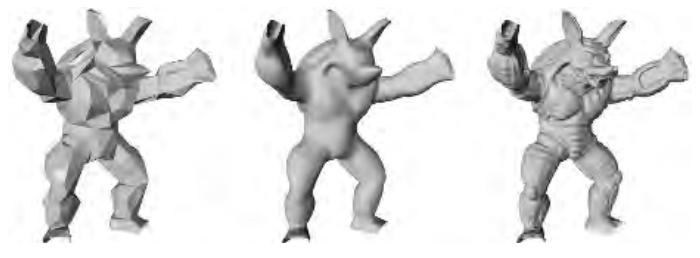

**图 17.52** 左图是粗网格；中图是使用 Loop 细分方案细分后的结果；右图显示位移细分曲面。（图片由 Aaron Lee、Henry Moreton 和 Hugues Hoppe 提供。）

## 17.5.5 法线、纹理和颜色插值

本节介绍处理逐顶点法线、纹理坐标和颜色的不同策略。

如 17.5.1 节针对 Loop 方案所示，可以显式计算极限切向量，进而计算极限法线。这涉及三角函数，求值开销可能较大。Loop 和 Schaefer [1070] 提出了一种近似技术，始终用双三次 Bézier 曲面（17.2.1 节）近似 Catmull-Clark 曲面。对于法线，推导出两个切向量曲面片，一个对应 u 方向，另一个对应 v 方向，再将这些向量叉乘求出法线。通常，Bézier 曲面片的导数用式（17.35）计算。然而，由于推导出的 Bézier 曲面片只是近似 Catmull-Clark 曲面，这些切向量曲面片不会形成连续法线场。关于如何克服这些问题，请参阅 Loop 和 Schaefer 的论文 [1070]。Alexa 和 Boubekeur [29] 认为，从单位计算量所获得的质量来看，同时对法线进行细分可能更高效，并可使着色具有更好的连续性。有关如何细分法线的细节，请参阅他们的论文。Ni 等人的 SIGGRAPH 课程 [1275] 还介绍了更多类型的近似方法。

假设网格中的每个顶点都有纹理坐标和颜色。为了将它们用于细分曲面，还必须为每个新生成的顶点创建颜色和纹理坐标。最直接的做法，是使用与细分多边形网格相同的细分方案。例如，可以把颜色视为四维向量（RGBA），对其进行细分，为新顶点生成新颜色。这是一种合理的方法，因为颜色将具有连续导数（假设细分方案至少为 ），从而避免曲面上颜色的突变。纹理坐标当然也可以如此处理 [347]。不过，当纹理空间存在边界时，就必须小心。例如，假设两个曲面片共享一条边，但沿这条边的纹理坐标不同。几何仍应照常用曲面规则细分，而纹理坐标在这种情况下应当使用边界规则细分。

Piponi 和 Borshukov [1419] 给出了一种为细分曲面添加纹理的精巧方案。
