# 19.1 空间数据结构

来源：《Real-Time Rendering》第4版，书页818—830（PDF物理页839—851）。范围从19.1节标题开始，到19.2节标题之前，包含19.1.1—19.1.5全部正文、图19.2—19.8及公式（19.1）；章首导言与图19.1另存。

空间数据结构是在某个n维空间中组织几何体的结构。本书只使用二维和三维结构，但这些概念往往很容易推广到更高维度。这些数据结构可用于加速关于几何实体是否重叠的查询。这类查询应用于各种操作，例如剔除算法、相交测试与光线追踪，以及碰撞检测。

空间数据结构通常按层次组织。大致说来，这意味着最高层包含一些子节点，每个子节点都定义自己的空间体积，并进一步包含自己的子节点。因此，这种结构是嵌套的，具有递归性质。层次结构中的某些元素引用几何体。使用层次结构的主要原因是，各类查询都能显著加快，典型情况下可从O(n)改善为O(log n)。也就是说，在执行诸如寻找给定方向上最近物体这样的操作时，我们只访问一小部分物体，而不必搜索全部n个物体。空间数据结构的构建时间可能很长，既取决于其中的几何体数量，也取决于所要求的数据结构质量。不过，这一领域的重要进展已大幅缩短构建时间，在某些情况下甚至可以实时完成。通过惰性求值和增量更新，还能进一步缩短构建时间。

常见的空间数据结构类型包括包围体层次结构、二叉空间划分（BSP）树的各种变体、四叉树和八叉树。BSP树和八叉树是基于空间细分的数据结构。这意味着，场景的整个空间被细分，并编码到数据结构中。例如，所有叶节点所表示空间的并集等于场景的整个空间。通常，叶节点的体积互不重叠，但松散八叉树等较少见的结构除外。BSP树的大多数变体是不规则的，即空间可以用更任意的方式细分。八叉树则是规则的，也就是说，空间以均匀方式划分。这种均匀性虽然限制更多，却往往也是效率的来源。另一方面，包围体层次结构并不是空间细分结构。它包围的是几何物体周围的空间区域，因此BVH在每一层都不必覆盖整个空间。

下面各节将介绍BVH、BSP树和八叉树，同时也介绍场景图。场景图这种数据结构更关注模型之间的关系，而不是高效渲染。

## 19.1.1 包围体层次结构

包围体（bounding volume，BV）是包住一组物体的体积。其基本思想是：BV应具有比被包围物体简单得多的几何形状，从而使针对BV的测试比针对物体本身的测试快得多。BV的例子包括球体、轴对齐包围盒（AABB）、定向包围盒（OBB）和k-DOP。定义见22.2节。BV在视觉上不对渲染图像作出贡献。它代替被包围物体充当代理，以加速渲染、选择、查询以及其他计算。

在三维场景的实时渲染中，包围体层次结构经常用于层次式视锥体剔除（19.4节）。场景被组织成由一组相互连接的节点构成的层次树结构。最上面的节点称为根节点，没有父节点。内部节点具有指向其子节点的指针，子节点也是节点。因此，除非根节点是树中唯一的节点，否则它也是内部节点。叶节点保存实际需要渲染的几何体，没有任何子节点。树中的每个节点，包括叶节点，都有一个包围体，包住其整个子树中的几何体。也可以决定不在叶节点中保存BV，而将BV放到每个叶节点正上方的内部节点中。这种组织方式就是“包围体层次结构”这个名称的由来。每个节点的BV都包住其子树中所有叶节点的几何体。这意味着，根节点的BV包含整个场景。图19.2给出了BVH的例子。注意，图中某些较大的包围圆还可以收得更紧，因为每个节点只需包含其子树中的几何体，不必包含后代节点的BV。对于包围圆或包围球，形成这样更紧的节点可能成本较高，因为每个节点都必须检查其子树中的全部几何体。实际中，通常沿树“自底向上”构造节点的BV：创建一个能包含所有子节点BV的BV。

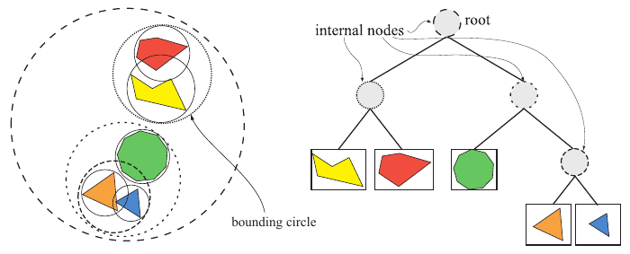

图19.2　左图展示一个包含五个物体的简单场景，以及右侧包围体层次结构所使用的包围圆。一个圆包住所有物体，随后以递归方式在大圆内包含更小的圆。右图展示用于表示左侧物体层次关系的包围体层次结构（树）。

BVH的底层结构是一棵树，而计算机科学领域关于树形数据结构的文献极为丰富。这里只提及几个重要结果。更多信息可参阅Cormen等人的《算法导论》[292]等书籍。

考虑一棵k叉树，即每个内部节点都有k个子节点的树。只有一个节点（根节点）的树被称为高度为0的树。根节点的叶子子节点位于高度1，依此类推。平衡树是指所有叶节点都位于高度h或h−1的树。一般而言，平衡树的高度h为⌊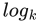 n⌋，其中n是树中节点的总数，包括内部节点和叶节点。注意，k越大，树的高度越低，这意味着遍历树所需的步数越少，但每个节点所需的工作也更多。二叉树通常是最简单的选择，并能提供合理的性能。不过，有证据表明，对某些应用而言，更大的k值，例如k＝4或k＝8，会带来更好的性能[980, 1829]。使用k＝2、k＝4或k＝8时，树的构造很简单：k＝2时只沿最长轴细分，k＝4时沿最长的两个轴细分，k＝8时沿所有轴细分。对于其他k值，构造良好的树要困难一些。从性能角度看，每个节点拥有较多子节点，例如k＝8，的树往往更受青睐，因为它们降低了平均树深度，也减少了需要跟随的间接引用次数，即从父节点到子节点的指针跳转次数。

> 译注：原文将此处平衡k叉树的一般高度写为⌊ n⌋，并将n定义为全部节点数。按紧邻文字所给的平衡树定义，该等式并非对任意k及任意平衡形态都成立；这里忠实保留原式。

BVH非常适合执行各种查询。例如，假设要让一条射线与场景求交，并返回找到的第一个交点，阴影射线就是这种情况。使用BVH时，测试从根节点开始。如果射线没有击中其BV，那么它也不会击中BVH中包含的任何几何体。否则，递归继续测试，即测试根节点各子节点的BV。一旦射线没有击中某个BV，就可以终止对该BVH子树的测试。如果射线击中叶节点的BV，则进一步用射线测试该节点的几何体。性能收益部分来自射线与BV之间的测试很快。这也是使用球体和盒体等简单物体作为BV的原因。另一个原因是BV的嵌套使我们能够提前终止树的遍历，从而避免测试大片空间区域。

我们通常需要的是最近交点，而不是最先找到的交点。为此唯一需要增加的数据，是遍历过程中已找到的最近物体的距离和标识。当前最近距离还用于在遍历过程中对树进行剔除。如果射线与某个BV相交，但交点距离大于目前找到的最近距离，就可以丢弃该BV。检查父包围盒时，我们对所有子节点的BV求交，并找出最近的一个。如果在这个BV的后代中找到交点，就利用新的最近距离判断其他子节点是否还需要遍历。后面将会看到，BSP树相对于普通BVH的一个优势是，它能保证从前向后的顺序，而BVH只能提供这种粗略排序。

BVH也可用于动态场景[1465]。当BV内的一个物体移动时，只需检查它是否仍被父节点的BV包含。如果仍被包含，BVH依旧有效；否则，就移除该物体节点并重新计算父节点的BV，然后从根节点开始，以递归方式将该节点重新插入树中。另一种方法是扩大父节点的BV，使其能包含子节点，并按需向上递归扩展。无论采用哪一种方法，随着编辑次数增多，树都可能变得不平衡且低效。另一种做法是，用BV包围物体在一段时间内的运动范围。这称为时间包围体[13]。例如，可以为摆锤设置一个包围盒，包住它运动时扫过的整个体积。还可以进行自底向上的重新拟合[136]，或选择树的某些部分进行重新拟合或重建[928, 981, 1950]。

要创建BVH，首先必须能够为一组物体计算紧致的BV。22.3节将讨论这个问题。随后，必须创建真正的BV层次结构。有关BV构建策略的更多内容，请参阅realtimerendering.com上的碰撞检测章节。

## 19.1.2 BSP树

二叉空间划分树，简称BSP树，在计算机图形学中存在两种明显不同的变体，我们称之为轴对齐型和多边形对齐型。构造这类树时，先用一个平面把空间一分为二，再把几何体分配到这两个空间中，并递归进行这种划分。一个很有价值的性质是：以特定方式遍历BSP树，可以从任意视点对树中的几何内容进行从前向后的排序。对于轴对齐BSP树，这种排序是近似的；对于多边形对齐BSP树，则是精确的。注意，轴对齐BSP树也称为k-d树。

### 轴对齐BSP树（k-d树）

轴对齐BSP树的构造如下。首先，用轴对齐包围盒（AABB）包住整个场景。接下来的思路是，递归地把这个盒子细分成更小的盒子。现在，考虑任意递归层级中的一个盒子。选取盒子的一条轴，并生成一个与其垂直的平面，将空间划分为两个盒子。有些方案固定划分平面的位置，使其恰好把盒子一分为二；另一些则允许平面的位置变化。允许平面位置变化的方法称为非均匀细分，可使得到的树更加平衡。固定平面位置的方法称为均匀细分，此时节点的内存位置可由它在树中的位置隐式确定。

对于与平面相交的物体，可以采用多种处理方式。例如，可以把它存储在树的当前层级，也可以让它同时成为两个子盒子的成员，或真正用平面把它分成两个独立物体。存储在树的当前层级的优点是，树中只保留该物体的一个副本，使物体删除操作很直接。不过，被划分平面穿过的小物体会滞留在树的高层，通常导致效率降低。将相交物体放入两个子节点，可以让较大物体得到更紧的界限，因为所有物体都会逐层下沉到一个或多个叶节点中，但只进入与它们重叠的叶节点。每个子盒子包含若干物体，随后重复这个平面划分过程，递归细分各个AABB，直至满足某个终止条件。图19.3给出了轴对齐BSP树的例子。

粗略的从前向后排序是轴对齐BSP树的一种用途。它可用于遮挡剔除算法（19.7节和23.7节），也可以通过尽量减少像素的重复绘制，普遍降低像素着色器成本。假设当前遍历到一个名为N的节点；在遍历开始时，N是根节点。检查N的划分平面，然后在观察者所在的平面一侧递归继续遍历。这样，只有遍历完树的这一整半边之后，才会开始遍历另一边。由于叶节点中的内容没有排序，而且物体可能出现在树的多个节点中，因此这种遍历不能给出精确的从前向后排序。不过，它能够提供一种通常很有用的粗略排序。如果从节点平面相对于观察者的另一侧开始遍历，就能得到粗略的从后向前排序。这对透明物体排序很有用。BSP遍历也可用于测试射线与场景几何体的相交情况，只需用射线原点替代观察者位置。

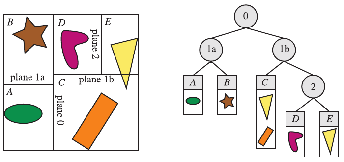

图19.3　轴对齐BSP树。在此例中，空间划分可以位于轴上的任意位置，而不限于中点。形成的空间区域标记为A至E。右侧的树展示底层BSP数据结构。每个叶节点代表一个区域，该区域的内容显示在其下方。注意，三角形同时出现在C和E两个区域的物体列表中，因为它与这两个区域都重叠。

### 多边形对齐BSP树

另一种BSP树是多边形对齐形式[4, 500, 501]。这种数据结构特别适合按精确排序的顺序渲染静态几何体或刚性几何体。在还没有硬件z缓冲的年代，这种算法曾广泛用于《DOOM》（2016）一类游戏。如今它仍偶有应用，例如用于碰撞检测和相交测试。

> 译注：原页确实印为“DOOM (2016)”，却又将其置于“没有硬件z缓冲”的年代；这两处表述存在明显的年代语境疑点。这里保留原书年份，不擅自替换。

在这种方案中，选择一个多边形作为分割者，将空间划分为两个半空间。也就是说，在根节点处选取一个多边形，用该多边形所在的平面将场景中其余多边形分成两组。任何与划分平面相交的多边形，都沿交线切成两个独立部分。然后，在划分平面的每个半空间中，再选择一个多边形作为分割者，只划分该半空间中的多边形。递归进行，直至所有多边形都进入BSP树。创建高效的多边形对齐BSP树是一个耗时过程，因此通常只计算一次并存储下来供重复使用。图19.4展示这种BSP树。一般最好构造平衡树，即所有叶节点深度相同，或最多相差1。

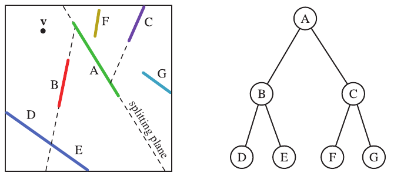

图19.4　多边形对齐BSP树。图中从上方观察多边形A至G。先用多边形A划分空间，再分别用B和C划分两个半空间。由多边形B形成的划分平面与左下角的多边形相交，将其切成独立的多边形D和E。右侧展示形成的BSP树。

多边形对齐BSP树具有一些有用的性质。其中之一是，对于给定视图，可以严格按从后向前或从前向后的顺序遍历该结构。相比之下，轴对齐BSP树通常只能提供粗略排序。先确定相机位于根平面的哪一侧。该平面远侧的多边形集合位于近侧集合的后面。然后，在远侧集合中，取下一层的划分平面，再确定相机位于哪一侧。远侧子集又是距离相机最远的子集。递归继续这个过程，就能确立严格的从后向前顺序，并使用画家算法渲染场景。画家算法不需要z缓冲。如果所有物体都按从后向前的顺序绘制，每个更近的物体都会绘制在其后方所有内容的前面，因此不需要比较z深度。

例如，考虑图19.4中的观察者v所看到的情况。无论观察方向和视锥体如何，v都位于A形成的划分平面左侧，因此C、F和G都在B、D和E后面。把v与C的划分平面比较，可知G位于该平面的另一侧，因此先显示G。对B的平面进行测试，可确定E应在D之前显示。于是，从后向前的顺序为G、C、F、A、E、B、D。注意，这个顺序并不保证某个物体一定比另一个物体更靠近观察者；它提供的是严格的遮挡顺序，两者存在细微区别。例如，多边形F比多边形E更靠近v，但在遮挡顺序中却位于更后面。

## 19.1.3 八叉树

八叉树与轴对齐BSP树相似。它同时沿全部三个轴划分盒子，而且划分点必须是盒子的中心。这会创建八个新盒子，因此称为八叉树。这使得结构具有规则性，可以让某些查询更高效。

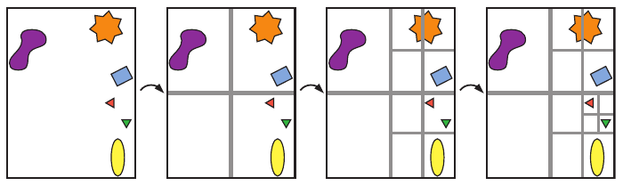

图19.5　四叉树的构建。从左侧开始，先用一个包围盒包住全部物体。然后递归地把盒子划分为四个大小相同的盒子，直至每个盒子在本例中为空，或只包含一个物体。

构建八叉树时，先用一个最小轴对齐包围盒包住整个场景。其余过程具有递归性质，并在满足某个停止条件时结束。与轴对齐BSP树一样，这些条件可以包括达到最大递归深度，或使盒子中的图元数达到某个数量[1535, 1536]。如果满足条件，算法便把图元关联到该盒子，并终止递归。否则，用三个平面沿主轴细分盒子，形成八个同样大小的盒子。对每个新盒子进行测试，必要时再次细分为2×2×2个更小的盒子。图19.5用二维情况说明这一过程，此时的数据结构称为四叉树。四叉树是八叉树的二维对应形式，忽略了第三条轴。当沿全部三个轴对数据分类并没有多少好处时，四叉树就很有用。

八叉树可以像轴对齐BSP树一样使用，因此能够处理相同类型的查询。事实上，BSP树可以给出与八叉树相同的空间划分。例如，先沿x轴中点划分一个单元，再沿y轴中点划分两个子单元，最后沿z轴中点划分这些子单元，就会形成八个大小相同的单元，与执行一次八叉树划分所得的结果相同。八叉树的一个效率来源是：它无需存储更灵活的BSP树结构所需要的信息。例如，划分平面的位置是已知的，因此不必显式描述。这种更紧凑的存储方式还通过减少遍历时访问的内存位置数量来节省时间。不过，轴对齐BSP树仍可能更高效，因为更好的平面位置带来的节省，可能超过读取划分平面位置所需的额外内存成本和遍历时间。没有一种方案在所有情况下效率最高；影响因素包括底层几何体的性质、访问结构的使用模式，以及运行代码的硬件架构等。通常，内存布局的局部性和缓存友好程度是最重要的因素，下一节将重点讨论这一点。

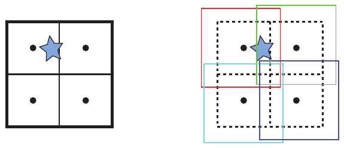

图19.6　普通八叉树与松散八叉树的比较。圆点表示第一次细分后各盒子的中心。左图中，星形穿过普通八叉树的一个划分平面，因此一种选择是把星形放入最大的盒子，即根节点的盒子。右图展示k＝1.5的松散八叉树，即盒子增大50%。为便于辨认，各盒子略有错开。现在，星形可以完整放入左上方的红色盒子。

在上面的描述中，物体总是存储在叶节点中。因此，某些物体必须存储在不止一个叶节点里。另一种选择是，把物体放入能够包含整个物体的最小盒子中。例如，图中的星形物体应放入从左数第二幅图右上方的盒子中。这种做法有一个明显缺点：例如，一个位于八叉树中心的小物体会被放入最上层、也就是最大的节点。这很低效，因为一个微小物体此时被包围整个场景的盒子包住。一种解决方法是切分物体，但这会引入更多图元。另一种方法是在物体所处的每个叶盒子中都放入指向它的指针，但会降低效率，也让八叉树的编辑更加困难。

> 译注：此段“从左数第二幅图右上方”的描述对应图19.5的细分序列；紧邻上方的图19.6用蓝色星形说明跨划分面的另一种情形。原文未在此句明确写出图号。

Ulrich提出了第三种解决方案：松散八叉树[1796]。其基本思想与普通八叉树相同，但放宽了各盒子尺寸的选择。若普通盒子的边长为l，就改用kl，其中k＞1。图19.6以k＝1.5为例，并与普通八叉树进行比较。注意，各盒子的中心点相同。使用更大的盒子，会减少跨越划分平面的物体数量，从而使物体能够放到八叉树更深的位置。一个物体始终只插入一个八叉树节点，因此从树中删除它很简单。使用k＝2还有一些好处。首先，物体的插入和删除都是O(1)。知道物体的尺寸，就能立即知道它可以成功插入八叉树的哪一层，并完全装入该层的一个松散盒子。实际中，有时还能将物体放入更深层的盒子。另外，如果k＜2，而物体装不下，就可能需要把它上移到树的更高层。

物体的质心决定了应将它放入哪个松散八叉树盒子。由于这些性质，该结构非常适合包围动态物体，代价是牺牲一些BV效率，并在遍历结构时失去严格排序能力。另外，物体通常每帧只移动一点，因此上一帧的盒子在下一帧仍有效。于是，松散八叉树中每帧只需更新一部分动画物体。Cozzi[302]指出，将各物体或图元分配到松散八叉树之后，可以围绕每个节点中的物体计算一个最小AABB，此时该结构本质上就变成了BVH。这种方法避免了跨节点切分物体。

## 19.1.4 缓存无关与缓存感知表示

由于内存系统带宽与CPU计算能力之间的差距逐年增大，在设计算法和空间数据结构表示时考虑缓存至关重要。本节将介绍缓存感知（cache-aware，也称cache-conscious）与缓存无关（cache-oblivious）空间数据结构。缓存感知表示假定缓存块的大小已知，因此可以针对特定架构进行优化。相比之下，缓存无关算法旨在适应各种缓存大小，因此具有平台独立性。

要创建缓存感知数据结构，首先必须确定目标架构的缓存块大小，例如64字节。然后尽量缩小数据结构。例如，Ericson[435]展示了如何仅用32位表示一个k-d树节点。其做法之一是借用节点32位数值中最低的两位。这两位可表示四种类型：叶节点，或分别沿三个轴之一划分的内部节点。对于叶节点，高30位保存指向物体列表的指针；对于内部节点，则表示精度略低的浮点划分值。这样，就能在一个64字节缓存块中存放一棵具有15个节点、深四层的二叉树。第16个节点用来指示哪些子节点存在，以及它们的位置。细节请参阅他的著作。关键思想是：确保结构能够整齐地装入缓存边界以内，可以显著改善数据访问。

一种常见而简单的树节点缓存无关排序是van Emde Boas布局[68, 422, 435]。假设有一棵高度为h的树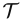，目标是计算树中节点的缓存无关布局或排列顺序。关键思想在于：递归地将层次结构拆成越来越小的块，那么在某一层级，一组块就能装入缓存。这些块在树中彼此接近，因此与简单地从最高层向下逐层列出全部节点相比，缓存中的数据能在更长时间内保持有效。那种朴素的排列方式会造成内存位置之间的大幅跳转。

把树的van Emde Boas布局记为v()。该结构以递归方式定义，一棵只有一个节点的树的布局就是节点本身。如果中有多个节点，就在高度的一半，即⌊h/2⌋处划分树。最上面的⌊h/2⌋层放入记为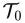的树中，从叶节点处开始的子树记为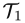、…、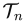。树的递归性质描述如下：

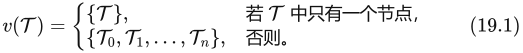

注意，所有子树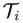（0≤i≤n）也由上述递归定义。例如，这意味着也必须在其高度的一半处分割，依此类推。图19.7给出了一个例子。

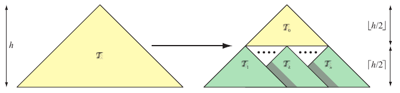

图19.7　树的van Emde Boas布局通过将树的高度h一分为二来构造。这会生成子树、、…、；再以相同方式递归划分每棵子树，直至每棵子树只剩一个节点。

一般来说，创建缓存无关布局包括两个步骤：聚类，以及对簇排序。对于van Emde Boas布局，聚类由子树给出，排序则隐含在创建顺序中。Yoon等人[1948, 1949]开发了专门面向高效包围体层次结构和BSP树的技术。他们建立了一个概率模型，同时考虑父节点与子节点之间的局部性以及空间局部性。其思想是确保访问子节点的成本很低，从而在父节点已被访问的情况下尽量减少缓存未命中。此外，彼此接近的节点在排序中也被放得更近。他们开发了一种贪心算法，将概率最高的节点聚为一簇。不改变底层算法，仅改变BVH中节点的排列顺序，就取得了大幅性能提升。

## 19.1.5 场景图

BVH、BSP树和八叉树都以某种树作为基本数据结构，区别在于如何划分空间以及存储几何体。它们也都以层次方式存储几何物体，而不存储其他东西。然而，渲染三维场景所涉及的远不止几何体。动画、可见性以及其他元素的控制，通常通过场景图完成；它在glTF中称为节点层次结构。这是一种面向用户的树结构，加入了纹理、变换、细节层次、渲染状态（例如材质属性）、光源以及其他适用内容。它用树来表示，并按某种顺序遍历这棵树，以渲染场景。例如，可以把一个光源放在内部节点中，使其只影响该节点子树中的内容。另一个例子是在遍历树时遇到材质：该材质可以应用于该节点子树中的全部几何体，也可能被子节点的设置覆盖。有关如何在场景图中支持不同细节层次，另见书页861的图19.34。从某种意义上说，每个图形应用都会使用某种形式的场景图，即使它只是一个根节点加上一张待显示子节点列表。

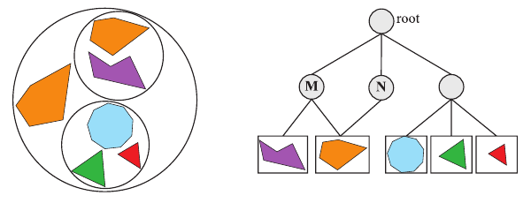

图19.8　一个场景图，将不同变换M和N应用于内部节点及其各自的子树。注意，这两个内部节点还指向同一个物体，但由于变换不同，会出现两个不同的物体，其中一个经过旋转和缩放。

实现物体动画的一种方法是改变树中内部节点的变换。场景图实现随后会变换该节点子树中的全部内容。由于变换可以放在任意内部节点中，因此能够实现层次动画。例如，汽车的车轮可以旋转，而整辆汽车可以向前移动。

当多个节点可以指向同一个子节点时，这种树结构称为有向无环图（DAG）[292]。“无环”表示它不能包含任何环路或循环。“有向”表示两个节点通过边连接时，这种连接具有确定的顺序，例如从父节点指向子节点。场景图通常是DAG，因为它们允许实例化，即在不复制几何数据的情况下，为物体创建多个副本（实例）。图19.8展示一个例子，其中两个内部节点对各自子树施加不同的变换。使用实例可以节省内存，而GPU可以通过API调用迅速渲染一个实例的多个副本（18.4.2节）。

当物体需要在场景中移动时，必须更新场景图。这可以通过对树结构进行递归调用完成。在从根节点向叶节点行进的过程中更新变换；在此遍历中，相乘各矩阵，并将结果存储到相关节点。然而，变换更新后，任何附带的BV就都失效了。因此，在从叶节点返回根节点的过程中更新BV。过于宽松的树结构会使这些任务极为复杂，所以常常避免使用DAG，或采用只有叶节点共享的受限DAG。更多信息见Eberly的著作[404]。还要注意，使用WebGL等基于JavaScript的API时，尽可能将更多工作转移到GPU，并尽可能减少返回CPU的反馈，极其重要[876]。

场景图本身也可带来一定的计算效率。场景图中的节点通常有一个包围体，因此与BVH非常相似。场景图的叶节点存储几何体。重要的是要认识到，完全无关的效率优化方案也能与场景图并用。这就是空间化的思想：用一个为不同任务创建的独立数据结构，例如BSP树或BVH，来补充用户的场景图，以实现更快的剔除或拾取等。大多数模型位于叶节点，而这些叶节点是共享的，因此额外增加一个用于空间效率优化的结构，成本相对较低。
