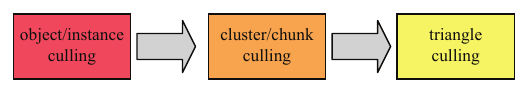
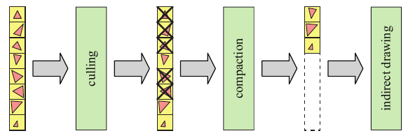

# 19.8 剔除系统

来源：Real-Time Rendering, Fourth Edition，第 19.8 节；书页 850—851（PDF 第 871—872 页）。已检查 PDF 第 873 页的章节边界；该页图 19.26 属于第 19.9 节。

多年来，剔除系统已经有了长足的发展，而且仍在继续演进。本节介绍一些总体思路，具体细节则请参阅相关文献。有些系统实际上在 GPU 的计算着色器中执行全部剔除工作，另一些系统则先在 CPU 上进行粗略剔除，再在 GPU 上进行更精细的剔除。

典型的剔除系统会在多种粒度上工作，如图 19.24 所示。物体的一个簇（cluster）或块（chunk），就是该物体三角形集合的一个子集。例如，可以采用包含 64 个顶点的三角形带 [625]，或者由 256 个三角形组成的分组 [1884]。在每个步骤中，都可以组合使用多种剔除技术。El Mansouri [415] 对物体采用小三角形剔除、细节剔除、视锥体剔除和遮挡剔除。由于簇的几何范围小于物体，更有可能被剔除，因此对簇同样采用这些剔除技术是合理的。例如，可以对簇采用细节剔除、视锥体剔除、成簇背面剔除和遮挡剔除。

**图 19.24** 一个在三种不同粒度上工作的剔除系统示例。首先，在逐物体层级进行剔除。然后，对未被剔除的物体在逐簇层级进行剔除。最后，进行三角形剔除，图 19.25 对此作了进一步说明。

图内标签：object/instance culling＝物体／实例剔除；cluster/chunk culling＝簇／块剔除；triangle culling＝三角形剔除。

**图 19.25** 三角形剔除系统。首先，对所有单独的三角形应用一系列剔除算法。为了能够使用间接绘制，也就是无需在 GPU 与 CPU 之间往返传递数据，随后将未被剔除的三角形紧缩为一个更短的列表。GPU 使用间接绘制来渲染这个列表。

图内标签：culling＝剔除；compaction＝紧缩；indirect drawing＝间接绘制。

完成逐簇层级的剔除后，还可以增加一个步骤，在逐三角形层级进行剔除。为了使这一过程完全在 GPU 上进行，可以采用图 19.25 所示的方法。三角形的剔除技术包括：除以 w 之后进行视锥体剔除，即将三角形的范围与 ±1 比较；背面测试；退化三角形剔除；小三角形剔除；还可能包括遮挡剔除。通过所有剔除测试后留下的三角形，随后被紧缩为一个最小列表，以便在下一步中只处理未被剔除的三角形 [1884]。其思路是，在这一步指示执行剔除的计算着色器，让 GPU 向自身发送一条绘制命令。这通过一条间接绘制命令来完成。这些调用在 OpenGL 中称为“multi-draw indirect”（多次间接绘制），在 DirectX 中称为“execute indirect”（间接执行）[433]。三角形数量被写入 GPU 缓冲区中的某个位置，GPU 可以结合这个数量和紧缩后的列表，渲染该三角形列表。

剔除算法的组合方式有很多种，执行位置也可以选择 CPU 或 GPU，而且每种剔除算法本身也有许多变体。最理想的组合尚未找到，但可以肯定的是，最佳方法取决于目标体系结构和待渲染的内容。接下来，我们列举 CPU/GPU 剔除系统领域中一些产生了重大影响的重要工作。Shopf 等人 [1637] 在 GPU 上完成了角色的全部 AI 模拟，因此，每个角色的位置只存在于 GPU 内存中。这促使他们探索利用计算着色器进行剔除和细节层次（LOD）管理，后来的大多数系统都深受其工作的影响。Haar 和 Aaltonen [625] 介绍了他们为《刺客信条：大革命》（Assassin’s Creed Unity）开发的系统。Wihlidal [1883, 1884] 解释了 Frostbite 引擎中使用的剔除系统。Engel [433] 提出了一种剔除系统，有助于改进使用可见性缓冲区的流水线（第 20.5 节）。Kubisch 和 Tavenrath [944] 介绍了渲染包含大量部件的庞大模型的方法，并通过不同的剔除方法和 API 调用进行优化。他们用于对包围盒进行遮挡剔除的一种方法值得注意：利用几何着色器生成包围盒的可见面，然后让提前深度测试（early-z）快速剔除被遮挡的几何体。
