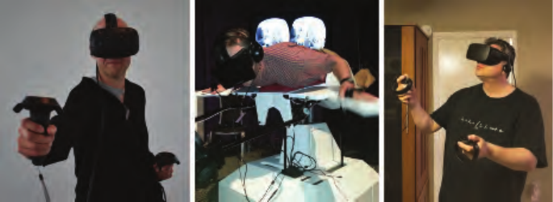

# 21 虚拟现实与增强现实

来源：《Real-Time Rendering, 4th Edition》第21章章首导言，书页915—916（PDF物理页936—937）；正文截至21.1节标题之前。

> “现实就是那种即使你不再相信它，它也不会消失的东西。”
>
> ——菲利普·K. 迪克（Philip K. Dick）

虚拟现实（VR）与增强现实（AR）是试图以真实世界刺激感官的相同方式来刺激你的感官的技术。在计算机图形学领域，增强现实将合成物体融入我们周围的世界；虚拟现实则完全替代这个世界。见图21.1。本章重点介绍这两种技术特有的渲染技术。它们有时被统称为“XR”，其中的X可以代表任意字母。这里的大部分内容将侧重虚拟现实技术，因为在本书写作时，这项技术应用得更为广泛。

渲染只是这些领域的一小部分。从硬件角度来看，系统会使用某种GPU，而这是系统中人们已经相当了解的一部分。系统开发者面临的挑战还包括：制造精确且使用舒适的头部跟踪传感器[994, 995]、有效的输入设备（可能带有触觉反馈或眼动跟踪控制）、舒适的头戴装置和光学器件，以及令人信服的音频效果。在性能、舒适度、活动自由度、价格等因素之间取得平衡，使这一领域的设计极具挑战性。

图21.1　本书前三位作者使用不同的VR系统。Tomas正在使用HTC Vive；Eric身处Birdly仿鸟飞行模拟器中；Naty正在使用Oculus Rift。

我们关注交互式渲染，以及这些技术如何影响图像的生成方式。首先简要介绍当时可用的各种虚拟现实与增强现实系统，随后讨论一些系统的SDK和API所具备的能力及其目标。最后介绍为了获得最佳用户体验，应当避免使用或需要修改的特定计算机图形学技术。
