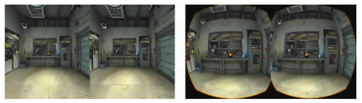
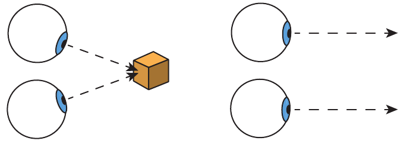

# 21.2 物理要素

来源：《Real-Time Rendering, Fourth Edition》，书页 919—924（PDF 物理页 940—945）。范围从 21.2 标题起，至 21.3 标题前，包含全部下级小节及图 21.3、图 21.4。

本节讨论现代 VR 和 AR 系统的各种组成部分与特性，尤其是与图像显示有关的部分。这些信息提供了一个框架，帮助我们理解厂商所提供工具背后的逻辑。

## 21.2.1 延迟

在 VR 和 AR 系统中，减轻延迟的影响尤其重要，往往是最关键的考虑因素 [5, 228]。第 3 章讨论过 GPU 如何隐藏内存延迟。那种由纹理读取等操作引起的延迟，只涉及整个系统中的一小部分。这里所说的则是整个系统的“运动到光子”（motion-to-photon）延迟。也就是说，假设你开始向左转头：从头部转到朝向某个特定方向的那一刻，到根据该方向生成的视图显示出来，中间经过了多长时间？从检测到用户输入（例如头部朝向）到作出响应（显示新图像），整条链路中每个硬件环节的处理和通信开销累加起来，会产生数十毫秒的延迟。

对于使用普通显示器（即并非贴在脸上的显示器）的系统，延迟最糟糕的后果也不过是令人烦躁，破坏交互感与关联感。对于增强现实和混合现实应用，降低延迟有助于提高“像素黏着性”（pixel stick），也就是场景中的虚拟物体保持附着于现实世界的程度。系统延迟越大，虚拟物体相对于现实世界中对应物体的游移或漂浮感就越明显。对于沉浸式虚拟现实，由于显示画面是唯一的视觉输入，延迟可能引发严重得多的一系列反应。这种反应虽然不是真正的疾病，却被称为模拟器晕动症（simulation sickness），可能导致出汗、头晕、恶心以及更严重的症状。如果你开始感到不适，应立即摘下头戴式显示器（HMD）——你无法靠“硬撑”克服这种不适，只会变得更加难受 [1183]。引用 Carmack 的话 [650]：“别勉强自己。我们可不想在演示室里清理呕吐物。”实际发生呕吐的情况很少，但这些影响仍可能十分严重，使人无力正常活动，而且可能持续长达一天。

在 VR 中，当显示图像与用户的预期，或与其他感官的感知不一致时，就会出现模拟器晕动症；其他感官的一个例子是内耳负责平衡与运动感知的前庭系统。头部运动与正确匹配的显示图像之间的滞后越小越好。一些研究指出，15 ms 的延迟无法被察觉。超过 20 ms 的滞后则肯定能够被感知，并会产生不良影响 [5, 994, 1311]。作为比较，电子游戏从鼠标移动到画面显示，通常有 50 ms 或更长的延迟；关闭垂直同步（vsync）时为 30 ms（第 23.6.2 节）。VR 系统常采用 90 FPS 的显示速率，对应每帧时间为 11.1 ms。在典型的桌面系统上，通过线缆将一帧扫描传输至显示器约需 11 ms，因此，即使能够在 1 ms 内完成渲染，仍然会有 12 ms 的延迟。

应用程序层面有许多技术可以预防或减轻不适 [1089, 1183, 1311, 1802]。这些技术既包括尽量减少视觉流动，例如在向前移动时不要诱导用户向侧面看，以及避免上楼梯；也包括更偏向心理层面的方法，例如播放环境音乐，或渲染一个代表用户鼻子的虚拟物体 [1880]。更加柔和的色彩和较暗的光照也有助于避免模拟器晕动症。让系统的响应符合用户的动作和预期，是提供愉快 VR 体验的关键。举几个指导原则：让所有物体都对头部运动作出响应；不要对相机进行变焦，或以其他方式改变视野；为虚拟世界设置恰当的尺度；不要从用户手中夺走相机控制权。在用户周围设置固定的视觉参照物，例如汽车或飞机的驾驶舱，也能减轻模拟器晕动症。施加给用户的视觉加速度可能造成不适，因此最好采用恒定速度。硬件解决方案也可能有用。例如，三星的 Entrim 4D 耳机会发出微弱的电脉冲，影响前庭系统，从而有可能使用户看到的内容与平衡感所传达的信息相匹配。这项技术是否有效，还有待时间检验，但它说明，为了减轻模拟器晕动症的影响，人们正在开展大量研究与开发工作。

跟踪位姿（tracking pose），或简称位姿（pose），指观看者头部在现实世界中的朝向，以及在能够获取时的位置。位姿用于构造渲染所需的相机矩阵。在一帧开始时，可以使用粗略的位姿预测执行模拟，例如检测角色与环境要素之间的碰撞。在渲染即将开始时，可以获取此时更新的位姿预测，并用它更新相机视图。这一预测会更加准确，因为它获取得更晚，预测的时间跨度也更短。在图像即将显示时，还可以获取另一个更加准确的位姿预测，并利用它对图像进行扭曲变换，使之更好地匹配用户的位置。每一次更晚的预测，都无法完全弥补基于先前不准确预测所作计算的误差；不过，尽可能使用这些更新的预测，可以显著改善整体体验。各种设备中的硬件增强功能，使系统能够在需要的时刻迅速查询并取得更新的头部位姿。

除了视觉以外，还有其他要素能够让与虚拟环境的交互令人信服；但如果图形出现问题，用户即使在最好的情况下，也注定只能得到不愉快的体验。在应用程序中尽量降低延迟、提高真实感，有助于实现沉浸感（immersion）或临场感（presence）：此时，界面的存在感消失，参与者会觉得自己的身体已成为虚拟世界的一部分。

## 21.2.2 光学

要设计精确的物理光学系统，将头戴式显示器上的内容映射到视网膜上的相应位置，成本十分高昂。虚拟现实显示系统之所以能变得经济实惠，是因为 GPU 生成的图像随后会在独立的后处理过程中进行畸变处理，使它们正确地到达我们的眼睛。

VR 系统的透镜向用户呈现具有宽视野的图像，但会产生枕形畸变（pincushion distortion），即图像边缘看起来向内弯曲。通过对每幅生成的图像施加桶形畸变（barrel distortion），就可以抵消这种效应，如图 21.3 右侧所示。光学系统通常还存在色差（chromatic aberration）：透镜像棱镜一样，使各种颜色相互分离。厂商的软件也能补偿这个问题，方法是生成具有反向颜色分离的图像。这相当于施加“反方向”的色差。当这些分离的颜色通过 VR 系统的光学部件显示时，它们会正确地重新组合。在那一对经过畸变处理的图像边缘，可以看到这种校正产生的橙色彩边。

图 21.3：用于在 HTC Vive 上显示的原始渲染目标（左），以及经过畸变处理的版本（右）[1823]。（图片由 Valve 提供。）

显示器可分为滚动式（rolling）和全局式（global）两种 [6]。这两种显示器的图像都通过串行数据流发送。滚动式显示器在接收到数据流时，立即逐条扫描线显示。全局式显示器则在收到整幅图像之后，以一次短暂的闪现显示它。虚拟现实系统中两种类型都有应用，各有优势。全局式显示器必须等待整幅图像到齐后才能显示；与之相比，滚动式显示器能够在结果一旦可用时就将其显示出来，因此可以尽量降低延迟。例如，如果按条带生成图像，就可以在即将显示之前，将刚渲染好的各条带发送出去，这就是“与扫描光束赛跑”（racing the beam）[1104]。其缺点是不同像素在不同时间发光，因此，取决于视网膜与显示器之间的相对运动，看到的图像可能显得摇晃。这类不匹配在增强现实系统中尤其可能令人不适。好在合成器通常会在一组扫描线之间对预测的头部位姿进行插值，以补偿这一问题。这基本上解决了头部快速转动时原本会出现的摇晃或剪切变形，但无法校正场景内运动物体造成的问题。

全局式显示器没有这种时序问题，因为图像在显示之前必须已经完整形成。它面临的挑战在技术层面：要求在一个短促、定时的发光脉冲中完成显示，会排除若干种显示方案。目前，有机发光二极管（OLED）显示器是全局式显示器的最佳选择，因为它们的速度足以跟上 VR 应用中常见的 90 FPS 显示速率。

## 21.2.3 立体视觉

如图 21.3 所示，两幅图像彼此错开，每只眼睛看到不同的视图。这样做会激发立体视觉（stereopsis），即利用双眼产生的深度感知。虽然这是一种重要的效应，但立体视觉会随距离增大而减弱，而且并不是我们感知深度的唯一方式。例如，在普通显示器上观看一幅图像时，我们根本不使用立体视觉。物体大小、纹理图案的变化、阴影、相对运动（视差），以及其他视觉深度线索，仅用一只眼睛也能发挥作用。

图 21.4：双眼为了看见某个物体而转动的程度称为辐辏（vergence）。集合（convergence）是双眼为了对准物体而向内转动的运动，如左图所示。散开（divergence）则是双眼改为观看远处物体时向外转动的运动；这里的远处物体位于页面右边缘之外。观看远处物体时，两条视线实际上近似平行。

为了使某个物体清晰成像，眼睛必须调整形状的程度，称为调节需求（accommodative demand）。例如，Oculus Rift 的光学效果，相当于观看位于用户前方约 1.3 米处的屏幕。双眼为了对准某个物体而需要向内转动的程度，称为辐辏需求（vergence demand），见图 21.4。在现实世界中，双眼改变晶状体形状和向内转动这两件事会同步发生，这种现象称为调节—集合反射（accommodation-convergence reflex）。使用显示器时，调节需求保持恒定，但辐辏需求会随着双眼注视不同感知深度处的物体而变化。这种不匹配可能引起眼疲劳，因此 Oculus 建议，将用户会长时间观看的物体放置在大约 0.75 至 3.5 米远的位置 [1311, 1802]。在某些 AR 系统中，这种不匹配还可能影响感知。例如，用户可能先对现实世界中的远处物体对焦，随后又必须重新对焦，以看清与该物体相关联、却位于眼睛附近固定深度处的虚拟公告牌。能够根据用户眼球运动调整感知焦距的硬件，有时称为自适应对焦（adaptive focus）或变焦（varifocal）显示器，目前有多个团队正在开展相关研发 [976, 1186, 1875]。

为 VR 和 AR 生成立体图像对的规则，与单显示器系统不同；后者通过某种技术（偏振镜片、快门眼镜或多视图显示光学系统），从同一块屏幕向每只眼睛呈现不同的图像。在 VR 中，每只眼睛都有独立的显示器，因此各显示器都必须放置在恰当的位置，使投射到视网膜上的图像与现实情况紧密吻合。两眼之间的距离称为瞳距（interpupillary distance，IPD）。一项针对 4000 名美国陆军士兵的研究发现，瞳距在 52 mm 到 78 mm 之间，平均为 63.5 mm [1311]。VR 和 AR 系统具备用于确定用户瞳距并据此调整的校准方法，从而改善图像质量与舒适度。系统的 API 控制着包含这一瞳距参数的相机模型。最好避免为了实现某种效果而改变用户感知到的瞳距。例如，增大双眼间距可能增强深度感，但也可能造成眼疲劳。

从零开始正确实现头戴式显示器的立体渲染，是一项颇具挑战的工作。好消息是，为每只眼睛设置并使用正确相机变换的过程，大部分都由 API 负责，而这正是下一节的主题。
