# 22.2 定义与工具

来源：原书第 943—948 页（PDF 物理页 964—969），从 22.2 节标题起至 22.3 节标题前；包括全部正文、图 22.1—22.6、公式（22.1）—（22.4）及原注 1。

本节介绍对本章整体都有用的记号与定义。

射线 **r**(t) 由起点 **o** 和方向向量 **d** 定义（为方便起见，方向向量通常会归一化，因此 ‖**d**‖ = 1）。其数学表达式见式（22.1），示意见图 22.1：

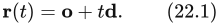

标量 t 是用于生成射线上不同点的变量。t 小于零的点称为位于射线起点后方（因此不属于射线），t 为正的点位于起点前方。另外，由于射线方向已经归一化，一个 t 值所生成的射线上的点，与射线起点之间的距离为 t 个距离单位。

实际使用中，我们通常还保存一个当前距离 l，表示希望沿射线搜索的最大距离。例如，拾取时通常希望找到沿射线最近的交点；比这个交点更远的物体可以放心忽略。

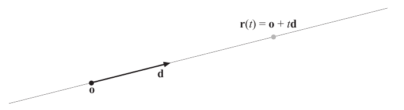

**图 22.1** 一条简单的射线及其参数：**o**（射线起点）、**d**（射线方向），以及用来生成射线上不同点的 t；**r**(t) = **o** + t**d**。

距离 l 的初值为 ∞。每当成功求得与物体的交点时，就用交点距离更新 l。一旦设定 l，射线在测试中就成为一条线段。在下面要讨论的射线／物体相交测试中，我们通常不把 l 纳入讨论。如果希望使用 l，只需要先执行普通的射线／物体测试，再将 l 与算出的交点距离比较，并采取适当的操作。

讨论曲面时，我们区分隐式曲面与显式曲面。隐式曲面由式（22.2）定义：

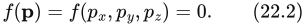

这里，**p** 是曲面上的任意一点。这意味着，把曲面上的一点代入 f，结果就是 0；否则，f 的结果就不为零。隐式曲面的一个例子是 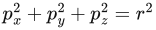，它描述了一个位于原点、半径为 r 的球面。容易看出，这可以改写成 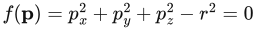，因此它确实是隐式的。第 17.3 节简要介绍了隐式曲面；Gomes 等人 [558] 和 de Araújo 等人 [67] 则全面讨论了使用多种隐式曲面进行建模与渲染的方法。

另一方面，显式曲面由向量函数 **f** 和一些参数 (ρ, φ) 定义，而不是用曲面上的点来定义。这些参数产生曲面上的点 **p**。下面的式（22.3）给出了基本思路：

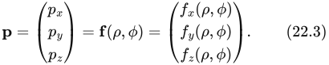

显式曲面的一个例子仍然是球面，不过这次以球坐标表示，其中 ρ 为纬度，φ 为经度，如式（22.4）所示：

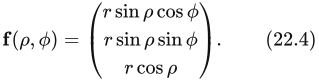

> 译注：原文将 ρ 称为 latitude（纬度）。按式（22.4）本身，ρ 实际是从正 z 轴量起的极角（余纬），而不是从赤道平面量起的通常意义的纬度；这里保留原文表述及公式，并指出这一术语疑点。

再举一个例子，三角形 △ 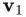 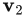 可以写成如下显式形式：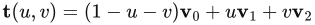，其中必须满足 u ≥ 0、v ≥ 0 和 u + v ≤ 1。

最后，我们给出球体以外的一些常见包围体的定义。

**定义。** 轴对齐包围盒（axis-aligned bounding box，也称矩形盒），简称 AABB，是各面法线与标准基的坐标轴重合的盒体。例如，一个 AABB A 可由两个对角点  和  描述，其中 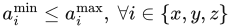。

图 22.2 给出了三维 AABB 及其记号的示意图。

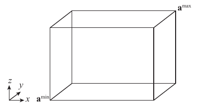

**图 22.2** 三维 AABB A，图中给出了它的极值点  和 ，以及标准基的坐标轴。

**定义。** 有向包围盒（oriented bounding box），简称 OBB，是各面法线两两正交的盒体，也就是经过任意旋转的 AABB。一个 OBB B 可以用盒体中心点 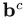 和三个归一化向量 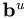、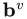、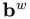 描述，这些向量给出盒体各边的方向。它们各自为正值的半长度记作 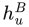、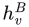 和 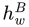，即从  到对应面中心的距离。

> 译注：原文“各面法线两两正交”表述不严谨；盒体相对面的法线彼此平行或反向，三组相对面的法线方向之间才两两正交。其后给出的三个轴向向量明确了定义意图。

图 22.3 给出了三维 OBB 及其记号。

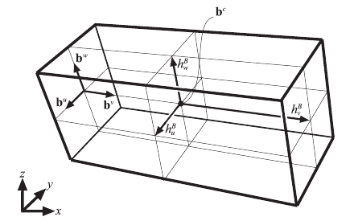

**图 22.3** 三维 OBB B，图中给出了中心点 ，以及归一化、指向各轴正向的边向量 、、。图中所示的边半长度 、 和 ，是从盒体中心到各面中心的距离。

**定义。** k-DOP（离散有向多面体，discrete oriented polytope）由 k/2 个归一化法线（方向）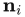 定义，其中 k 为偶数，1 ≤ i ≤ k/2。每个  关联两个标量值 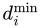 和 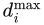，满足 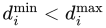。每个三元组 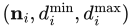 描述一个厚平板 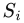，即两个平面 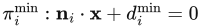 与 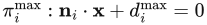 之间的体积；所有厚平板的交集 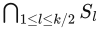 就是实际的 k-DOP 体积。k-DOP 定义为包围物体的最紧密的一组厚平板 [435]。AABB 和 OBB 均可表示为 6-DOP，因为它们各自由三个厚平板定义六个平面。图 22.4 展示了二维情形下的一个 8-DOP。

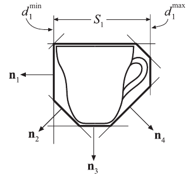

**图 22.4** 茶杯的二维 8-DOP 示例，图中显示了所有法线 ，以及第一个厚平板 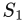 和它的“尺寸”：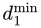 与 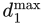。

为了定义凸多面体，引入平面的半空间概念很有帮助。正半空间包括所有满足 **n** · **x** + d ≥ 0 的点 **x**，负半空间则为 **n** · **x** + d ≤ 0。

**定义。** 凸多面体是由 p 个平面的负半空间的交集定义的有限体积，其中每个平面的法线均指向多面体外部。

AABB、OBB、k-DOP，以及任意视锥体，都是凸多面体的特殊形式。更复杂的 k-DOP 和凸多面体主要用于碰撞检测算法，因为计算底层网格的精确相交可能代价高昂。构成这些包围体的额外平面能够从包围物体的体积中进一步削去多余部分，因此可能值得付出额外的开销。

另外两种值得关注的包围体是线段扫掠球体和矩形扫掠球体。它们也分别更常被称为胶囊体（capsule）和扁圆体（lozenge），示例见图 22.5。

分离轴指定这样一条直线：两个不重叠（不相交）的物体在这条直线上的投影也不重叠。同样，如果可以在两个三维物体之间插入一个平面，该平面的法线就定义了一条分离轴。下面给出一种重要的相交测试工具 [576, 592]，它适用于 AABB、OBB 和 k-DOP 等凸多面体。这是分离超平面定理 [189] 的一种情形。注1

**注1：** 在计算机图形学中，这个测试有时被称为“分离轴定理”；我们在本书前几版中也助长了这种误称的传播。它本身并不是一个定理，而是分离超平面定理的一个特例。

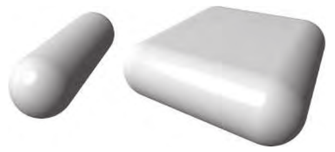

**图 22.5** 线段扫掠球体与矩形扫掠球体，也称胶囊体与扁圆体。

**分离轴测试（SAT）。** 对任意两个互不相交的凸多面体 A 和 B，至少存在一条分离轴，使这两个多面体在该轴上的投影（形成轴上的区间）也互不相交。如果其中一个物体是凹的，这一结论就不成立。例如，井壁与井内的水桶可能并不接触，但没有任何平面能将它们分开。此外，如果 A 和 B 互不相交，那么它们就可以由一条与下列某项正交的轴分开（也就是说，可以由一个与该项平行的平面分开）[577]：

1. A 的一个面。
2. B 的一个面。
3. 从两个多面体各取的一条边（例如，利用叉积）。

前两项测试表明：如果一个物体完全位于另一个物体的某个面的外侧，那么它们就不可能重叠。在前两项测试处理各个面之后，最后一项测试以物体的边为依据。为了通过第三项测试把物体分开，我们希望插入一个尽可能靠近两个物体的平面（其法线就是分离轴）；这个平面最靠近一个物体时，也只能贴着它的一条边。因此，要测试的每一条分离轴，都是由分别来自这两个物体的一条边的叉积形成的。图 22.6 以两个盒体说明了这个测试。

注意，这里对凸多面体的定义较为宽泛。线段和三角形这样的凸多边形也算凸多面体（不过是退化的，因为它们不围成任何体积）。线段 A 没有面，因此第一项测试就不再需要。第 22.12 节推导三角形／盒体重叠测试，以及第 22.13.5 节推导 OBB／OBB 重叠测试时，都使用了这个测试。Gregorius [597] 指出，对任何使用分离轴的相交测试，都可以采用一项重要优化：时间连贯性。如果本帧找到了一条分离轴，就存储该轴，并在下一帧对这一对物体首先测试它。

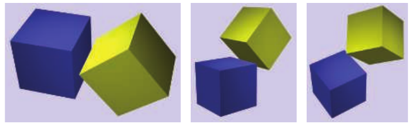

**图 22.6** 分离轴。将蓝色盒体称为 A，黄色盒体称为 B。第一幅图中，B 完全位于 A 的右侧面的右方；第二幅图中，A 完全位于 B 的左下面的下方。第三幅图中，没有哪个面所在的平面能将另一个盒体完全排除在外，因此，用 A 的右上边和 B 的左下边的叉积形成一条轴，便可确定分隔两个物体的平面的法线。

回到可用方法的讨论，一种常见的相交测试优化技巧，是在一开始就做一些简单计算，以确定射线或物体是否会错过另一个物体。这种测试称为排除测试（rejection test）；如果测试成功，就称相交被排除。

本章经常使用的另一种方法，是将三维物体投影到“最佳”的正交平面（xy、xz 或 yz）上，改为在二维空间中求解问题。

最后，由于数值计算不精确，相交测试中经常使用一个极小的数。这个数记为 ε（epsilon），其取值因测试而异。不过，人们往往只是选择一个能解决程序员手头问题案例的 ε（Press 等人 [1446] 称之为“方便的虚构”），而没有仔细分析舍入误差并相应调整 ε。把这样的代码用于另一种场景时，很可能因条件不同而失效。Ericson 的著作 [435] 在几何计算的背景下深入讨论了数值鲁棒性。在充分强调这一注意事项之后，我们有时仍会尝试给出一些 ε，使它们至少能够作为“正常”数据的合理初值：这些数据尺度较小（例如小于 100、大于 0.1），并且接近原点。
