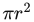
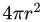
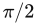
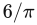
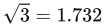

# 22.4 几何概率

原书页码：953—954（PDF 第 974—975 页）。本节从“22.4 Geometric Probability”开始，至“22.5 Rules of Thumb”标题之前结束。

常见的几何运算包括判断一个平面或一条射线是否与物体相交，以及一个点是否位于物体内部。与此相关的一个问题是：一个点、一条射线或一个平面与物体相交的相对概率是多少？空间中一个随机点位于物体内部的相对概率相当直观：它与物体的体积成正比。因此，一个 1 × 2 × 3 的盒子包含某个随机选取点的可能性，是一个 1 × 1 × 1 盒子的 6 倍。

对于空间中的任意一条射线，它与一个物体相交的可能性，相对于与另一个物体相交的可能性是多少？这个问题与另一个问题有关：采用正交投影时，一个任意朝向的物体平均会覆盖多少个像素？正交投影可以看作视景体内的一组平行射线，每个像素都有一条射线穿过。给定一个朝向随机的物体，它覆盖的像素数就等于与它相交的射线数。

答案出人意料地简单：任何凸实体的平均投影面积，都是其表面积的四分之一。对于屏幕上的球体，这一点显然成立：它的正交投影始终是面积为  的圆，而它的表面积为 。对于其他任意朝向的凸物体，例如盒子或 k-DOP，其平均投影面积也满足相同的比例关系。非形式化的证明可参见 Nienhuys 的文章 [1278]。

球体、盒子或其他凸物体，在其覆盖的每个像素处总有一个正面和一个背面，因此深度复杂度为二。这种概率度量可以推广到任意多边形，因为一个（双面）多边形的深度复杂度始终为一。因此，任意多边形的平均投影面积都是其表面积的一半。

在光线追踪文献中，这种度量称为**表面积启发式**（surface area heuristic，SAH）[71, 1096, 1828]，它对于为数据集构建高效的可见性结构十分重要。其用途之一是比较包围体的效率。例如，与一个内接于球体的立方体（即各顶点都与球面接触的立方体）相比，球体被射线击中的相对概率为 1.57（）。同样，与内接于立方体的球体相比，立方体被击中的相对概率为 1.91（）。这类概率度量可以用于细节层次计算等领域。例如，设想一个细长物体，它覆盖的像素远少于一个形状较圆的物体，但两者的包围球大小相同。通过包围盒的表面积预先得知命中比例后，就可以认为这个细长物体在视觉影响方面的相对重要性较低。

现在我们知道，点被包含的概率与体积有关，而射线相交的概率与表面积有关。平面与盒子相交的可能性，和盒子在三个维度上的尺寸之和成正比 [1580]。这个和称为物体的**平均宽度**（mean width）。例如，边长为 1 的立方体，其平均宽度为 1 + 1 + 1 = 3。盒子的平均宽度与它被平面击中的可能性成正比。因此，1 × 1 × 1 的盒子对应度量值 3，而 1 × 2 × 3 的盒子对应度量值 6，这意味着后者被任意平面相交的可能性是前者的两倍。

不过，这个和大于真正的**几何平均宽度**（geometric mean width）；后者是指遍历物体所有可能的朝向时，它沿某一固定轴的投影长度的平均值。在不同类型的凸物体之间，并不存在类似表面积那样简单的关系，可供计算平均宽度。直径为 d 的球体，其几何平均宽度就是 d，因为无论朝向如何，球体沿该轴跨越的长度都相同。关于这个话题，我们最后只说明一点：将盒子的各维尺寸之和（即这里所说的平均宽度）乘以 0.5，就得到它的几何平均宽度；这个值可以直接与球体的直径比较。因此，度量值为 3 的 1 × 1 × 1 盒子，其几何平均宽度为 3 × 0.5 = 1.5。包围这个盒子的球体，其直径为 。因此，包围立方体的球体被任意平面相交的可能性，是该立方体的 1.732/1.5 = 1.155 倍。

这些关系有助于判断各种算法能带来多大的收益。视锥体剔除尤其适合应用这些关系，因为它涉及平面与包围体的相交测试。另一个用途是确定：对于一个包含物体的 BSP 节点，是否应当划分，以及在哪里划分最佳，从而改善视锥体剔除的性能（第 19.1.2 节）。
