# 22.6 射线与球体相交

来源：原书第955—959页（PDF物理页976—980），从22.6节标题起至22.7节标题前，包含22.6.1与22.6.2全部内容。

我们先从一个数学上简单的相交测试开始，即射线与球体的相交测试。后面将会看到，只要开始从相关几何关系着眼，就能让直接的数学解法变得更快 [640]。

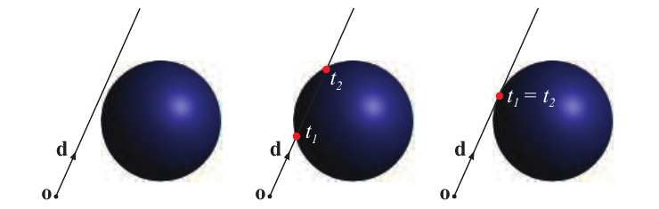

**图22.10** 左图中的射线未命中球体，因此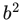 − c < 0。中图中的射线与球体相交于两点（b² − c > 0），这两个点由标量与确定。右图表示 − c = 0的情况，此时两个交点重合。

## 22.6.1 数学解法

球体可由球心 **c** 和半径r定义。因此，与前面介绍的表达式相比，球体有一个更紧凑的隐式公式：


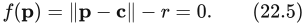


其中，**p** 是球面上的任意一点。为求射线与球体的交点，只需用射线 **r**(t) 替换式（22.5）中的 **p**，得到


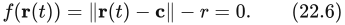


利用式（22.1），即 **r**(t) = **o** + t**d**，可将式（22.6）化简如下：


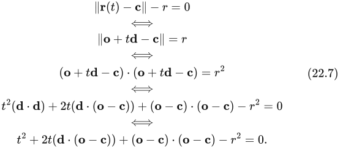


最后一步利用了 **d** 已归一化这一假设，即 **d** · **d** = ‖**d**‖² = 1。所得方程是二次多项式，这并不令人意外；这意味着，如果射线与球体相交，最多会有两个交点，见图22.10。如果方程的解为虚数，那么射线未命中球体；否则，可以把两个解和代入射线方程，计算球面上的交点。

得到的式（22.7）可写成二次方程：


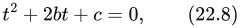


其中b = **d** · (**o** − **c**)，c = (**o** − **c**) · (**o** − **c**) − 。这个二次方程的解如下：


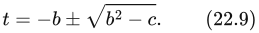


注意，如果 − c < 0，射线就未命中球体，此时可以判定不相交，并省去后续计算（例如开平方以及一些加法）。若通过此测试，就可以计算 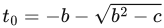 和 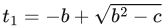。还需要再做一次比较，找出与中最小的正值。关于另一种数值上更稳定的二次方程求解方法，可参阅realtimerendering.com上的碰撞检测章节 [1446]。

如果改从几何角度审视这些计算，就能发现更好的排除测试。下一小节介绍这样的一个例程。

## 22.6.2 优化解法

对于射线与球体相交的问题，我们首先注意到，射线起点后方的交点并不是所需的。例如，拾取通常就是如此。为了及早检查这一情况，先计算向量 **l** = **c** − **o**，它是从射线起点指向球心的向量。所用的全部记号见图22.11。同时计算该向量的长度平方，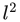 = **l** · **l**。如果 < ，就表明射线起点位于球体内部，这又意味着射线必定命中球体；若只想检测射线是否命中球体，此时即可退出；否则继续。接下来，计算 **l** 在射线方向 **d** 上的投影：s = **l** · **d**。

现在进行第一个排除测试：如果s < 0，并且射线起点在球体外部，那么球体位于射线起点后方，可以判定不相交。否则，利用勾股定理计算球心到投影点的距离平方：m² = l² − s²。第二个排除测试比第一个更简单：若m² > ，射线肯定未命中球体，可以放心省去其余计算。如果球体和射线通过了这最后一个测试，那么射线必定命中球体；如果只关心是否命中，此时便可退出。

为了求出实际交点，还需要做一点工作。首先计算距离平方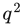 =  − 。注2 见图22.11。由于 ≤ ，因此大于或等于零，这意味着可以计算 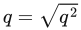。最后，到交点的距离为t = s ± q，其解的形式与前面数学解法一节中得到的二次方程解十分相似。

**注2：** 可以只计算一次标量，并将它存储在球体的数据结构中，以求进一步提高效率。实际上，这样的“优化”也可能更慢，因为它需要访问更多内存，而内存访问是影响算法性能的主要因素之一。

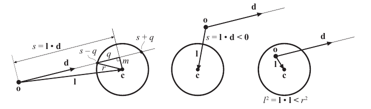

**图22.11** 优化的射线与球体相交测试所用的几何记号。左图中，射线与球体相交于两点，沿射线到这两点的距离为t = s ± q。中图展示了球体位于射线起点后方时作出的排除判定。最后，右图中的射线起点位于球体内部，此时射线总会命中球体。

如果只关心第一个正向交点，那么，射线起点位于球体外部时，应采用 = s − q；起点位于内部时，应采用 = s + q。将相应的t值代入射线方程（式（22.1）），即可得到实际交点。

优化版本的伪代码如下。该例程返回一个布尔值：射线未命中球体时为REJECT，否则为INTERSECT。如果射线与球体相交，还会返回从射线起点到交点的距离t，以及交点 **p**。

```text
RaySphereIntersect(o, d, c, r)
返回 ({REJECT, INTERSECT}, t, p)
 1: l = c − o
 2: s = l · d
 3: l² = l · l
 4: 如果 (s < 0 且 l² > r²)，返回 (REJECT, 0, 0);
 5: m² = l² − s²
 6: 如果 (m² > r²)，返回 (REJECT, 0, 0);
 7: q = √(r² − m²)
 8: 如果 (l² > r²)，t = s − q
 9: 否则 t = s + q
10: 返回 (INTERSECT, t, o + td);
```

注意，在第3行之后，可以测试 **p** 是否位于球体内部；如果我们只想知道射线与球体是否相交，那么在相交时，例程即可终止。译注1 此外，第6行之后，射线就保证会命中球体。如果进行运算次数统计（计算加法、乘法、比较及类似操作的次数），会发现，在完整执行至结束的情况下，几何解法与前面给出的代数解法大致相当。重要的差别在于，排除测试在计算过程中的执行时机提前了许多，因此，该算法的平均总成本更低。

对于射线与其他一些二次曲面及混合物体之间的求交，也有优化过的几何算法。例如，已有针对圆柱 [318, 713, 1621]、圆锥 [713, 1622]、椭球、胶囊体以及圆角矩形体（lozenge）[404] 的方法。

**译注1：** 原文此处写作“测试p是否在球体内部”，但依前文定义，p是尚未求出的交点；第3行计算的是射线起点o到球心的距离平方。因此这里疑应指测试起点o是否在球体内部。译文保留原文点名，不暗改。另，原文前段及图22.10用、标记两个交点，而式（22.9）后的正文改用、；本译文也保留该编号变化。二次方程中的标量c与粗体球心向量c同名，按原书字体区分。
