# 22.7 射线与盒相交

来源：原书第 959—962 页（PDF 第 980—983 页）。范围从 22.7 节标题开始，到 22.8 节标题之前，包含 22.7.1 和 22.7.2。

下面给出三种判断射线是否与实心盒相交的方法。第一种同时处理轴对齐包围盒（AABB）和有向包围盒（OBB）。第二种是一种通常更快的变体，但只能处理较简单的 AABB。第三种基于第 947 页的分离轴测试，只处理线段与 AABB 的相交问题。这里使用第 22.2 节中包围体（BV）的定义和记号。

> 译注：原文此处写“三种方法”，但本节实际只设置了“平板法”和“射线斜率法”两个下级小节；分离轴测试在平板法的优化讨论中被提及。此处保留原文陈述，不另补写第三种算法。

## 22.7.1 平板法

一种射线与 AABB 相交的方案基于 Kay 和 Kajiya 的平板法（slab method）[640, 877]，该方法又受到 Cyrus–Beck 线裁剪算法的启发 [319]。

我们将这一方案扩展到更一般的 OBB 包围体。它返回最近的正 t 值，也就是从射线原点 **o** 到交点的距离（如果存在交点）。在介绍一般情形之后，我们再讨论针对 AABB 的优化。解决问题的途径是：计算射线与 OBB 各个面所在平面相交时的所有 t 值。把盒看成三个平板的集合；图 22.12 左侧用二维情况说明了这一点。对每个平板，都有最小和最大的 t 值，分别称为 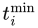 和 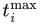，其中 i ∈ {u, v, w}。下一步是计算式（22.10）中的变量：


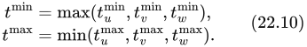


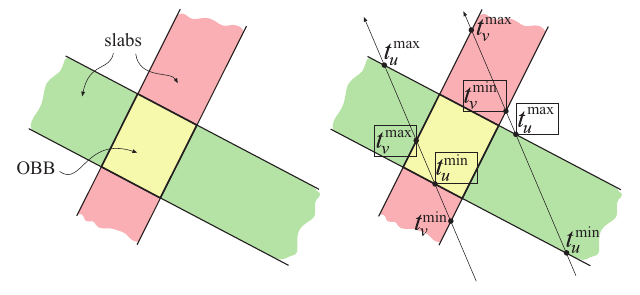

**图 22.12。** 左图展示由两个平板构成的二维 OBB，右图展示两条接受 OBB 相交测试的射线。图中标出了所有 t 值，绿色平板使用下标 u，橙色平板使用下标 v。极端的 t 值用方框标出。左边的射线击中 OBB，因为 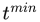 < 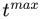；右边的射线未击中，因为  < 。

现在来看这个巧妙的测试：如果  ≤ ，那么射线所定义的直线与盒相交；否则不相交。换句话说，我们求出每个平板的近交点距离和远交点距离。如果所得“近”距离中最远的一个，小于或等于“远”距离中最近的一个，那么射线所定义的直线就击中了盒。仔细观察图 22.12 右侧的示意图，便可以理解这一点。这两个距离定义了直线上的交点，所以，如果最近的“远”距离非负，那么射线本身就击中了盒，也就是说，盒没有位于射线后方。

下面给出 OBB（A）与射线（由式（22.1）描述）之间的射线/OBB 相交测试伪代码。代码返回一个布尔值，表示射线是否与 OBB 相交（INTERSECT 或 REJECT），还返回到交点的距离（如果存在交点）。回顾一下：对于 OBB A，中心记为 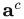，、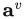 和  是盒各边的归一化方向；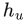、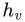 和 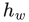 是正的半长度，即从中心到盒面的距离。

```text
RayOBBIntersect(o, d, A)
返回 ({REJECT, INTERSECT}, t);
 1: tᵐⁱⁿ = −∞
 2: tᵐᵃˣ = ∞
 3: p = aᶜ − o
 4: 对每个 i ∈ {u, v, w}
 5:     e = aⁱ · p
 6:     f = aⁱ · d
 7:     if (|f| > ϵ)
 8:         t₁ = (e + hᵢ)/f
 9:         t₂ = (e − hᵢ)/f
10:         if (t₁ > t₂) swap(t₁, t₂);
11:         if (t₁ > tᵐⁱⁿ) tᵐⁱⁿ = t₁
12:         if (t₂ < tᵐᵃˣ) tᵐᵃˣ = t₂
13:         if (tᵐⁱⁿ > tᵐᵃˣ) return (REJECT, 0);
14:         if (tᵐᵃˣ < 0) return (REJECT, 0);
15:     else if (−e − hᵢ > 0 or −e + hᵢ < 0) return (REJECT, 0);
16: if (tᵐⁱⁿ > 0) return (INTERSECT, tᵐⁱⁿ);
17: else return (INTERSECT, tᵐᵃˣ);
```

第 7 行检查射线方向是否不垂直于当前受测平板的法线方向。换句话说，它测试射线是否不平行于平板的两个平面，从而能够与它们相交。注意，这里的 ϵ 是一个极小的数，数量级约为 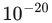，其作用仅仅是避免除法发生溢出。第 8 行和第 9 行都要除以 f；在实际实现中，通常先计算一次 1/f，再乘以这个值会更快，因为除法往往开销很大。第 10 行确保  与 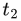 中的较小值存储在  中，因此较大值存储在  中。实际实现并不一定要进行交换；可以在该分支中重复第 11 行和第 12 行，并在那里调换  与  的位置。如果第 13 行返回，那么射线没有击中盒；类似地，如果第 14 行返回，那么盒位于射线原点后方。射线平行于平板、因而不能与其相交时，会执行第 15 行；这一行测试射线是否位于平板之外。若是，射线便没有击中盒，测试结束。为了进一步加快代码，Haines 讨论了一种展开循环的方法，可以借此省去一些代码 [640]。

还有一项测试没有写进伪代码，但值得加入实际代码中。如定义射线时所述，我们通常希望找到最近的物体。因此，在第 15 行之后还可以测试  ≥ l 是否成立，其中 l 是当前射线长度。这实际上把射线当作线段处理。如果新交点并不更近，就拒绝这一相交结果。这项测试可以推迟到整个射线/OBB 测试完成之后，但在循环内部尝试提前拒绝通常效率更高。

对于 OBB 恰好是 AABB 的特殊情况，还有其他优化。第 5 行和第 6 行变为 e =  和 f = ，这会使测试更快。通常在第 8 行和第 9 行使用 AABB 的角点 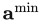 和 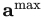，从而省去加法和减法。Kay 和 Kajiya [877] 以及 Smits [1668] 指出，通过允许除以 0 并正确解释处理器的结果，可以省去第 7 行。Kensler [1629] 给出了这一测试的精简版本代码。Williams 等人 [1887] 提供了正确处理除以 0 的实现细节，以及其他优化。Aila 等人 [16] 展示了在某些 NVIDIA 架构上，如何用单次 GPU 操作完成“最小值中的最大值”测试，或者反过来的测试。也可以使用分离轴测试（SAT）推导射线与盒的测试，但这样得到的结果不包含相交距离，而相交距离往往很有用。

平板法的推广形式可用于计算射线与 k-DOP、视锥体或任意凸多面体的相交；网上提供了代码 [641]。

## 22.7.2 射线斜率法

2007 年，Eisemann 等人 [410] 提出了一种与盒求交的方法，看起来比此前的方法更快。它不进行三维测试，而是将射线与盒在二维中的三个投影分别进行测试。关键思想是：对每个二维测试，都有两个盒角点界定射线所“看到”的极端范围，类似于模型的轮廓边。要与盒的这一投影相交，射线斜率必须位于由射线原点与这两个点分别定义的两条直线的斜率之间。如果三个投影全部通过这一测试，射线就一定击中盒。这种方法极快，因为一些用于比较的项完全取决于射线自身的数值。只计算一次这些项，随后就能高效地将该射线与大量盒进行比较。此方法可以仅返回是否击中盒，也可以付出少量额外开销，同时返回相交距离。

