# 22.10 平面与盒体相交测试

本节来源：《Real-Time Rendering, 4th Edition》书页 970—972（PDF 物理页 991—993），范围从 22.10 标题开始，到 22.11 标题之前，包含 22.10.1 与 22.10.2。

把一个点代入平面方程 π：**n**·**x** + d = 0，就可以知道该点到平面的距离。所得结果的绝对值就是到平面的距离。因此，平面与球体的测试很简单：把球心代入平面方程，检查结果的绝对值是否小于或等于球体半径。

判断盒体是否与平面相交的一种方法，是把盒体的所有顶点代入平面方程。如果得到的结果既有正值又有负值（或者有零值），就说明顶点位于平面的两侧（或者位于平面上），因而检测到了相交。还有一些更巧妙、更快的测试方法，接下来的两小节将分别介绍针对 AABB 和 OBB 的方法。

这两种方法的共同思想是：八个角点中，只需把两个代入平面方程。对于朝向任意的盒体，无论它是否与平面相交，沿平面法线方向测量时，总有两个互为对角的角点之间距离最大。每个盒体的角点构成四条对角线。把各条对角线的方向与平面法线做点积，最大值就确定了包含这两个最远点的那条对角线。只测试这两个角点，就能完成整个盒体与平面的测试。

## 22.10.1 AABB

假设有一个轴对齐包围盒（AABB）B，由中心点 **c** 和各分量为正的半对角线向量 **h** 定义。注意，利用 B 的最小角点与最大角点，可以很容易地求出 **c** 和 **h**，即

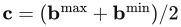，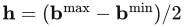。

现在，要测试 B 与平面 **n**·**x** + d = 0 的关系。有一种快得令人惊讶的方法可以完成这一测试。其思想是计算盒体投影到平面法线 **n** 上的“延伸范围”，这里记作 e。理论上，可以把盒体八条不同的半对角线全部投影到法线上，再选出最长的一条。不过，实际实现时可以用下面的式子快速求得：


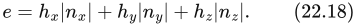


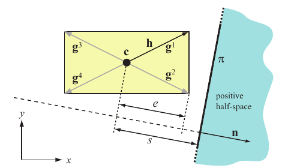

**图 22.18** 对一个中心为 **c**、正半对角线为 **h** 的轴对齐盒体进行与平面 π 的测试。其思想是计算盒体中心到平面的有符号距离 s，并将其与盒体的“延伸范围” e 比较。向量 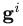 是二维盒体中各条可能的对角线，本例中 **h** 等于 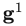。还要注意，有符号距离 s 为负，而且其绝对值大于 e，这表明盒体位于平面内侧（s + e < 0）。图中的 positive half-space 表示“正半空间”。

为什么这等价于求八条不同半对角线投影的最大值？这八条半对角线是以下组合：

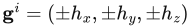，

我们要对全部八个 i 计算 ·**n**。当点积的每一项都为正时，·**n** 取得最大值。对于 x 项，当 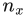 与  同号时就会如此；不过，既然已知  为正，就可以把这一项的最大值计算为 ||。对 y 和 z 也这样做，就得到了公式（22.18）。

接下来，计算中心点 **c** 到平面的有符号距离 s，计算式为 s = **c**·**n** + d。图 22.18 展示了 s 和 e。假设平面的“外侧”是正半空间，那么只需测试 s − e > 0；若成立，就说明盒体完全位于平面外侧。类似地，s + e < 0 表示盒体完全位于内侧。否则，盒体与平面相交。这项技术基于 Ville Miettinen 的思想及其巧妙实现。伪代码如下：

```text
PlaneAABBIntersect(B, π)
returns({OUTSIDE, INSIDE, INTERSECTING});
1 : c = (bᵐᵃˣ + bᵐⁱⁿ)/2
2 : h = (bᵐᵃˣ − bᵐⁱⁿ)/2
3 : e = hₓ|nₓ| + hᵧ|nᵧ| + h[z]|n[z]|
4 : s = c·n + d
5 : if(s − e > 0) return (OUTSIDE);
9 : if(s + e < 0) return (INSIDE);
10 : return (INTERSECTING);
```

其中 OUTSIDE、INSIDE、INTERSECTING 分别表示外侧、内侧和相交。伪代码中的 c、h、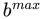、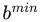 和 n 均为向量；h[z] 与 n[z] 表示相应向量的 z 分量。

## 22.10.2 OBB

对有向包围盒（OBB）进行平面测试，与上一小节的 AABB／平面测试只有细微差别。只需改变盒体“延伸范围”的计算方式，改为


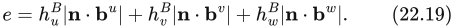


回顾一下，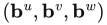 是 OBB 的坐标系轴（参见 22.2 节对 OBB 的定义），而 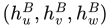 是盒体沿这些轴的长度。

> 译注：本节将 **n**·**x** + d 直接称为有符号距离，隐含了 **n** 为单位法线的条件；若法线未归一化，实际距离还须除以其模长。对盒体分类而言，只要 s 和 e 使用同一法线尺度，文中的比较仍成立。
>
> 译注：原文推导中使用的 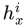，按上下文表示第 i 条半对角线的 x 分量；前文将这条向量记为 ，原文此处符号不统一，译文保留原式。原书伪代码行号从 5 跳到 9，亦原样保留。
>
> 译注：OBB 末段原文写作沿轴的“长度”；依公式（22.19）中从中心向两侧延伸的含义，这些量应按半边长理解，不能代入完整边长。

