# 22.12 三角形与盒的相交

来源：《Real-Time Rendering, Fourth Edition》，书页 974—975（PDF 物理页 995—996）；并核对 PDF 第 997 页以确认节边界及插图归属。

本节介绍一种判定三角形是否与轴对齐盒相交的算法。这种测试可用于体素化和碰撞检测。

Green 和 Hatch [581] 提出了一种算法，可以判定任意多边形是否与盒重叠。Akenine-Möller [21] 基于分离轴测试（第 947 页）开发了一种更快的方法，这就是我们在这里介绍的方法。三角形与球的测试也可以利用这一测试来完成，详情参见 Ericson 的文章 [440]。

我们重点考虑由中心 **c** 和半边长向量 **h** 定义的轴对齐包围盒（AABB），与三角形 Δ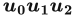 之间的测试。为简化测试，首先平移盒和三角形，使盒的中心位于原点，即 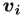 = 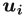 − **c**，i ∈ {0, 1, 2}。图 22.21 展示了这一平移以及所用记号。若要针对有向盒进行测试，则先利用盒变换的逆变换来旋转三角形顶点，再使用这里的测试。根据分离轴测试（SAT），我们测试以下 13 条轴：

1. ［3 次测试］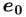 = (1, 0, 0)、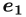 = (0, 1, 0)、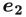 = (0, 0, 1)，即 AABB 的面法线。换句话说，测试该 AABB 与包围三角形的最小 AABB 是否重叠。

2. ［1 次测试］**n**，即 Δ 的法线。我们使用一种快速的平面与 AABB 重叠测试（第 22.10.1 节），它只测试盒的一条体对角线的两个端点；这条体对角线的方向与三角形法线最为接近。

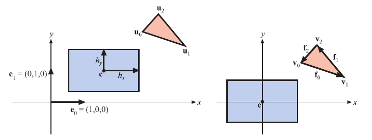

**图 22.21**　三角形与盒重叠测试使用的记号。左图显示盒和三角形的初始位置；右图中，盒和三角形都经过了平移，使盒的中心与原点重合。

3. ［9 次测试］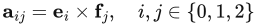，其中 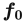 = 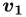 − 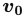、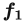 = 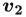 − 、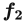 =  − ，也就是边向量。这些测试的形式相似，我们只展示 i = 0 且 j = 0 这一情形的推导（见下文）。

一旦找到分离轴，算法就终止并返回“不重叠”。如果所有测试都通过，也就是说不存在分离轴，那么三角形就与盒重叠。

下面推导步骤 3 中九次测试之一，即 i = 0 且 j = 0 的情形。这意味着 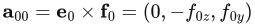。因此，现在需要将三角形顶点投影到 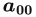（以下称为 **a**）上：

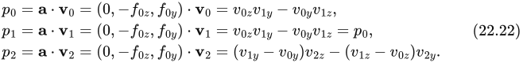

通常，我们需要求 min(, , ) 和 max(, , )，但幸运的是  = ，这简化了计算。现在只需求 min(, ) 和 max(, )，速度会快得多，因为条件语句在现代 CPU 上的开销很大。

将三角形投影到 **a** 上之后，还需要把盒也投影到 **a** 上。盒在 **a** 上投影的“半径”r 按下式计算：

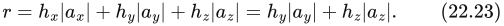

其中，最后一步成立是因为对于这条特定的轴，有 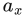 = 0。于是，这条轴上的测试变为：

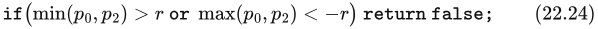

代码可在网上获取 [21]。
