# 22.13 包围体／包围体相交

来源：《Real-Time Rendering, Fourth Edition》，书页 976—981（PDF 物理页 997—1002）。本节包含 22.13.1—22.13.5 的全部内容；图 22.22 位于本节标题之前，但属于本节，亦收录于此。正文止于 22.14 标题之前。

包围体的目的是提供更简单的相交测试，并更高效地排除不相交的情况。例如，要测试两辆汽车是否碰撞，可以先求出它们的包围体（BV），再测试这些包围体是否重叠。如果不重叠，就能保证汽车不会碰撞（这里假定这是最常见的情况）。这样就不必把一辆汽车的每个图元与另一辆汽车的每个图元逐一进行测试，从而节省计算。

测试两个包围体是否重叠是一项基本操作。下面各小节将介绍 AABB、k-DOP 和 OBB 的重叠测试方法。为图元构造包围体的算法见第 22.3 节。

之所以使用比球体和 AABB 更复杂的包围体，是因为更复杂的包围体通常能够更紧密地贴合物体。图 22.22 展示了这一点。当然，也可以使用其他包围体。例如，有时会使用圆柱体和椭球体作为物体的包围体；也可以布置多个球体来包围单个物体 [782, 1582]。

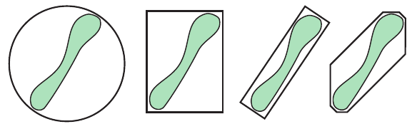

图 22.22．图中展示了同一物体的球体包围体（左）、AABB（中左）、OBB（中右）和 k-DOP（右）；OBB 和 k-DOP 内部的空余空间明显少于另外两种。

对于胶囊体和圆角矩形体（lozenge）包围体，计算最小距离是一项相对快速的操作。因此，它们常用于间距容差验证应用；这类应用希望验证两个或更多物体之间的距离至少达到某个指定值。Eberly [404] 和 Larsen 等人 [979] 为这些类型的包围体推导了公式和高效算法。

## 22.13.1 球体／球体相交

对于球体，相交测试简单而快速：计算两个球心之间的距离；如果该距离大于两个球体的半径之和，就判定不相交，否则它们相交。实现这一算法时，最好比较这两个量的平方，因为所需的只是比较结果。这样就能避免计算平方根这一开销较大的操作。Ericson [435] 给出了同时测试四组独立球体对的 SSE 代码。

## 22.13.2 球体／包围盒相交

Arvo [70] 最早提出了测试球体与 AABB 是否相交的算法，该算法出人意料地简单。其思路是找出 AABB 上距离球心 **c** 最近的点。对 AABB 的三个轴分别进行一次一维测试：将球心在某个轴上的坐标与 AABB 在该轴上的边界比较。如果坐标位于边界之外，就计算球心到包围盒沿该轴的距离（一次减法），并将其平方。对三个轴完成这些操作后，将距离平方之和与球体半径的平方 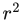 比较。如果前者小于半径平方，则最近点位于球体内部，包围盒与球体重叠。正如 Arvo 所示，可以修改此算法，使其处理空心包围盒、空心球体以及轴对齐椭球体。

Larsson 等人 [982] 提出了该算法的一些变体，其中包括速度快得多的 SSE 向量化版本。他们的关键想法是尽早使用简单的排除测试：可以逐轴进行，也可以一开始就全部进行。排除测试检查球心到包围盒沿某个轴的距离是否大于半径。如果是，就可以提前结束测试，因为球体此时不可能与包围盒重叠。当重叠的可能性较低时，这种提前排除的方法明显更快。下面给出他们的 QRI（quick rejections intertwined，交错快速排除）版本。第 4 行和第 7 行是提前退出测试，必要时可以去掉。

以下伪代码保留原算法的函数名、变量名和行号；OVERLAP 表示“重叠”，DISJOINT 表示“不相交”。

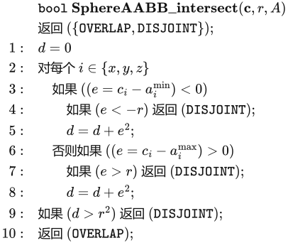

为了实现快速的向量化版本（使用 SSE），Larsson 等人建议消除大部分分支。思路是用下面的表达式同时计算第 3 行与第 6 行：

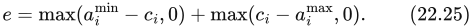

通常，接下来会按 d = d + 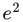 更新 d。不过，使用 SSE 可以针对 x、y、z 并行计算式（22.25）。完整测试的伪代码如下。

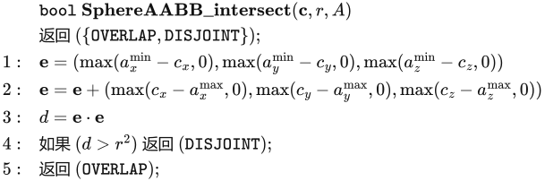

注意，第 1 行和第 2 行可以用并行的 SSE max 函数实现。尽管这一测试没有提前退出，它仍然比其他技术更快。这是因为它消除了分支，并使用了并行计算。另一种 SSE 实现方式是对物体对进行向量化。Ericson [435] 给出了同时将四个球体与四个 AABB 进行比较的 SIMD 代码。

对于球体／OBB 相交测试，先将球心变换到 OBB 的空间中。也就是说，以 OBB 的归一化轴为基，变换球心。此时球心已经相对于 OBB 的各轴表示，因此可以把 OBB 当成 AABB，然后使用球体／AABB 算法测试相交。

Larsson [983] 给出了一种高效的椭球体／OBB 相交测试方法。首先缩放两个物体，使椭球体变成球体，OBB 变成平行六面体。可以利用球体／平板相交测试快速接受或排除。最后，只测试球体与那些朝向它的平行四边形是否相交。

## 22.13.3 AABB／AABB 相交

顾名思义，AABB 是各面与主坐标轴方向对齐的包围盒。因此，只需两个点就足以描述这样的包围体。这里采用第 22.2 节给出的 AABB 定义。

由于简单，AABB 既常用于碰撞检测算法，也常作为场景图中节点的包围体。两个 AABB（A 和 B）的相交测试非常简单，概括如下：

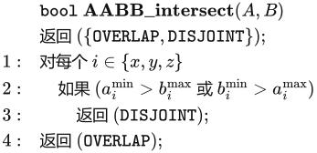

第 1 行和第 2 行遍历全部三个标准坐标轴方向 x、y、z。Ericson [435] 提供了同时测试四组独立 AABB 对的 SSE 代码。

## 22.13.4 k-DOP／k-DOP 相交

一个 k-DOP 与另一个 k-DOP 的相交测试只包含 k/2 次区间重叠测试。Klosowski 等人 [910] 表明，当 k 取适中数值时，两个 k-DOP 的重叠测试比两个 OBB 的测试快一个数量级。书页 946 的图 22.4 展示了一个简单的二维 k-DOP。注意，AABB 是 6-DOP 的一种特例，其法线方向为主坐标轴的正向和负向。OBB 也是 6-DOP 的一种形式，但是只有两个 OBB 具有相同的轴时，才能采用这一快速测试。

下面的相交测试简单而且极快，虽然不精确，但具有保守性。若要测试两个 k-DOP，即 A 和 B（以上标 A 和 B 区分），是否相交，则测试所有相互平行的平板对 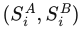 是否重叠；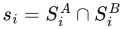 是一维区间重叠测试，很容易求解。这正是第 22.5 节经验法则所建议的降维方法的一个例子：三维平板测试在这里被简化为一维区间重叠测试。

只要出现  = ∅（即空集），就说明这两个包围体不相交，测试随即终止。否则，继续进行平板重叠测试。当且仅当对所有 1 ≤ i ≤ k/2 均有  ≠ ∅ 时，才认为两个包围体重叠。按照分离轴测试（第 22.2 节），还需要分别从两个 k-DOP 中各取一条边，测试与其叉积平行的轴。但是，这些测试的开销通常大于它们带来的性能收益，所以常被省略。因此，如果下面的测试返回 k-DOP 重叠，它们实际上仍有可能不相交。k-DOP／k-DOP 重叠测试的伪代码如下：

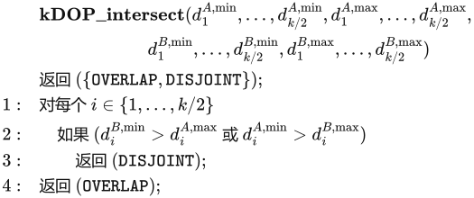

注意，每个 k-DOP 实例只需存储 k 个标量值（法线  是固定的，因此所有 k-DOP 共享一份法线数据）。如果两个 k-DOP 分别平移 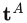 和 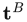，测试只会稍微复杂一点。将  投影到法线  上，例如 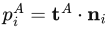（注意，这与任何具体 k-DOP 无关，因此每个  或  只需计算一次），然后在 if 语句中，分别将 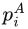 加到 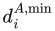 和 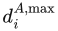 上。对  也做同样的处理。换句话说，平移会改变 k-DOP 沿各法线方向的距离。

Laine 和 Karras [965] 提出了一种称为顶点映射（apex point map）的 k-DOP 扩展。其思路是将一组平面法线映射到 k-DOP 上的各个点，使存储的每个点表示沿对应方向最远的位置。这个点与该方向共同确定一个平面，使模型完全包含在该平面的某个半空间内；也就是说，该点位于模型 k-DOP 的最外端。在测试期间，针对给定方向检索到的顶点可以用于更精确地测试 k-DOP 之间的相交、改善视锥体剔除，以及在旋转之后求得更紧密的 AABB 等。

## 22.13.5 OBB／OBB 相交

本小节简要介绍一种快速测试两个 OBB（A 和 B）是否相交的方法 [436, 576, 577]。该算法采用分离轴测试，比此前使用最近特征或线性规划的方法快大约一个数量级。OBB 的定义见第 22.2 节。

测试在由 A 的中心和各轴构成的坐标系中进行。这意味着原点为 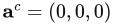，该坐标系的主轴为 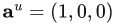、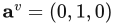 和 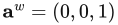。另外，假定 B 相对于 A 的位置由平移 **t** 和旋转矩阵 **R** 给定。

根据分离轴测试，只需找到一条能够将 A 和 B 分开的轴，就能确定它们不相交（不重叠）。需要测试十五条轴：三条来自 A 的面，三条来自 B 的面，还有 3 · 3 = 9 条来自 A 与 B 的边的组合。图 22.23 用二维情形说明了这一过程。

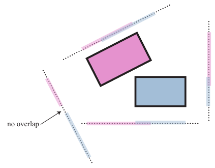

图 22.23．可以使用分离轴测试来判断两个 OBB 是否重叠。这里展示的是二维情形。四条分离轴与两个 OBB 的面正交，每个包围盒对应两条轴。随后将两个 OBB 投影到这些轴上。如果在所有轴上，两者的投影都重叠，那么 OBB 就重叠；否则不重叠。因此，只要找到一条将投影分开的轴，就足以确定 OBB 不重叠。在本例中，左下方的轴是唯一一条能够将投影分开的轴。（图据 Ericson [436] 绘制。）图内“no overlap”意为“不重叠”。

由于矩阵 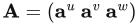 的正交归一性，与 A 的各面正交的候选分离轴就是轴 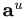、 和 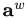。B 也同样如此。其余九条候选轴各由 A、B 的一条边构成，即 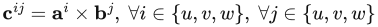。好在网上已有这部分的优化代码 [1574]。

> 译注：原文在球体／AABB 的文字说明中使用“平方和小于半径平方”来描述重叠，而伪代码只在 d >  时返回不相交，因此将 d =  的相切情况归入重叠。此处保留原文的两种表述，不擅自改写其边界条件。
