# 22.14 视锥体相交

来源：《Real-Time Rendering, Fourth Edition》，书页 981—987（PDF 物理页 1002—1008）。本节从 22.14 标题开始，至 22.15 标题之前结束，包含全部下级小节及跨页续文。

如第 19.4 节所述，要快速渲染复杂场景，层次化视锥体剔除至关重要。在遍历包围体层次结构以进行剔除的过程中，调用的少数几种操作之一就是视锥体与包围体之间的相交测试。因此，这些操作对于快速执行极为关键。理想情况下，它们应当确定包围体（BV）是完全位于视锥体内部（包含）、完全位于外部（排除），还是与视锥体相交。

先回顾一下：视锥体是一个被近、远两个相互平行的平面截断的棱锥，由此成为有限的体积。实际上，它变成了一个多面体。图 22.24 展示了这一点，并标出了六个平面的名称：近、远、左、右、上和下。视锥体的体积界定了场景中应当可见、因而应当被渲染的部分（对于棱锥形视锥体，采用透视方式渲染）。

用于层次结构（例如场景图）内部节点以及包围几何体的最常见包围体，是球体、轴对齐包围盒（AABB）和有向包围盒（OBB）。因此，这里将讨论并推导视锥体/球体以及视锥体/AABB/OBB 测试。

为了理解为什么需要外部、内部、相交这三种返回结果，我们来看遍历包围体层次结构时会发生什么。如果发现某个 BV 完全位于视锥体外部，就不再继续遍历该 BV 的子树，其任何几何体都不会被渲染。另一方面，如果 BV 完全位于内部，该子树就不必再计算任何视锥体/BV 测试，所有可渲染的叶节点都会被绘制。对于部分可见的 BV，也就是与视锥体相交的 BV，则递归地对其子树进行视锥体测试。如果该 BV 对应一个叶节点，就必须渲染这个叶节点。

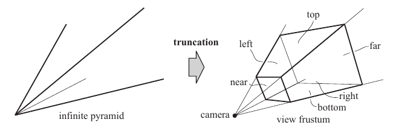

图 22.24：左图是一个无限延伸的棱锥，用相互平行的近、远平面截取它，就构成了视锥体。图中也标出了其余平面的名称；摄像机位于棱锥的顶点。

完整的测试称为排除/包含/相交测试。有时，人们可能认为第三种状态——相交——的计算代价过高。这时，BV 被归类为“可能在内部”。我们把这种简化算法称为排除/包含测试。如果无法成功排除某个 BV，就有两种选择。一种是把“可能在内部”状态当作包含，即渲染 BV 内的所有内容。这通常效率不高，因为不会再进行进一步的剔除。另一种选择是依次对该子树中的每个节点进行排除测试。这种测试也常常没有收益，因为子树中的很大一部分确实可能位于视锥体内部。由于这两种选择都不特别理想，尝试快速区分相交与包含通常是值得的，即使测试并不完美。

必须认识到，对场景图进行剔除时，快速分类测试不必精确，只需保守即可。在区分排除与包含时，唯一的要求是：测试即使出错，也必须偏向包含。也就是说，实际上应当排除的对象，可以被错误地包含进来。这样的错误只会多花一些时间。反过来，应当包含的对象绝不能被快速测试归类为排除，否则就会产生渲染错误。至于包含与相交之间的区分，两种误分类通常都是允许的。如果把完全包含的 BV 归类为相交，就会浪费时间对其子树进行相交测试。如果把相交的 BV 视为完全位于内部，就会因渲染全部对象而浪费时间，其中一些对象原本可以被剔除。

在介绍视锥体与球体、AABB 或 OBB 之间的测试之前，我们先描述视锥体与一般对象之间的一种相交测试方法。图 22.25 展示了这种测试。其思路是把 BV/视锥体测试转化为点/体积测试。首先，选取一个相对于 BV 位置固定的点。然后，让 BV 沿着视锥体外侧移动，在不重叠的前提下尽量靠近视锥体。在移动过程中，跟踪这个相对于 BV 固定的点，其轨迹会形成一个新体积（图 22.25 中以粗边界表示的多边形）。由于 BV 已经尽可能靠近视锥体移动，因此，如果该点在 BV 原始位置所对应的位置落在轨迹形成的体积内，BV 就与视锥体相交，或者位于视锥体内部。因此，我们不再测试 BV 与视锥体的相交，而是测试这个相对于 BV 固定的点是否位于由该点轨迹形成的新体积内。同样，也可以让 BV 沿着视锥体内侧移动，并尽可能靠近视锥体边界。这会描出一个新的、更小的视锥体，其各平面与原视锥体平行 [83]。如果相对于对象固定的点位于这个新体积内，BV 就完全位于视锥体内部。后续小节将利用这种技术推导测试方法。注意，新体积的构造与实际 BV 的位置无关，只取决于该点相对于 BV 的位置以及 BV 的形状。这意味着，可以用相同的这些体积测试处于任意位置的 BV。

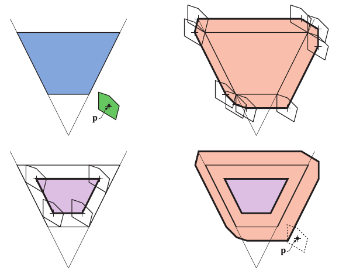

图 22.25：左上图显示了视锥体（蓝色）和一般包围体（绿色），并选取了一个相对于对象位置固定的点 p。让对象沿视锥体的外侧（右上）和内侧（左下）移动，并尽量靠近视锥体，同时跟踪点 p，就可以把视锥体/BV 测试改写为点 p 与外、内两个体积的测试，如右下图所示。如果点 p 位于橙色体积之外，则 BV 位于视锥体之外。如果 p 位于橙色区域内，BV 就与视锥体相交；如果 p 位于紫色区域内，BV 就完全位于视锥体内部。

只需在各个子节点处保存其父 BV 的相交状态，就是一种有用的优化。如果已知父节点完全位于视锥体内部，那么其所有后代都不必再进行视锥体测试。第 19.4 节讨论的平面掩码和时间连贯性技术，也能显著改善对包围体层次结构的测试，不过在 SIMD 实现中，它们的作用较小 [529]。

首先，我们推导视锥体的平面方程，因为这些测试需要用到它们。接着介绍视锥体/球体相交，再解释视锥体/盒体相交。

## 22.14.1 视锥体平面提取

进行视锥体剔除，需要视锥体六个不同侧面的平面方程。这里介绍一种巧妙而快速的推导方法。假设观察矩阵为 **V**，投影矩阵为 **P**，则复合变换为 **M** = **PV**。点 **s**（其中 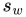 = 1）按 **t** = **Ms** 变换为 **t**。此时，由于透视投影等原因，可能有 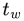 ≠ 1。因此，将 **t** 的所有分量除以 ，得到满足 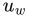 = 1 的点 **u**。对于位于视锥体内部的点，满足 −1 ≤  ≤ 1，其中 i 取 x、y、z；也就是说，点 **u** 位于一个单位立方体内。这适用于 OpenGL 类型的投影矩阵（第 4.7 节）。DirectX 的情况相同，唯一区别是 0 ≤ 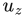 ≤ 1。视锥体的平面可以直接由复合变换矩阵的各行推导出来。

先来看单位立方体左平面右侧的体积，该体积满足 −1 ≤ 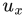。展开如下：

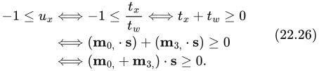

在推导中， 表示 **M** 的第 i 行。最后一步 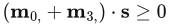 实际上表示视锥体左平面的一个（半）平面方程。这是因为单位立方体中的左平面已被变换回世界坐标。此外，注意  = 1，这使该方程成为一个平面方程。为了使平面的法线指向视锥体外部，必须将方程取反，因为原方程描述的是单位立方体内部。这样就得到视锥体左平面的方程 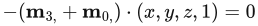。这里改用 (x, y, z, 1)，以采用 ax + by + cz + d = 0 这种形式的平面方程。归纳起来，所有平面为：

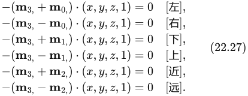

网上提供了在 OpenGL 和 DirectX 中完成这项操作的代码 [600]。

> 译注：式（22.27）按原书保留，其中近平面的表达式对应前文 OpenGL 的深度范围。若采用前文 DirectX 的 0 ≤  ≤ 1，近平面应由 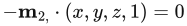 提取。另，后文通过将点代入平面方程获得有符号距离时，平面法线应为单位长度；提取后须相应归一化全部平面系数。

## 22.14.2 视锥体/球体相交

正交视图的视锥体是一个盒体，因此，这种情况下的重叠测试变成了球体/OBB 相交，可以使用第 22.13.2 节介绍的算法求解。要进一步测试球体是否完全位于盒体内部，首先检查球心是否位于盒体沿各坐标轴的边界之间，并且到边界的距离大于球体半径。如果在三个维度上都满足这一条件，球体就被完全包含。关于这一修改算法的高效实现及代码，参见 Arvo 的文章 [70]。

按照推导视锥体/BV 测试的方法，对于任意视锥体，我们选取球心作为要跟踪的点 p，如图 22.26 所示。让半径为 r 的球体沿视锥体内侧和外侧移动，并尽量靠近视锥体，那么点 p 的轨迹就给出了重新表述视锥体/球体测试所需的体积。实际体积见图 22.26 中间部分。与之前一样，如果 p 位于橙色体积之外，球体就在视锥体之外。如果 p 位于紫色区域内，球体就完全位于视锥体内部。如果该点位于橙色区域内，球体就与视锥体的侧面平面相交。通过这种方式，可以进行精确测试。不过，为了提高效率，我们使用图 22.26 右侧所示的近似。这里把橙色体积向外扩展，以避免处理圆角所需的更复杂计算。注意，外部体积由视锥体各平面沿其法线方向向外移动 r 个距离单位构成；内部体积则可以通过将各平面沿法线方向向内移动 r 个距离单位来构造。

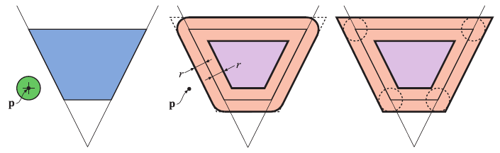

图 22.26：左图显示了一个视锥体和一个球体。精确的视锥体/球体测试，可以表述为对点 p 与中图橙色、紫色体积的测试。右图是对中间体积的一种合理近似。如果球心位于圆角之外，却位于全部外侧平面之内，那么即使球体实际上位于视锥体外部，也会被错误地归类为相交。

假设视锥体的平面方程使正半空间位于视锥体之外。那么，实际实现时将遍历视锥体的六个平面，针对每个平面计算球心到该平面的有符号距离。这通过把球心代入平面方程来完成。如果距离大于半径 r，则球体位于视锥体之外。如果到所有六个平面的距离都小于 −r，则球体位于视锥体内部；否则，球体与视锥体相交。更准确地说，我们把结果报告为球体与视锥体相交，但球心可能位于图 22.26 所示圆角之外的某个尖角区域。这意味着球体实际上位于视锥体之外，但为了保证保守正确性，我们将其报告为相交。

为提高测试精度，可以增加额外的平面，用来测试球体是否在外部。不过，对于快速剔除场景图节点这一用途，偶尔出现的误命中只会引起不必要的测试，并不会导致算法失败；而增加这些测试会使总体耗时更多。第 20.3 节介绍了另一种更准确、但仍不精确的方法，当这些尖角区域的影响显著时，该方法很有用。

在高效着色技术中，视锥体常常高度不对称；书页 895 的图 20.7 描述了一种针对这种情况的特殊方法。Assarsson 和 Möller [83] 提供的方法把视锥体划分为八个卦限，并确定对象中心位于哪个卦限，从而在每次测试中省去三个平面。

## 22.14.3 视锥体/盒体相交

如果视图采用正交投影，即视锥体呈盒状，就可以使用 OBB/OBB 相交测试（第 22.13.5 节）进行精确测试。对于一般的视锥体/盒体相交测试，有两种常用方法。一种简单方法是使用视锥体的观察矩阵和投影矩阵，将盒体的全部八个角点变换到视锥体坐标系。对沿各轴范围均为 [−1, 1] 的规范视体进行裁剪测试（第 4.7.1 节）。如果所有点都位于某个边界之外，就拒绝该盒体；如果所有点都位于内部，则盒体被完全包含 [529]。由于这种方法模拟了裁剪，因此可以用于任何由一组点界定的对象，例如线段、三角形或 k-DOP。这种方法的一个优点是不需要提取视锥体平面。它简单且自成一体，因此适合在计算着色器中高效使用 [1883, 1884]。

在 CPU 上效率高得多的方法，是使用第 22.10 节介绍的平面/盒体相交测试。与视锥体/球体测试一样，将 OBB 或 AABB 与视锥体的六个平面分别比较。在平面/盒体测试中，我们不必计算全部八个角点到平面的有符号距离，而只检查由平面法线确定的至多两个角点。如果最近的角点位于平面外侧，那么整个盒体都在外部，可以提前结束测试。如果对于每一个平面，最远角点都位于内侧，那么盒体就被包含在视锥体内部。注意，由于近平面和远平面相互平行，它们可以共用点积距离计算。这第二种方法唯一额外的代价，就是必须先推导视锥体的平面；如果要测试几个盒体，这点开销微不足道。

与视锥体/球体算法一样，该测试也会把实际上完全位于外部的盒体归类为相交。图 22.27 显示了这类错误。Quílez [1452] 指出，对于固定大小的地形网格或其他大型对象，这种情况可能更加频繁。他的解决方案是：当报告相交时，再用构成包围盒的各个平面测试视锥体的角点。如果全部点都位于盒体某个平面之外，那么视锥体与盒体就不相交。这项额外测试相当于分离轴测试的第二部分，即测试垂直于第二个对象各面的轴。话虽如此，额外测试的代价可能超过其收益。Eng [425] 在自己的 GIS 渲染器中发现，这项优化每帧花费 2 ms 的 CPU 时间，却只节省了少数几个绘制调用。

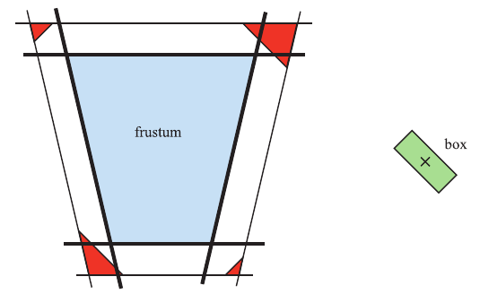

图 22.27：黑色粗线是视锥体的平面。使用所介绍的算法测试盒体（左）与视锥体时，可能把实际位于外部的盒体错误地归类为相交。对于图中的情况，当盒体中心位于红色区域内时，就会发生这种情况。

> 译注：原图注写作“盒体（左）”，但原图中绿色盒体实际位于右侧；这里保留原文表述并指出该处图注疑误。

Wihlidal [1884] 则在视锥体剔除中朝另一个方向改进：只使用视锥体的四个侧平面，不进行近平面和远平面的剔除测试。他指出，这两个平面对电子游戏帮助不大。近平面大多是冗余的，因为侧平面已经裁掉了近平面所裁空间的几乎全部；远平面通常又被设置成能够看到场景中的所有对象。

另一种方法是使用分离轴测试（见第 22.13 节）来推导相交例程。多位作者使用分离轴测试给出了两个凸多面体的一般解法 [595, 1574]。这样，单个经过优化的测试就可以用于线段、三角形、AABB、OBB、k-DOP、视锥体和凸多面体的任意组合。

