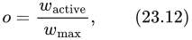
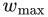
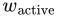
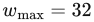
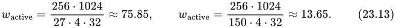
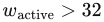
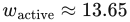

# 23.3 延迟与占用率

来源：《Real-Time Rendering》第 4 版，书页 1004—1006（PDF 物理页 1025—1027）。本节从“23.3 Latency and Occupancy”标题开始，到“23.4 Memory Architecture and Buses”标题前结束。

一般来说，**延迟**是从发出查询到收到结果之间的时间。例如，可以请求内存中某个地址处的值，从发出查询到获得结果所需的时间就是延迟。另一个例子是向纹理单元请求经过过滤的颜色；从发出请求到该值可用，可能需要数百个、甚至数千个时钟周期。为了高效利用 GPU 中的计算资源，必须隐藏这种延迟。如果不隐藏这些延迟，内存访问很容易就会占据执行时间的主要部分。

隐藏延迟的一种机制是 SIMD 处理中的多线程部分，书页 33 的图 3.1 对此作了说明。一般来说，一个多处理器（MP）能够处理的线程束（warp）数量有一个上限。**活动线程束**的数量取决于寄存器的使用情况，也可能取决于纹理采样器、L1 缓存、插值量的使用情况以及其他因素。这里，我们将**占用率** o 定义为

其中， 是一个 MP 上允许的最大线程束数， 是当前活动线程束的数量。也就是说，o 衡量的是计算资源保持被利用的程度。例如，假设 ，一个着色处理器具有 256 kB 的寄存器存储空间，某个着色器程序的单个线程使用 27 个 32 位浮点寄存器，另一个着色器程序则使用 150 个。此外，我们假设决定活动线程束数量的因素是寄存器使用量。假设 SIMD 宽度为 32，那么这两种情况下的活动线程束数分别可以计算为

在第一种情况下，也就是使用 27 个寄存器的短程序，，因此占用率 o = 1。这是理想情况，因而有利于隐藏延迟。然而，在第二种情况下，，所以 o ≈ 13.65/32 ≈ 0.43。由于活动线程束较少，占用率就更低，这可能不利于隐藏延迟。因此，在设计架构时，在线程束数量上限、寄存器数量上限以及其他共享资源之间取得良好平衡十分重要。

有时候，过高的占用率可能适得其反：如果着色器进行了大量内存访问，就可能导致缓存抖动 [1914]。另一种隐藏延迟的机制，是在发出内存请求后继续执行同一个线程束；只要存在不依赖该内存访问结果的指令，就可以这样做。虽然这会使用更多寄存器，但有时保持较低占用率反而可能更高效 [1914]。循环展开就是一个例子：它通常会生成更长的独立指令链，为指令级并行提供更多机会，从而能够在切换线程束之前持续执行更长时间。不过，这也会使用更多临时寄存器。一般原则仍然是争取更高的占用率。例如，着色器请求纹理访问时，占用率低就意味着能够切换到另一个线程束的可能性较小。

另一种延迟出现在从 GPU 向 CPU 回读数据时。一个很好的理解方式是，把 GPU 和 CPU 看成两台异步工作的独立计算机，而两者之间的通信需要付出一定代价。改变信息流动方向所产生的延迟可能严重损害性能。从 GPU 回读数据时，可能必须先排空流水线，再进行读取。在此期间，CPU 会等待 GPU 完成工作。对于 Intel 的 GEN 架构 [844] 这类 GPU 与 CPU 位于同一芯片、并采用共享内存模型的架构，这种延迟会大幅降低。较低层级的缓存由 CPU 和 GPU 共享，而较高层级的缓存则不共享。共享缓存带来的延迟降低，使得不同类型的优化及其他种类的算法成为可能。例如，这一特性已被用于加速光线追踪：光线在图形处理器与 CPU 核心之间来回传递，而不产生开销 [110]。

遮挡查询就是一种不会导致 CPU 停顿的回读机制，参见第 19.7.1 节。在遮挡测试中，其机制是先执行查询，然后不时检查 GPU，看看查询结果是否已经可用。在等待结果期间，CPU 和 GPU 都可以执行其他工作。

> 译注：式（23.13）及随后占用率的数值按原书保留。这里将寄存器容量相除所得的小数作为容量估算；实际可同时驻留的完整线程束数必须取整数。在本例仅考虑寄存器容量和 32 束上限的简化假设下，两种情况分别最多容纳 32 束和 13 束，后一种对应 13/32 = 0.40625；真实硬件还可能受到寄存器分配粒度等约束。
