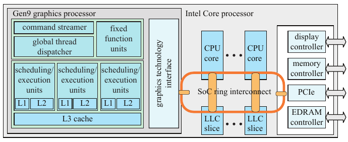

# 23.4 内存架构与总线

来源：原书第 1006—1007 页（PDF 第 1027—1028 页），从 23.4 节标题起至 23.5 节标题前。

这里，我们将介绍一些术语，讨论几种不同类型的内存架构，然后介绍压缩与缓存。

**端口**（port）是在两个设备之间传送数据的通道，而**总线**（bus）是在两个以上设备之间传送数据的共享通道。**带宽**（bandwidth）用于描述端口或总线上的数据吞吐量，以每秒字节数（B/s）计量。端口和总线在计算机图形学架构中很重要，简单地说，是因为它们将不同的构建模块连接在一起。同样重要的是，带宽是一种稀缺资源，因此在构建图形系统之前，必须进行仔细的设计和分析。由于端口和总线都提供数据传输能力，人们也经常将端口称为总线，这里我们也沿用这一惯例。

对于许多 GPU，在图形加速器上配备 GPU 专用内存是很常见的，这种内存通常称为**显存**（video memory）。访问这种内存，通常比让 GPU 经由总线访问系统内存快得多，例如经由 PC 中使用的 PCI Express（PCIe）总线。16 通道的 PCIe v3 在两个方向上均可提供 15.75 GB/s 的带宽，PCIe v4 则可提供 31.51 GB/s。然而，Pascal 图形架构（GTX 1080）的显存带宽可达 320 GB/s。

传统上，纹理和渲染目标存储在显存中，但显存也可以用来存储其他数据。场景中的许多物体在相邻帧之间并不会发生明显的形状变化。即使是人物角色，通常也是用一组保持不变的网格来渲染，并在关节处使用 GPU 端的顶点混合。对于这种完全通过建模矩阵和顶点着色器程序实现动画的数据，通常使用放置在显存中的**静态**顶点缓冲区和索引缓冲区。这样可以让 GPU 快速访问数据。对于每帧由 CPU 更新的顶点，则使用**动态**顶点缓冲区和索引缓冲区，并将它们放置在可以经由 PCI Express 等总线访问的系统内存中。PCIe 的一个良好特性是，查询可以采用流水线方式处理，因此能够在结果返回之前发出多个查询请求。

**图 23.9** Intel 片上系统（SoC）Gen9 图形架构的内存架构简图，该架构与 CPU 核心相连，并采用共享内存模型。注意，末级缓存（LLC）由图形处理器和 CPU 核心共享。（插图依据 Junkins [844] 绘制。）

大多数游戏主机，例如所有 Xbox 主机和 PLAYSTATION 4，都采用**统一内存架构**（unified memory architecture，UMA），这意味着图形加速器可以使用主机内存中的任何部分来存储纹理和各种缓冲区 [889]。CPU 和图形加速器使用同一块内存，因此也使用同一条总线。这显然不同于使用专用显存的方式。Intel 也采用 UMA，使 CPU 核心与 GEN9 图形架构共享内存 [844]，如图 23.9 所示。不过，并非所有缓存都是共享的。图形处理器拥有自己的一组 L1 缓存、L2 缓存，以及一个 L3 缓存。末级缓存是内存层次结构中第一个共享的资源。对于任何计算机架构或图形架构，拥有缓存层次结构都很重要。如果内存访问具有某种局部性，这样做就能降低访问内存的平均时间。下一节将讨论 GPU 的缓存与压缩。
