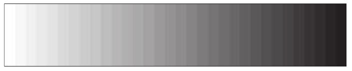
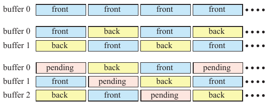

# 23.6 颜色缓冲

来源：原书书页 1009—1013（PDF 物理页 1030—1034）；另核查 PDF 第 1035 页以确认下一节边界。以下技术陈述保留原书出版时的语境。

使用 GPU 进行渲染需要访问多种不同的缓冲区，例如颜色、深度和模板缓冲区。注意，尽管称为“颜色”缓冲区，但任何类型的数据都可以渲染并存储到其中。

颜色缓冲区通常提供几种颜色模式，其依据是表示颜色所用的字节数。这些模式包括：

- **高彩色（high color）**：每像素 2 字节，其中 15 或 16 位用于颜色，分别提供 32,768 或 65,536 种颜色。
- **真彩色或 RGB 彩色（true color / RGB color）**：每像素 3 或 4 字节，其中 24 位用于颜色，提供 16,777,216 ≈ 1680 万种不同颜色。
- **深彩色（deep color）**：每像素 30、36 或 48 位，提供至少十亿种不同颜色。

高彩色模式有 16 位可用于颜色分辨率。通常，红、绿、蓝三个通道各分配至少 5 位，因此每个颜色通道有 32 个级别。这样还剩下一位，通常分给绿色通道，形成 5-6-5 的划分。之所以选择绿色通道，是因为它对人眼感知亮度的影响最大，因此需要更高的精度。高彩色相对于真彩色和深彩色具有速度优势，因为访问每像素 2 字节的内存通常比访问每像素 3 字节或更多字节更快。话虽如此，如今高彩色模式已经很少使用，甚至几乎不再使用。当每个通道只有 32 或 64 个颜色级别时，相邻颜色级别的差异很容易被辨认出来。这个问题有时称为**色带（banding）**或**色调分离（posterization）**。人类视觉系统还会因一种称为 **马赫带效应（Mach banding）** 的感知现象而进一步放大这些差异 [543, 653]。见图 23.11。**抖动（dithering）** [102, 539, 1081] 通过混合相邻级别，以空间分辨率换取有效颜色分辨率的提高，从而减轻这种现象。即使在 24 位显示器上，渐变中的色带也可能很明显。向帧缓冲图像添加噪声，可以掩盖这个问题 [1823]。

**图 23.11**　当矩形从白到黑进行着色时，会出现色带。尽管这 32 个灰度条各自都具有均一的强度级别，但由于马赫带错觉，每一条看起来都可能左侧较暗、右侧较亮。

真彩色使用 24 位 RGB 颜色，每个颜色通道占 1 字节。在 PC 系统中，排列顺序有时反过来，成为 BGR。在内部，这些颜色通常以每像素 32 位存储，因为大多数内存系统都针对访问 4 字节元素进行了优化。在某些系统中，额外的 8 位还可以用于存储 alpha 通道，使像素具有 RGBA 值。24 位颜色（不含 alpha）的表示也称为**紧凑像素格式（packed pixel format）**，与对应的 32 位非紧凑格式相比，可以节省帧缓冲内存。对于实时渲染，使用 24 位颜色几乎总是可以接受的。虽然仍有可能看到颜色色带，但发生的可能性远低于只有 16 位的情况。

深彩色使用 30、36 或 48 位来表示一个 RGB 颜色，即每通道 10、12 或 16 位。如果加入 alpha，这些数字就增加到 40/48/64。HDMI 从 1.3 版本起支持全部 30/36/48 位模式，DisplayPort 标准也支持每通道最高 16 位。

颜色缓冲区通常会按第 23.5 节所述进行压缩和缓存。此外，第 23.10 节的各个案例研究还会进一步说明如何将传入的片元数据与颜色缓冲区混合。混合由 **光栅操作（raster operation，ROP）** 单元处理，而每个 ROP 通常连接到一个内存分区，例如采用一种广义棋盘格模式进行组织 [1160]。接下来，我们将讨论视频显示控制器，它读取颜色缓冲区并使其显示在屏幕上。随后介绍单缓冲、双缓冲和三缓冲。

## 23.6.1 视频显示控制器

每个 GPU 中都有一个**视频显示控制器（video display controller，VDC）**，也称为**显示引擎（display engine）**或**显示接口（display interface）**，负责把颜色缓冲区显示在显示器上。它是 GPU 中的一个硬件单元，可以支持多种接口，例如高清多媒体接口（HDMI）、DisplayPort、数字视频接口（DVI）和视频图形阵列（VGA）。待显示的颜色缓冲区可能位于 CPU 执行任务所使用的同一内存中，也可能位于专用帧缓冲内存或显存中；其中，显存可以包含任意 GPU 数据，但 CPU 无法直接访问。每种接口都使用其标准规定的协议来传输颜色缓冲区的各部分、时序信息，有时甚至包括音频。VDC 还可能执行图像缩放、降噪、多个图像源的合成以及其他功能。

显示器（例如 LCD）更新图像的频率通常为每秒 60 到 144 次（赫兹）。这也称为**垂直刷新率**。当刷新率低于 72 Hz 时，大多数观看者会注意到闪烁。有关这一主题的更多信息，请参见第 12.5 节。

显示器技术已经在刷新率、每分量位数、色域和同步等多个方面取得进步。刷新率过去通常为 60 Hz，但 120 Hz 正变得越来越常见，甚至可以达到 600 Hz。在高刷新率下，通常会多次显示同一幅图像，有时还会插入黑帧，以尽量减少在一帧显示期间眼睛移动造成的拖影伪影 [7, 646]。显示器也可以采用每通道超过 8 位的精度，HDR 显示器可能成为显示技术的下一个重要发展方向。这些显示器可以使用每通道 10 位或更高的精度。杜比拥有一种 HDR 显示技术，利用分辨率较低的 LED 背光阵列来增强其 LCD 显示器。这样，它们的显示器能够达到普通显示器约 10 倍的亮度和 100 倍的对比度 [1596]。具有更宽色域的显示器也越来越常见。通过使纯光谱色成为可表示的颜色，这些显示器能够显示更广的颜色范围，例如更加鲜艳的绿色。有关色域的更多信息，请参见第 8.1.3 节。

为了减少撕裂现象，各公司开发了自适应同步技术，例如 AMD 的 FreeSync 和 NVIDIA 的 G-sync。其思想是让显示器的更新速率适应 GPU 能够生成图像的速率，而不使用预先确定的固定速率。例如，如果一帧需要 10 ms 渲染，下一帧需要 30 ms，那么每幅图像渲染完成后，就立即开始向显示器更新该图像。采用这类技术后，渲染结果看起来会流畅得多。此外，如果图像没有更新，就不必把颜色缓冲区发送给显示器，从而节省功耗。

## 23.6.2 单缓冲、双缓冲和三缓冲

在第 2.4 节中，我们提到，双缓冲能够确保图像直到渲染完成后才显示在屏幕上。这里，我们将介绍单缓冲、双缓冲，乃至三缓冲。

假设我们只有一个缓冲区。这个缓冲区必然就是当前显示在屏幕上的缓冲区。随着一帧中的三角形逐个绘制，显示器每次刷新时都会显现出越来越多的三角形，这样的效果并不令人信服。即使帧率等于显示器的更新速率，单缓冲仍然存在问题。如果我们决定清除缓冲区或绘制一个大三角形，那么，当视频显示控制器传输颜色缓冲区中正在被绘制的区域时，我们就会短暂地看到颜色缓冲区实际发生的局部变化。这种现象有时称为**撕裂（tearing）**，因为显示的图像看起来仿佛被短暂地撕成了两半；这不是实时图形所希望出现的效果。在某些很早期的系统中，例如 Amiga，可以检测扫描束的位置，从而避免在那里绘制，使单缓冲能够正常工作。如今单缓冲已经很少使用，一个可能的例外是虚拟现实系统，其中“与扫描束赛跑（racing the beam）”可以成为降低延迟的一种方式 [6]。

为了避免撕裂问题，通常使用双缓冲。完整的图像显示在**前缓冲区（front buffer）**中，而一个离屏的**后缓冲区（back buffer）**包含当前正在绘制的图像。然后，图形驱动程序交换后缓冲区和前缓冲区；为避免撕裂，这通常发生在整幅图像刚刚传输给显示器之后。交换往往只需交换两个颜色缓冲区指针。对于 CRT 显示器，这个事件称为**垂直回扫（vertical retrace）**，这段时间内的视频信号称为**垂直同步脉冲（vertical synchronization pulse）**，简称 **vsync**。对于 LCD 显示器，虽然没有扫描束的物理回扫，但我们仍使用同一个术语来表示整幅图像刚刚传输到显示器的时刻。在渲染完成后立即交换前后缓冲区，有利于对渲染系统进行基准测试，也被许多应用采用，因为这样可以使帧率最大化。不在垂直同步时更新也会导致撕裂，但由于此时有两幅完整成形的图像，这种伪影不像单缓冲时那么严重。交换之后，新的后缓冲区立即开始接收图形命令，而新的前缓冲区则显示给用户。图 23.12 展示了这一过程。

**图 23.12**　对于单缓冲（上），始终显示前缓冲区。对于双缓冲（中），起初缓冲区 0 在前，缓冲区 1 在后；随后每帧它们都会交换，前者变为后者，后者变为前者。三缓冲（下）通过额外设置一个待处理缓冲区来工作。首先，清除一个缓冲区并开始向其渲染（pending，待处理）；其次，系统继续使用该缓冲区进行渲染，直到图像完成（back，后缓冲）；最后，显示该缓冲区（front，前缓冲）。图中 buffer 0、buffer 1、buffer 2 分别表示缓冲区 0、1、2。

可以给双缓冲增加第二个后缓冲区，我们把它称为**待处理缓冲区（pending buffer）**。这称为**三缓冲（triple buffering）** [1155]。待处理缓冲区与后缓冲区一样，也位于屏幕之外，而且可以在前缓冲区显示期间进行修改。待处理缓冲区成为三缓冲循环的一部分。在某一帧期间，可以访问待处理缓冲区。到下一次交换时，它成为后缓冲区，并在其中完成渲染。然后，它变为前缓冲区并显示给观看者。再下一次交换时，这个缓冲区又变成待处理缓冲区。图 23.12 底部直观展示了这一过程。

相对于双缓冲，三缓冲有一个主要优势：等待垂直回扫时，系统仍可以访问待处理缓冲区。而对于双缓冲，在等待垂直回扫以便进行交换期间，图像构建只能继续等待。原因在于，前缓冲区必须显示给观看者，而后缓冲区也必须保持不变，因为其中已有一幅完整图像，正等待显示。三缓冲的缺点是，延迟最多会增加整整一帧。这会推迟对用户输入的响应，例如按键，以及鼠标或摇杆移动。控制可能感觉迟钝，因为待处理缓冲区开始渲染后，这些用户事件的处理会被推迟。

理论上，可以使用三个以上的缓冲区。如果计算一帧所需的时间变化很大，更多缓冲区可以带来更均衡的运行和总体更高的显示速率，代价是可能增加延迟。更一般地说，可以把多缓冲看作一个环形结构。其中有一个渲染指针和一个显示指针，分别指向不同的缓冲区。渲染指针领先于显示指针，在当前渲染缓冲区计算完成后移动到下一个缓冲区。唯一的规则是，显示指针绝不能与渲染指针指向同一个缓冲区。

对于 PC 图形加速器，一种相关的进一步加速方法是使用 **SLI 模式**。早在 1998 年，3dfx 就使用 SLI 作为**扫描线交错（scanline interleave）**的缩写：两个图形芯片组并行运行，一个处理奇数扫描线，另一个处理偶数扫描线。NVIDIA（收购了 3dfx 的资产）则把这个缩写用于一种完全不同的双显卡（或多显卡）连接方式，称为**可扩展链接接口（scalable link interface）**。AMD 将其称为 CrossFire X。这种并行形式可以通过以下方式划分工作：把屏幕分成两个或更多水平区域，每张显卡负责一个区域；或者让每张显卡完整渲染自己的一帧，交替输出。还有一种模式，允许各张显卡加速同一帧的抗锯齿。最常见的用法是让每个 GPU 渲染单独的一帧，称为**交替帧渲染（alternate frame rendering，AFR）**。虽然这种方案听起来似乎会增加延迟，但它往往几乎不影响延迟，甚至完全没有影响。假设单 GPU 系统以 10 FPS 渲染。如果 GPU 是瓶颈，那么使用 AFR 的两个 GPU 可能以 20 FPS 渲染，四个 GPU 甚至可以达到 40 FPS。每个 GPU 渲染自己那一帧所花的时间相同，因此延迟不一定会改变。

屏幕分辨率持续提高，给基于逐像素采样的渲染器带来了严峻挑战。维持帧率的一种方法，是在屏幕各处 [687, 1805] 以及表面各处 [271] 自适应地改变像素着色速率。
