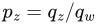
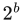
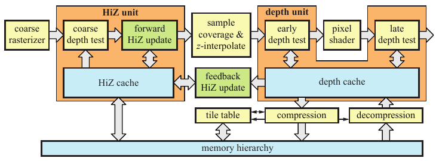
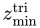
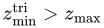
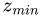

# 23.7 深度剔除、测试与缓冲

来源：《Real-Time Rendering, Fourth Edition》，书页 1014—1016（PDF 物理页 1035—1037）；已核对 PDF 第 1038 页的 23.8 节标题以确认结束边界。图 23.13 在原书中排于本节标题之前，属于本节。

本节将介绍与深度有关的各个方面，包括分辨率、测试、剔除、压缩、缓存、缓冲以及 early-z。

深度分辨率很重要，因为它有助于避免渲染错误。例如，假设你建立了一张纸的模型，并把它放在桌子上，位置仅比桌面略高一点。由于为桌面和纸张计算的 z 深度具有精度限制，桌面可能会在若干位置穿透纸张。这种问题有时称为 **z-fighting（深度冲突）**。注意，如果纸张放置得与桌面完全等高，即纸张与桌面共面，那么在没有关于两者关系的额外信息时，就不存在正确答案。这种问题源于不良建模，无法通过提高 z 精度来解决。

正如第 2.5.2 节所述，z 缓冲（也称为深度缓冲）可用于判定可见性。这类缓冲通常为每个像素（或采样点）分配 24 位或 32 位，可以采用浮点或定点表示 [1472]。对于正交观察，距离值与 z 值成正比，因此得到均匀的分布。然而，对于透视观察，分布是不均匀的，正如书页 99—102 所述。应用透视变换（式 4.74 或式 4.76）后，需要除以 w 分量（式 4.72）。此时深度分量变为 ，其中 **q** 是与投影矩阵相乘后得到的点。对于定点表示，数值  从其有效范围（例如 DirectX 中的 [0, 1]）映射到整数范围 [0,  − 1]，并存入 z 缓冲，其中 b 是位数。有关深度精度的更多信息，参见书页 99—102。

**图 23.13** 深度流水线的一种可能实现，其中 z-interpolate 只是通过插值计算深度值。（插图据 Andersson 等人 [46] 绘制。）

硬件深度流水线如图 23.13 所示。这条流水线的主要目标，是将光栅化图元时产生的每个输入深度与深度缓冲进行测试；如果片元通过深度测试，则可能将输入深度写入深度缓冲。同时，这条流水线还必须高效运行。图的左侧从粗粒度光栅化开始，也就是在图块层面进行光栅化（第 23.1 节）。此时，只有与图元重叠的图块才会被送往下一阶段，即 HiZ 单元，在那里执行 z 剔除技术。HiZ 单元以一个称为粗粒度深度测试的模块开始，这里通常执行两类测试。我们先介绍  剔除，它是第 19.7.2 节所介绍的 Greene 分层 z 缓冲算法 [591] 的简化形式。其思想是存储每个图块内全部深度的最大值，称为 。图块尺寸取决于体系结构，但常用尺寸为 8 × 8 像素 [1238]。这些  值可以存放在固定的片上存储器中，也可以通过缓存访问。在图 23.13 中，我们将其称为 HiZ 缓存。简言之，我们要测试三角形是否在一个图块内被完全遮挡。为此，需要计算三角形在该图块内的最小 z 值 。如果 ，就能保证该三角形在这个图块内被先前渲染的几何体遮挡。于是可以终止该三角形在这个图块内的处理，从而省去逐像素深度测试。注意，这并不会减少任何像素着色器执行，因为无论如何，流水线后续的逐采样点深度测试都会剔除被遮挡的片元。实际上，我们无法承担精确计算  的开销，因此改为计算一个保守估计值。计算  可以采用几种不同的方法，各有优缺点：

1. 可以使用三角形三个顶点中的最小 z 值。这并不总是准确，但额外开销很小。
2. 利用三角形的平面方程，求出图块四个角点处的 z 值，并取其中的最小值。

将这两种策略结合起来，可以获得最佳剔除性能。做法是取这两个  值中较大的一个。

另一类粗粒度深度测试是  剔除，其思想是存储图块中所有像素的  [22]。它有两种用途。首先，可以用它避免读取 z 缓冲。如果正在渲染的三角形确定处于先前渲染的全部几何体前方，就没有必要进行逐像素深度测试。在某些情况下，可以完全避免读取 z 缓冲，从而进一步提高性能。其次，它可以用于支持不同类型的深度测试。对于  剔除方法，我们假定使用标准的“小于”深度测试。不过，如果其他深度测试也能使用剔除，就会很有益；而当  与  都可用时，通过这种剔除过程就能支持所有深度测试。Andersson 的博士论文 [49] 给出了对深度流水线更详细的硬件描述。

图 23.13 中的绿色方框涉及更新图块  与  值的不同方式。如果一个三角形覆盖整个图块，就可以直接在 HiZ 单元中完成更新。否则，需要读取整个图块的逐采样点深度，将其归约为最小值与最大值，再传回 HiZ 单元，这会引入一定延迟。Andersson 等人 [50] 提出了一种方法，无需代价较高的深度缓存反馈便能完成这一过程，同时仍能保留大部分剔除效率。

对于通过粗粒度深度测试的图块，接下来会确定像素或采样点的覆盖情况（使用第 23.1 节所述的边方程），并计算逐采样点深度（图 23.13 中称为 z-interpolate）。这些值被传送到图右侧所示的深度单元。按照 API 的描述，接下来应当执行像素着色器。不过，在下文将介绍的某些情况下，可以在不改变预期行为的前提下，执行一种额外测试，称为 **early-z** [1220, 1542] 或**提前深度测试**。实际上，early-z 就是将逐采样点深度测试放在像素着色器之前执行，并丢弃被遮挡的片元。因此，这一过程可以避免不必要的像素着色器执行。early-z 测试经常与 z 剔除混淆，但二者由完全独立的硬件执行。任何一种技术都可以在不使用另一种技术的情况下单独使用。

在许多情况下，GPU 会自动使用  剔除、 剔除和 early-z。然而，例如当像素着色器写入自定义深度、使用 discard 操作，或向无序访问视图写入数值时，就必须禁用这些技术 [50]。如果不能使用 early-z，则在像素着色器之后进行深度测试（称为**延后深度测试**）。

在较新的硬件上，可能可以在着色器中对图像执行原子的读—改—写操作，以及加载和存储操作。在这些情况下，如果你确定这样做是安全的，就可以显式启用 early-z，并覆盖这些限制。另一项可以在像素着色器输出自定义深度时使用的功能，是**保守深度**。在这种情况下，如果程序员保证自定义深度大于三角形深度，就可以启用 early-z。对于这个例子，也可以启用  剔除，但不能启用 early-z 和  剔除。

> 译注：原书本段先说上述保守深度条件下可以启用 early-z，随后又说不能启用 early-z，前后陈述矛盾。此处按原文保留，未擅自改写。

与往常一样，遮挡剔除会受益于从前向后的渲染顺序。另一种名称和目的都相近的技术是 **z 预通道（z-prepass）**。其思想是，程序员先渲染场景，只写入深度，同时禁用像素着色和向颜色缓冲的写入。在渲染后续通道时，使用“等于”测试；由于 z 缓冲已经初始化，这意味着只有最前面的表面才会被着色。参见第 18.4.5 节。

作为本节的结束，我们简要介绍深度流水线的缓存与压缩，对应图 23.13 的右下部分。总体压缩系统与第 23.5 节介绍的系统类似。每个图块可以被压缩到几个选定大小之一，并且始终存在退回到未压缩数据的方案；当压缩无法达到任何一个选定大小时，就采用这一方案。清空深度缓冲时，使用快速清空来节省带宽消耗。由于深度在屏幕空间中是线性的，典型的压缩算法要么以高精度存储平面方程，要么采用结合增量编码的差分之差技术，要么采用某种锚点方法 [679, 1238, 1427]。图块表和 HiZ 缓存可以完全存放在片上缓冲中，也可以像深度缓存那样，通过存储层次结构的其余部分进行通信。片上存储的代价很高，因为这些缓冲必须足够大，能够处理所支持的最高分辨率。
