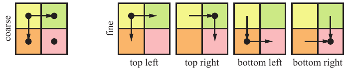
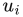
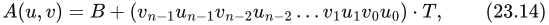
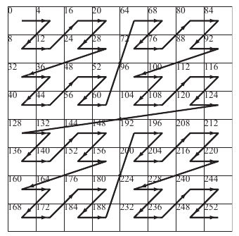

# 23.8 纹理处理

来源：原书第 1017—1019 页（PDF 第 1038—1040 页）。范围从 23.8 节标题开始，到 23.9 节标题之前，包含移至第 1019 页的图 23.15 及其完整图注。

纹理操作包括读取、过滤和解压缩，当然可以完全用运行于 GPU 多处理器上的软件来实现。不过，已有研究表明，用于纹理处理的固定功能硬件速度可达到这种实现的 40 倍 [1599]。纹理单元执行寻址、过滤、钳制以及纹理格式的解压缩（第 6 章）。它与纹理缓存配合使用，以减少带宽用量。我们首先讨论过滤，以及过滤会给纹理单元带来哪些影响。

为了使用 mipmapping 和各向异性过滤等缩小过滤方法，需要知道纹理坐标相对于屏幕空间的导数。也就是说，要计算纹理的细节层次 λ，需要 ∂u/∂x、∂v/∂x、∂u/∂y 和 ∂v/∂y。这些导数告诉我们，片元代表了纹理区域或纹理函数的多大范围。如果直接使用从顶点着色器传入的纹理坐标来访问纹理，就可以通过解析方法计算导数。如果先用某个函数变换纹理坐标，例如 (u′, v′) = (cos v, sin u)，那么解析计算导数就会变得更复杂。不过，仍然可以使用链式法则或符号微分来完成 [618]。尽管如此，图形硬件并不采用这些方法，因为实际情况可能任意复杂。设想一下，使用环境贴图计算一个表面的反射，而该表面的法线又经过了凹凸映射。例如，反射向量由法线贴图上的反射产生，随后用于访问环境贴图，要以解析方式计算这种反射向量的导数就很困难。因此，通常以四像素组（quad），也就是 2 × 2 个像素为基础，使用 x 和 y 方向上的有限差分来数值计算导数。这也是 GPU 架构围绕四像素组进行调度的原因。

一般来说，导数计算在内部自动进行，对用户不可见。实际实现通常是在一个四像素组内使用跨通道指令（shuffle/swizzle），这些指令可以由编译器插入。有些 GPU 则使用固定功能硬件来计算这些导数。关于应当如何计算导数，并没有精确的规范。图 23.14 展示了一些常见方法。OpenGL 4.5 和 DirectX 11 都支持用于计算粗导数和细导数的函数 [1368]。

**图 23.14** 导数可能采用的计算方式示意图。箭头表示，以箭头终点处的像素减去起点处的像素来计算差值。例如，左上角的水平差分等于右上像素减去左上像素。对于粗导数（左），四像素组内的全部四个像素共用一个水平差分和一个垂直差分。对于细导数（右），则使用离该像素最近的差分。（插图据 Penner [1368] 绘制。）

所有 GPU 都使用纹理缓存 [362, 651, 794, 795] 来减少纹理的带宽用量。有些架构使用专用纹理缓存，甚至采用两级专用纹理缓存；另一些架构则让包括纹理处理在内的各种访问共享缓存。纹理缓存通常由一小块片上存储器（一般为 SRAM）实现。这个缓存存储最近的纹理读取结果，访问速度很快。替换策略和容量取决于具体架构。如果相邻像素需要访问相同或位置接近的纹素，就很可能在缓存中找到它们。如第 23.4 节所述，存储器访问通常采用分块方式，因此纹素不是按扫描线顺序存储，而是存放在小块中，例如每块 4 × 4 个纹素。这能提高效率 [651]，因为一个块中的纹素会一起被读取。以字节计的块大小通常与缓存行大小相同，例如 64 字节。另一种存储纹理的方法是采用交错重排（swizzled）模式。假设纹理坐标已经转换为定点数 (u, v)，其中 u 和 v 各有 n 位。u 中编号为 i 的位记作 。那么，将 (u, v) 重映射为交错纹理地址 A 的公式为

其中，B 是纹理的基地址，T 是一个纹素占用的字节数。这种重映射的优点是，它会产生图 23.15 所示的纹素顺序。可以看出，这是一条空间填充曲线，称为 Morton 序列 [1243]，已知它能够提高相干性 [1825]。这里的曲线是二维的，因为纹理通常也是二维的。

纹理单元还包含专门定制的硬件电路，用来解压缩多种不同的纹理格式（第 6.2.6 节）。与软件实现相比，以固定功能硬件实现这些解压缩操作，效率通常要高出许多倍。注意，当纹理既用作渲染目标，又用于纹理映射时，还会出现其他压缩机会。如果启用了颜色缓冲区压缩（第 23.5 节），那么在把这样的渲染目标当作纹理访问时，有两种设计选择。第一种选择是在渲染目标完成渲染后，将整个渲染目标从其颜色缓冲区压缩格式解压缩，并以未压缩形式存储，以供后续纹理访问。第二种选择是在纹理单元中增加硬件支持，以解压缩颜色缓冲区的压缩格式 [1716]。后一种选择效率更高，因为即使作为纹理被访问，渲染目标也可以保持压缩状态。有关缓存和压缩的更多信息，参见第 23.4 节。

mipmapping 对纹理缓存的局部性很重要，因为它限制了纹素与像素之比的最大值。在遍历一个三角形时，每前进到一个新像素，在纹理空间中大约就前进一个纹素。mipmapping 是渲染中少数几种能够同时改善视觉效果和性能的技术之一。

**图 23.15** 纹理交错重排提高了纹素存储器访问的相干性。注意，这里的纹素大小为 4 字节，每个纹素的左上角标出了其地址。
