# 23.10 案例研究

来源：《Real-Time Rendering, Fourth Edition》书页 1024—1039（PDF 物理页 1045—1060）。范围自 23.10 标题起，至 23.11 标题前，包含全部三个下级小节；插图按正文关联位置编排。

本节将介绍三种不同的图形硬件架构。首先介绍面向移动设备与电视的 ARM Mali G71 Bifrost 架构，随后介绍 NVIDIA 的 Pascal 架构，最后描述名为 Vega 的 AMD GCN 架构。

请注意，图形硬件公司在作出设计决策时，往往以对尚未制造出来的 GPU 进行的大量软件模拟为依据。也就是说，他们让多个应用程序（例如游戏）在参数化模拟器中，以若干种不同配置运行。可调整的参数例如包括 MP 数量、时钟频率、缓存数量、光栅引擎／曲面细分引擎数量以及 ROP 数量。模拟用于收集性能、功耗和内存带宽使用量等方面的信息。最终，他们选择在大多数使用情形下表现最好的配置，并据此制造芯片。此外，模拟还可以帮助找出架构中的典型瓶颈，随后便可采取措施解决，例如增大某个缓存。对于某款 GPU，其各项速度和单元数量之所以如此，原因简单地说就是：“这样效果最好。”

## 23.10.1 案例研究：ARM Mali G71 Bifrost

Mali 产品线涵盖 ARM 的所有 GPU 架构，Bifrost 是其 2016 年的架构。这一架构面向移动与嵌入式系统，例如手机、平板电脑和电视。2015 年，基于 Mali 的 GPU 出货量达到 7.5 亿颗。由于其中许多设备由电池供电，因此设计节能的架构非常重要，不能只关注性能。因此，采用中间排序（sort-middle）架构很有意义：所有帧缓冲访问均保留在芯片内部，从而降低功耗。所有 Mali 架构都属于中间排序类型，有时也称为分块（tiling）架构。图 23.20 展示了 GPU 的高层概貌。可以看到，G71 最多支持 32 个统一着色器引擎。ARM 使用“着色器核心”（shader core）而非“着色器引擎”（shader engine）一词，但为了避免与本章其余内容混淆，我们使用后者。一个着色器引擎能够同时为 12 个线程执行指令，即它具有 12 个 ALU。32 个着色器引擎是 G71 的具体配置选择，但架构本身可以扩展到超过 32 个引擎。

驱动软件向 GPU 提交工作。随后，作业管理器（即调度器）将工作分配给各个着色器引擎。这些引擎通过 GPU 互连（GPU fabric）相连；它是一条总线，引擎可以通过它与 GPU 内的其他单元通信。所有内存访问都通过内存管理单元（MMU），由它把虚拟内存地址转换为物理地址。

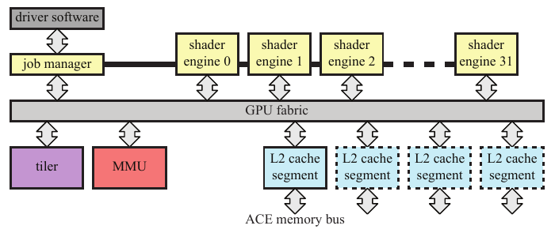

图 23.20。Bifrost G71 GPU 架构，可扩展至 32 个着色器引擎，每个着色器引擎均采用图 23.21 所示的结构。（根据 Davies [326] 的插图绘制。）

图 23.21 展示了着色器引擎的概貌。可以看到，它包含三个执行引擎，以执行四元组（quad）的着色为中心。因此，它们被设计成 SIMD 宽度为 4 的小型通用处理器。每个执行引擎包含四个用于 32 位浮点数的融合乘加（FMA）单元和四个 32 位加法器等。这意味着每个着色器引擎具有 3 × 4 个 ALU，即 12 条 SIMD 通道。按照本文使用的术语，四元组相当于一个线程束（warp）。为了隐藏纹理访问等操作的延迟，该架构可以让每个着色器引擎至少保有 256 个正在处理中的线程。

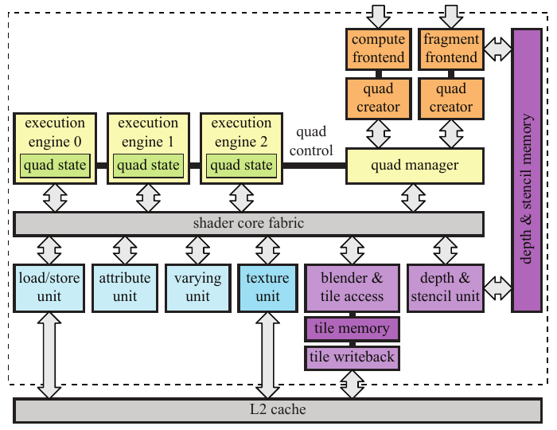

图 23.21。Bifrost 着色器引擎架构。分块内存位于芯片内部，使局部帧缓冲访问能够快速完成。（根据 Davies [326] 的插图绘制。）

请注意，着色器引擎是统一的，可以执行计算着色、顶点着色和像素着色等任务。执行引擎还支持许多超越函数，例如正弦和余弦。此外，采用 16 位浮点精度时，性能最高可达 2 倍。当寄存器中的结果仅用作后续某条指令的输入时，这些单元还支持旁路传递寄存器内容。这样无需访问寄存器文件，因而能够节省功耗。此外，在进行纹理访问或其他内存访问等操作时，四元组管理器可以换入单个四元组，方式类似于其他架构隐藏此类操作延迟的做法。请注意，这种切换的粒度很小：交换的是 4 个线程，而非全部 12 个线程。加载／存储单元负责一般内存访问、内存地址转换以及一致性缓存 [264]。属性单元处理属性索引和寻址，并把访问请求发送给加载／存储单元。插值属性单元（varying unit）对变化的属性执行插值。

分块架构（中间排序）的核心思想是先执行所有几何处理，从而确定每个待渲染图元的屏幕空间位置。与此同时，为帧缓冲中的每个分块建立一个多边形列表，其中包含指向所有与该分块重叠的图元的指针。这一步之后，与分块重叠的图元集合就已确定。因此，可以对一个分块内的图元进行光栅化和着色，并把结果保存在片上分块内存中。当该分块中的全部图元渲染完毕后，分块内存中的数据经由 L2 缓存写回外部内存。这会减少内存带宽使用量。然后对下一个分块进行光栅化，依此类推，直到整帧渲染完成。最早的分块架构是 Pixel-Planes 5 [502]，该系统在高层结构上与 Mali 架构有一些相似之处。

图 23.22 展示了几何处理与像素处理。可以看到，顶点着色器被拆分为两部分：一部分只对位置进行着色，另一部分称为插值属性着色（varying shading），在分块之后执行。与 ARM 先前的架构相比，这样可以节省内存带宽。执行分箱（binning），即确定图元与哪些分块重叠，唯一需要的信息就是顶点的位置。负责分箱的分块器单元以层次化方式工作，如图 23.23 所示。这有助于减小分箱的内存占用，并使其更加可预测，因为内存占用不再与图元大小成正比。

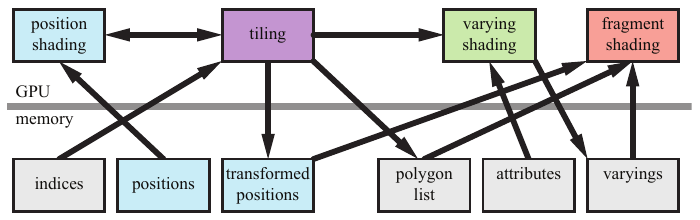

图 23.22。几何数据在 Bifrost 架构中的流动方式。顶点着色器包含供分块器使用的位置着色，以及仅在需要时、于分块之后执行的插值属性着色。（根据 Choi [264] 的插图绘制。）

当分块器完成场景中所有图元的分箱后，就确切知道哪些图元与某个分块重叠。因此，只要有可并行工作的着色器引擎，就可以对任意数量的分块并行执行剩余的光栅化、像素处理和混合操作。通常，一个分块被提交给一个着色器引擎，由它处理该分块中的所有图元。在对所有分块执行这些工作的同时，也可以开始下一帧的几何处理和分块。这种处理模型意味着分块架构可能具有更大的延迟。

接下来执行光栅化、像素着色器、混合以及其他逐像素操作。分块架构最重要的单一特性是，一个分块的帧缓冲（例如包含颜色、深度和模板）可以保存在快速的片上内存中，这里称为分块内存（tile memory）。由于分块很小（16 × 16 像素），这样做在成本上是可行的。一个分块中的全部渲染完成后，将该分块所需的输出（通常是颜色，也可能包括深度）复制到与屏幕尺寸相同的片外帧缓冲中（位于外部内存）。这意味着逐像素处理期间的全部帧缓冲访问实际上几乎无需付出代价。避免使用外部总线非常有益，因为使用它们会带来很高的能耗 [22]。将片上分块内存的内容换出到片外帧缓冲时，仍可以使用帧缓冲压缩。

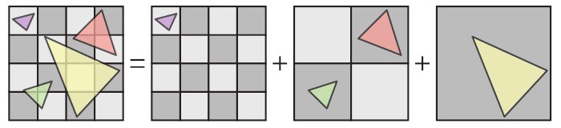

图 23.23。Bifrost 架构的层次化分块器。本例在三个不同层级上进行分箱，每个三角形被分配到它只与一个方格重叠的那个层级。（根据 Bratt [191] 的插图绘制。）

Bifrost 支持像素局部存储（pixel local storage，PLS），这是一组通常由中间排序架构支持的扩展。利用 PLS，可以让像素着色器访问帧缓冲的颜色，进而实现自定义混合技术。相比之下，混合通常由 API 配置，不能像像素着色器那样编程。还可以利用分块内存，为每个像素存储任意固定大小的数据结构。这使程序员能够高效实现延迟着色等技术。第一个遍中将 G 缓冲（例如法线、位置和漫反射纹理）存入 PLS。第二个遍执行光照计算，并将结果累积到 PLS 中。第三个遍利用 PLS 中的信息计算最终像素颜色。请注意，对于单个分块而言，所有这些计算期间，整个分块内存都保留在芯片上，因此速度很快。

所有 Mali 架构在从头设计时就考虑了多重采样抗锯齿（MSAA），并实现了第 143 页介绍的旋转网格超采样（RGSS）方案，每个像素使用四个样本。中间排序架构非常适合抗锯齿，因为滤波恰好在分块离开 GPU、被发送到外部内存之前执行。因此，外部内存中的帧缓冲只需为每个像素存储一种颜色。标准架构则需要四倍大小的帧缓冲。对于分块架构，只需将片上分块缓冲增大到四倍，或者等效地使用更小的分块（宽和高分别减半）。

Mali Bifrost 架构还可以为一批渲染图元选择使用多重采样或超采样。这意味着，必要时可以使用成本更高的超采样，即为每个样本执行像素着色器。例如，渲染一棵采用 alpha 映射的带纹理树木时，需要高质量采样来避免视觉伪影。对于这些图元，可以启用超采样。当复杂情形结束，开始渲染较简单的物体时，可以切回成本较低的多重采样。该架构还支持 8× 和 16× MSAA。

Bifrost（以及前一代名为 Midgard 的架构）还支持一种称为事务消除（transaction elimination）的技术。其思想是：对于场景中逐帧不变的部分，避免从分块内存向片外内存传输数据。当前帧中，每个分块被换出到片外帧缓冲时，都会计算其唯一签名。该签名是一种校验和。下一帧则为即将换出的分块计算签名。如果某个分块上一帧的签名与当前帧相同，架构便不再把颜色缓冲写入片外内存，因为其中已经有正确内容。这对休闲移动游戏（例如《愤怒的小鸟》）特别有用，因为每帧只更新场景中的较小一部分。还应注意，这类技术难以在末端排序（sort-last）架构上实现，因为后者不是按分块工作的。G71 还支持智能合成（smart composition），即将事务消除应用于用户界面合成。如果所有来源和操作均与前一帧相同，就可以避免对一个像素块进行读取、合成和写入。

该架构还大量使用时钟门控和电源门控等底层节能技术。这意味着流水线中未使用或不活跃的部分会被关闭，或以较低能耗保持空闲，从而降低功耗。

为减少纹理带宽，纹理缓存配有专门用于 ASTC 和 ETC 的解压单元。此外，压缩纹理以压缩形式保存在缓存中，而不是先解压，再把纹素放入缓存。这意味着，收到纹素请求时，硬件先从缓存读取相应块，再即时解压该块的纹素。这种配置增加了缓存的有效容量，提高了效率。

总体而言，分块架构的一个优点是，其设计天然适合并行处理分块。例如，可以增加着色器引擎，每个引擎负责在某一时刻独立渲染一个分块。分块架构的一个缺点是，整个场景的数据都需要发送到 GPU 进行分块，处理后的几何数据还要流式写出到内存中。一般来说，中间排序架构并不适合处理几何放大，例如使用几何着色器和曲面细分，因为更多的几何数据会增加来回搬运几何数据所需的内存传输量。在 Mali 架构中，几何着色（第 18.4.2 节）与曲面细分均由 GPU 上的软件处理，Mali 最佳实践指南 [69] 建议完全不要使用几何着色器。对于大多数内容，中间排序架构在移动和嵌入式系统上表现良好。

## 23.10.2 案例研究：NVIDIA Pascal

Pascal 是 NVIDIA 开发的一种 GPU 架构。它既有图形版本 [1297]，也有计算版本 [1298]，后者面向高性能计算和深度学习应用。这里主要关注图形版本，尤其是名为 GeForce GTX 1080 的具体配置。我们将采用自底向上的方式介绍该架构，从最小的统一 ALU 开始，逐步构建出整个 GPU。本小节末尾还会简要提到其他一些芯片配置。

Pascal 图形架构采用的统一 ALU，在 NVIDIA 术语中称为 CUDA 核心，其高层结构与第 1002 页图 23.8 左侧的 ALU 相同。ALU 主要用于浮点数和整数运算，但也支持其他操作。为了提高计算能力，多个此类 ALU 被组合为一个流式多处理器（streaming multiprocessor，SM）。在 Pascal 的图形版本中，SM 由四个处理块组成，每个处理块有 32 个 ALU。这意味着 SM 可以同时执行四个各含 32 个线程的线程束，如图 23.24 所示。

每个处理块，即宽度为 32 的 SIMT 引擎，还具有 8 个加载／存储（LD/ST）单元和 8 个特殊函数单元（SFU）。加载／存储单元负责读取和写入寄存器文件中的寄存器值。每个处理块的寄存器文件容量为 16,384 × 4 字节，即 64 kB，合计每个 SM 为 256 kB。SFU 处理超越函数指令，例如正弦、余弦、以 2 为底的指数、以 2 为底的对数、倒数以及平方根的倒数。它们还支持属性插值 [1050]。

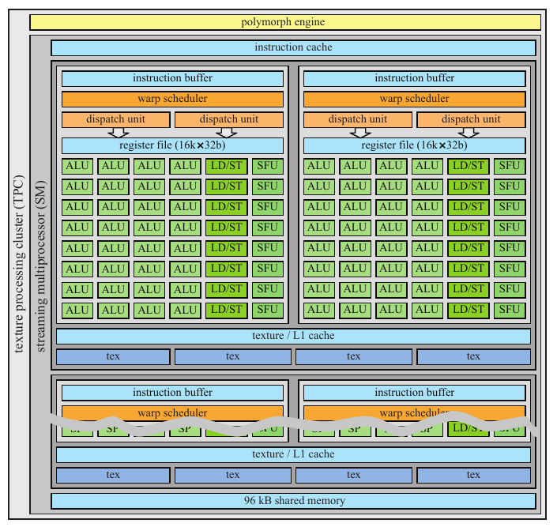

图 23.24。Pascal 流式多处理器（SM）具有 32 × 2 × 2 个统一 ALU，SM 与一个多形体引擎（polymorph engine）封装在一起，共同构成纹理处理簇（TPC）。请注意，上方的深灰色方框在紧下方重复了一次，但重复部分中的一些内容被省略了。（根据 NVIDIA 白皮书 [1297] 的插图绘制。）

SM 中的所有 ALU 共享一个指令缓存，而每个 SIMT 引擎拥有自己的指令缓冲，其中保存最近加载的一组局部指令，以进一步提高指令缓存命中率。线程束调度器每个时钟周期能够分派两条线程束指令 [1298]，例如可以在同一周期中同时向 ALU 和 LD/ST 单元调度工作。还应注意，每个 SM 有两个 L1 缓存，各具有 24 kB 存储空间，即每个 SM 合计 48 kB。之所以设置两个 L1 缓存，很可能是因为更大的 L1 缓存需要更多读写端口，这会提高缓存的复杂度，并增大其芯片实现面积。此外，每个 SM 有 8 个纹理单元。

由于着色必须按 2 × 2 像素四元组执行，线程束调度器会寻找 8 个不同像素四元组的工作，将它们组合起来，在 32 条 SIMT 通道上执行 [1050]。由于采用统一 ALU 设计，线程束调度器可以把顶点、像素、图元或计算着色器工作中的某一种组合成线程束。请注意，一个 SM 可以同时处理不同类型的线程束（例如顶点、像素和图元）。该架构还能够以零开销将当前执行的线程束换出，换入已经准备好执行的线程束。Pascal 如何选择下一个待执行线程束，其细节并未公开，但 NVIDIA 先前的一种架构提供了一些线索。2008 年的 NVIDIA Tesla 架构 [1050] 使用记分牌（scoreboard），在每个时钟周期判断各线程束是否符合发射条件。记分牌是一种允许无冲突乱序执行的通用机制。线程束调度器从已准备好执行的线程束中（例如未在等待纹理加载返回的线程束）选择优先级最高者。用于选择最高优先级线程束的参数包括线程束类型、指令类型和“公平性”。

SM 与多形体引擎（polymorph engine，PM）协同工作。该单元的最初版本在 Fermi 芯片中引入 [1296]。PM 执行若干与几何相关的任务，包括顶点获取、曲面细分、同步多投影、属性设置和流输出。第一阶段从全局顶点缓冲中获取顶点，并向 SM 分派线程束，进行顶点着色与外壳着色。随后是可选的曲面细分阶段（第 17.6 节）：将新生成的曲面片坐标 (u, v) 分派给 SM，进行域着色以及可选的几何着色。第三阶段处理视口变换和透视校正。此外，这里还会执行可选的同步多投影步骤，例如可用于高效的 VR 渲染（第 21.3.1 节）。接下来是可选的第四阶段，将顶点流式输出到内存。最后，结果被转发给相关的光栅引擎。

光栅引擎有三个任务：三角形设置、三角形遍历以及 z 剔除。三角形设置获取顶点、计算边方程，并执行背面剔除。三角形遍历采用层次化的分块遍历技术，访问与三角形重叠的分块。它利用边方程执行分块测试与内部测试。在 Fermi 上，每个光栅器每时钟周期最多处理 8 个像素 [1296]。Pascal 在这方面没有公开数据。z 剔除单元使用第 23.7 节介绍的技术，以分块为单位进行剔除。如果某个分块被剔除，便立即终止对它的处理。对于未被剔除的三角形，逐顶点属性被转换成平面方程，以便在像素着色器中高效求值。

一个流式处理器与一个多形体引擎结合，称为纹理处理簇（texture processing cluster，TPC）。在更高层级上，五个 TPC 组成一个图形处理簇（graphics processing cluster，GPC），由一个光栅引擎为这五个 TPC 提供服务。GPC 可以看作一个小型 GPU，其目标是提供一组相互平衡的图形硬件单元，例如顶点、几何、光栅、纹理、像素和 ROP 单元。如本小节末尾将看到的，把功能划分为独立单元后，设计人员可以更容易地创建一个能力各不相同的 GPU 芯片家族。

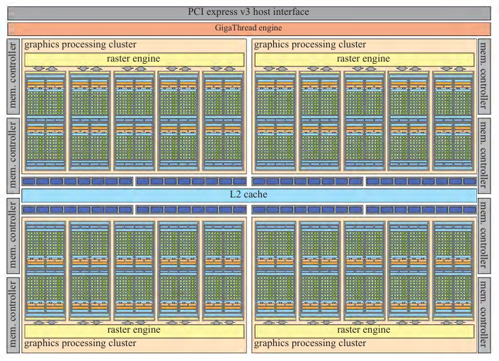

图 23.25。采用 GTX 1080 配置的 Pascal GPU：包含 20 个 SM、20 个多形体引擎、4 个光栅引擎、8 × 20 = 160 个纹理单元（峰值速率为 277.3 Gtexels/s）、总容量为 256 × 20 = 5120 kB 的寄存器文件，以及总计 20 × 128 = 2560 个统一 ALU。（根据 NVIDIA 白皮书 [1297] 的插图绘制。）

至此，我们已经介绍了 GeForce GTX 1080 的大多数组成模块。它由四个 GPC 组成，整体配置如图 23.25 所示。请注意，这里还有一层由 GigaThread 引擎负责的调度，并配有 PCIe v3 接口。GigaThread 引擎是一个全局工作分配引擎，负责将线程块调度到所有 GPC。

图 23.25 还展示了光栅操作单元，不过位置不太显眼。它们紧邻图中央 L2 缓存的上方和下方。每个蓝色块代表一个 ROP 单元，共有 8 组，每组 8 个，总计 64 个。ROP 单元的主要任务是将输出写入像素及其他缓冲，并执行混合等操作。从图的左右两侧可以看到，总共有八个 32 位内存控制器，合计为 256 位。八个 ROP 单元与一个内存控制器及 256 kB 的 L2 缓存绑定。这使整颗芯片的 L2 缓存总容量达到 2 MB。每个 ROP 都绑定到特定的内存分区，因此负责缓冲中某个特定像素子集。ROP 单元还处理无损压缩。除支持未压缩形式和快速清除外，还有三种不同的压缩模式 [1297]。对于 2∶1 压缩（例如从 256 B 压缩到 128 B），每个分块存储一个参考颜色值，并对像素间的差值进行编码；每个差值使用的位数少于其未压缩形式。4∶1 压缩是 2∶1 模式的扩展，但只有在差值能用更少位数编码时才能启用，因此只适用于内容平滑变化的分块。还有一种 8∶1 模式，它将 2 × 2 像素块的 4∶1 恒定颜色压缩与上述 2∶1 模式结合。8∶1 模式优先于 4∶1，后者又优先于 2∶1，也就是说，始终使用能够成功压缩该分块的最高压缩率模式。如果所有压缩尝试均失败，分块就必须以未压缩形式传输并存入内存。图 23.26 展示了 Pascal 压缩系统的效率。

图 23.26。左侧为渲染图像，中间和右侧分别可视化了 Pascal 的上一代架构 Maxwell，以及 Pascal 的压缩结果。图像中的紫色越多，缓冲压缩的成功率越高。（图片来自 NVIDIA 白皮书 [1297]。）

使用的显存为 GDDRX5，时钟速率为 10 GHz。上文已知，八个内存控制器合计提供 256 位 = 32 B。因此，总峰值内存带宽为 320 GB/s；但多级缓存与压缩技术相结合，使其有效速率看起来更高。

> 译注：此处原文及图 23.27 将显存名称写为“GDDRX5”，疑为“GDDR5X”的字母顺序排印错误；译文保留原写法。

芯片的基础时钟频率为 1607 MHz，功率预算充足时可运行于加速模式（1733 MHz）。峰值计算能力为

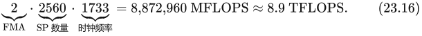

其中，系数 2 来自融合乘加通常被计为两次浮点运算这一事实；从 MFLOPS 换算到 TFLOPS 时，我们除以了 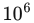。GTX 1080 Ti 具有 3584 个 ALU，计算能力为 12.3 TFLOPS。

NVIDIA 长期以来一直开发末端片元排序（sort-last fragment）架构。不过，自 Maxwell 起，它们还支持一种称为分块缓存（tiled caching）的新渲染方式，某种程度上介于中间排序与末端片元排序之间。图 23.27 展示了该架构。其思想是利用局部性和 L2 缓存。几何数据被分成足够小的批块进行处理，使输出能留在这一缓存内。此外，只要与当前分块重叠的几何数据还未完成像素着色，该分块的帧缓冲也保留在 L2 中。

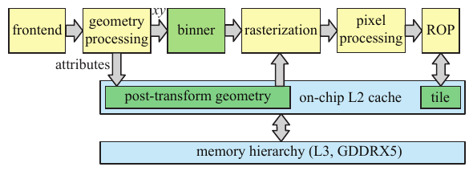

图 23.27。分块缓存引入一个分箱器，将几何数据分类到分块中，并使变换后的几何数据保留在 L2 缓存内。当前处理的分块也保留在 L2 中，直到当前几何批块中落入该分块的几何数据处理完毕。

图 23.25 中有四个光栅引擎，但我们知道，图形 API 在大多数情况下必须遵守图元的提交顺序 [1598]。帧缓冲通常以一种广义棋盘格模式划分为分块 [1160]，每个光栅引擎“拥有”其中一组分块。当前三角形会发送给所有至少有一个所属分块与它重叠的光栅引擎，从而为每个分块独立解决顺序问题。这有利于负载均衡。GPU 架构中通常还有多个 FIFO 队列，用来减少硬件单元因没有工作而饥饿的情况。图中没有画出这些队列。

显示控制器的每个颜色分量为 12 位，并支持 BT.2020 广色域。它还支持 HDMI 2.0b 和 HDCP 2.2。视频处理方面，它支持 SMPTE 2084，这是一种用于高动态范围视频的传递函数。Venkataraman [1816] 描述了 NVIDIA 从 Fermi 起的架构如何配备一个或多个复制引擎（copy engine）。这些内存控制器能够执行直接内存访问（DMA）传输。DMA 传输发生在 CPU 与 GPU 之间，通常由其中一方启动。启动传输的处理单元可以在传输期间继续执行其他计算。复制引擎可以发起 CPU 与 GPU 内存之间的数据 DMA 传输，并独立于 GPU 其余部分执行。因此，当信息从 CPU 传输到 GPU，或反向传输时，GPU 仍可以渲染三角形并执行其他功能。

Pascal 架构也可以配置为用于训练神经网络或大规模数据分析等非图形应用。Tesla P100 就是其中一种配置 [1298]。它与 GTX 1080 的一些区别包括：采用第二代高带宽内存（HBM2），内存总线宽度为 4096 位，总内存带宽为 720 GB/s。此外，它原生支持 16 位浮点数，性能最高为 32 位浮点数的 2 倍，双精度处理速度也显著更快。SM 的配置以及寄存器文件设置同样不同 [1298]。

GTX 1080 Ti（titanium，钛）是一种更高端的配置。它具有 3584 个 ALU、352 位内存总线、484 GB/s 总内存带宽、88 个 ROP 和 224 个纹理单元；GTX 1080 对应的数据分别为 2560、256 位、320 GB/s、64 和 160。它配置了六个 GPC，即六个光栅引擎，而 GTX 1080 为四个。其中四个 GPC 与 GTX 1080 完全相同，另外两个稍小，各只有四个 TPC，而非五个。1080 Ti 芯片使用 120 亿个晶体管，1080 则使用 72 亿个。Pascal 架构很灵活，也能够向下缩减。例如，GTX 1070 相当于 GTX 1080 减去一个 GPC，而 GTX 1050 由两个 GPC 组成，每个含三个 SM。

## 23.10.3 案例研究：AMD GCN Vega

AMD 的 Graphics Core Next（GCN）架构被用于多款 AMD 显卡，以及 Xbox One 和 PLAYSTATION 4。这里介绍 GCN Vega 架构 [35] 的一般组成；它是这些游戏机所用架构的演进版本。

GCN 架构的一个核心组成模块是计算单元（compute unit，CU），如图 23.28 所示。CU 具有四个 SIMD 单元，每个单元有 16 条 SIMD 通道，即 16 个统一 ALU（采用第 23.2 节的术语）。每个 SIMD 单元为 64 个线程执行指令，这组线程称为波前（wavefront）。每个 SIMD 单元每个时钟周期可以发射一条单精度浮点指令。由于该架构让每个 SIMD 单元处理含 64 个线程的波前，需要 4 个时钟周期才能完成一个波前的全部发射 [1103]。还应注意，一个 CU 可以同时运行不同内核的代码。由于每个 SIMD 单元具有 16 条通道，每个时钟周期可以发射一条指令，整个 CU 的最大吞吐量为：每个 CU 的 4 个 SIMD 单元 × 每个单元的 16 条 SIMD 通道 = 每时钟周期 64 次单精度浮点运算。CU 执行半精度（16 位浮点）指令的数量还可以达到单精度的两倍，这对于精度要求较低的情形很有用，例如机器学习和着色器计算。请注意，两个 16 位浮点值被打包到一个 32 位浮点寄存器中。每个 SIMD 单元具有 64 kB 的寄存器文件，折合每个线程 65,536 ÷ (4 × 64) = 256 个寄存器，因为单精度浮点数占 4 字节，而每个波前有 64 个线程。ALU 具有四级硬件流水线 [35]。

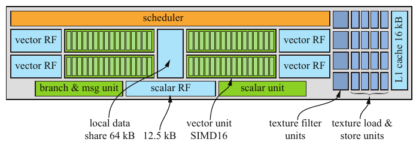

图 23.28。Vega 架构的 GCN 计算单元。每个向量寄存器文件的容量为 64 kB，标量寄存器文件（RF）为 12.5 kB，局部数据共享存储为 64 kB。请注意，每个 CU 中有四个用于计算的单元，各具有 16 条 32 位浮点 SIMD 通道（浅绿色）。（根据 Mah [1103] 和 AMD 白皮书 [35] 的插图绘制。）

每个 CU 具有一个指令缓存（图中未画出），最多由四个 SIMD 单元共享。相关指令被转发到 SIMD 单元的指令缓冲（IB）。每个 IB 可存储用于处理 10 个波前的信息；需要时，这些波前可换入或换出 SIMD 单元，以隐藏延迟。这意味着一个 CU 可以处理 40 个波前，相当于 40 × 64 = 2560 个线程。因此，图 23.28 中的 CU 调度器可同时处理 2560 个线程，其任务是将工作分配给 CU 的不同单元。每个时钟周期都会考虑当前 CU 的全部波前是否可以发射指令，并且最多向每个执行端口发射一条指令。CU 的执行端口包括分支、标量／向量 ALU、标量／向量内存、局部数据共享、全局数据共享或导出，以及特殊指令 [32]；换言之，每个执行端口大致对应 CU 的一个单元。

标量单元是一个 64 位 ALU，同样由各 SIMD 单元共享。它拥有自己的标量寄存器文件和标量数据缓存（未画出）。标量寄存器文件为每个 SIMD 单元提供 800 个 32 位寄存器，即 800 × 4 × 4 = 12.5 kB。其执行与波前紧密耦合。由于向一个 SIMD 单元完整发射一条指令需要四个时钟周期，标量单元只能每隔四个时钟周期为某个特定 SIMD 单元服务一次。标量单元处理控制流、指针运算，以及线程束内各线程可以共享的其他计算。有条件和无条件分支指令从标量单元发送到分支与消息单元执行。每个 SIMD 单元有一个 48 位程序计数器（PC），由所有通道共享。因为各通道执行相同指令，这样已经足够。分支被采取时，程序计数器便会更新。该单元可发送的消息包括调试消息、特殊图形同步消息和 CPU 中断 [1121]。

图 23.29 展示了 Vega 10 架构 [35]。上部包含一个图形命令处理器、两个硬件调度器（HWS）以及八个异步计算引擎（ACE）[33]。GPC 的任务是把图形任务分派到 GPU 的图形流水线与计算引擎。HWS 的缓冲以队列形式工作，并在可能时尽快将队列分配给 ACE。ACE 的任务是把计算任务调度到计算引擎。此外，还有两个可以处理复制任务的 DMA 引擎（图中未画出）。GPC、ACE 和 DMA 引擎能够并行工作，并向 GPU 提交工作。由于不同队列的任务可以交错执行，这提高了利用率。任何队列都可以分派工作，而无需等待其他工作完成，因此独立任务能够同时在计算引擎上执行。ACE 可以通过缓存或内存同步。它们可以共同支持任务图，让某个 ACE 的任务依赖另一个 ACE 的任务，或依赖图形流水线的任务。建议将较小的计算和复制任务与负载较重的图形任务交错安排 [33]。

> 译注：上一段原文两次使用缩写“GPC”指代图形命令处理器；这与上一小节表示图形处理簇的 GPC 含义不同，且与“graphics command processor”的词首顺序不一致。此处保留原文缩写。

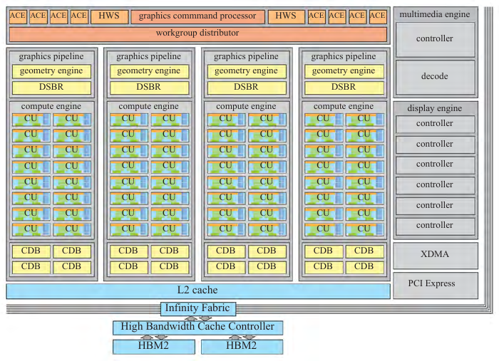

图 23.29。由 64 个 CU 构成的 Vega 10 GPU。请注意，每个 CU 都包含图 23.28 所示的硬件。（根据 AMD 白皮书 [35] 的插图绘制。）

从图 23.29 可以看到，共有四条图形流水线和四个计算引擎。每个计算引擎具有 16 个 CU，合计 64 个。图形流水线有两个模块：几何引擎和绘制流分箱光栅器（draw-stream binning rasterizer，DSBR）。几何引擎包括几何装配器、曲面细分单元和顶点装配器。此外，还支持一种新的图元着色器（primitive shader）。图元着色器旨在实现更灵活的几何处理和更快的图元剔除 [35]。DSBR 结合了中间排序与末端排序架构的优点，这也是分块缓存的目标（第 23.10.2 节）。图像在屏幕空间划分为分块，几何处理之后，每个图元被分配到与其重叠的分块中。对一个分块进行光栅化期间，所需的所有数据（例如分块缓冲）都保存在 L2 缓存中，从而提高性能。像素着色可以自动推迟到一个分块中的所有几何数据处理完毕之后。因此，系统在内部执行一次 z 预遍，像素仅着色一次。延后着色可以开启和关闭；例如，对于透明几何数据，必须关闭。

为处理深度、模板和颜色缓冲，GCN 架构提供了一种称为颜色与深度模块（color and depth block，CDB）的组成模块。它们除执行颜色混合外，还处理颜色、深度和模板的读写。CDB 可以采用第 23.5 节介绍的一般方法压缩颜色缓冲。这里采用差分压缩技术，每个分块以未压缩形式存储一个像素的颜色，其余颜色值均相对于该像素颜色进行编码 [34, 1238]。为提高效率，可以根据访问模式动态选择分块大小。对于最初以 256 字节存储的分块，最大压缩率为 8∶1，即压缩至 32 字节。压缩后的颜色缓冲可以在后续遍中用作纹理，此时纹理单元会解压该压缩分块，进一步节省带宽 [1716]。

光栅器每个时钟周期最多可以光栅化四个图元。与图形流水线和计算引擎连接的 CDB 每时钟周期能够写入 16 个像素。也就是说，小于 16 像素的三角形会降低效率。光栅器还处理粗粒度深度测试（HiZ）和层次化模板测试。HiZ 使用的缓冲称为 HTILE，开发人员可以对它编程，例如用它向 GPU 提供遮挡信息。

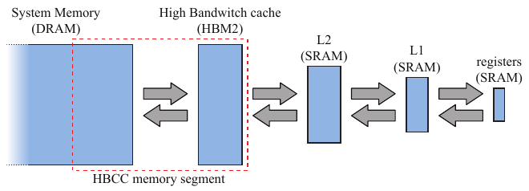

图 23.30。Vega 架构的缓存层次结构。

Vega 的缓存层次结构如图 23.30 所示。层次结构的顶端（图中最右侧）是寄存器，随后是 L1 和 L2 缓存。再往下是同样位于显卡上的第二代高带宽内存（HBM2），最后是 CPU 一侧的系统内存。Vega 的一项新特性是图 23.29 底部所示的高带宽缓存控制器（High-Bandwidth Cache Controller，HBCC）。它使显存能够像最后一级缓存那样工作。这意味着，如果一次内存访问对应的内容不在显存（即 HBM2）中，HBCC 就会自动通过 PCIe 总线取来相关的一个或多个系统内存页面，并将其放入显存。作为结果，显存中较久未使用的页面可能被换出。HBM2 与系统内存之间共享的内存池称为 HBCC 内存段（HBCC memory segment，HMS）。所有图形模块也都通过 L2 缓存访问内存，这与先前架构不同。该架构还支持虚拟内存（第 19.10.1 节）。

请注意，所有片上模块，例如 HBCC、XDMA（CrossFire DMA）、PCI Express、显示引擎和多媒体引擎，都通过名为 Infinity Fabric（IF）的互连通信。AMD CPU 也可以连接到 IF。Infinity Fabric 可以连接不同芯片裸片上的模块。IF 还具备一致性，这意味着所有模块对内存内容看到的视图相同。

芯片的基础时钟频率为 1677 MHz，因此其峰值计算能力为

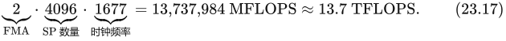

其中，FMA 与 TFLOPS 的计算方式与式（23.16）相同。该架构灵活且可扩展，因此预计还会出现更多配置。
