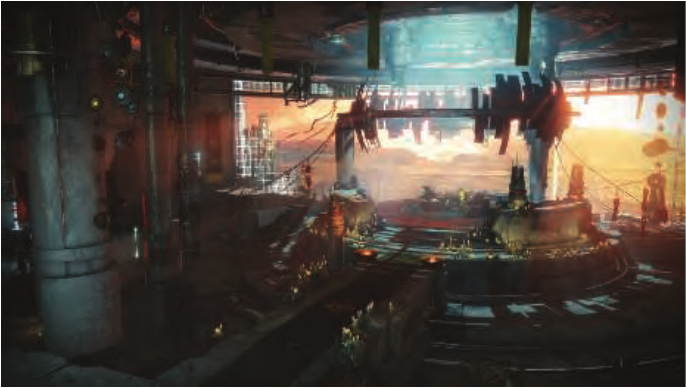

# 24 未来

来源：原书第1041页（PDF第1062页），第24章章首标题、题辞与导言；不含24.1节正文。

> “用不了多久，计算机就会很快了。”
>
> ——比利·泽尔斯纳克（Billy Zelsnack）

> “预测很困难，尤其是预测未来。”
>
> ——尼尔斯·玻尔（Niels Bohr）或约吉·贝拉（Yogi Berra）

> “预测未来的最好办法，就是创造未来。”
>
> ——艾伦·凯（Alan Kay）

未来包含两个部分：你，以及其他一切。本章讨论这两个部分。首先，我们会作一些预测，其中有几条甚至可能成真。更重要的是第二部分，它讨论你接下来可以走向何方。这一部分有点像扩展版的“延伸阅读与资源”一节，但也讨论从这里继续前进的方式：通用的信息来源、会议、代码，以及更多内容。不过，先来看一幅图：见图24.1。

图24.1. 透过游戏《命运2》（Destiny 2），一窥某种未来。（图片© 2017 Bungie, Inc.，保留所有权利。）
