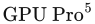
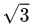
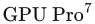

# 参考文献 801—1000

**[801]** Isensee, Pete, 《C++优化策略与技术》（C++ Optimization Strategies and Techniques），Pete Isensee 网站, 2007. 本书引用页：815。

**[802]** Isidoro, John, Alex Vlachos，以及 Chris Brennan, 《海水渲染》（Rendering Ocean Water），载于 Wolfgang Engel（编）， Direct3D ShaderX：顶点与像素着色器技巧及技术（Direct3D ShaderX: Vertex & Pixel Shader Tips and Techniques） , Wordware, 第347–356页, 2002年5月. 本书引用页：43。

**[803]** Isidoro, John, 《下一代皮肤渲染》（Next Generation Skin Rendering），游戏技术大会（Game Tech Conference）, 2004. 本书引用页：635。

**[804]** Isidoro, John, 《阴影映射：基于GPU的技巧与技术》（Shadow Mapping: GPU-Based Tips and Techniques），游戏开发者大会（Game Developers Conference）, 2006年3月. 本书引用页：250。

**[805]** Iwanicki, Michał, 《结合低频预计算可见性的法线映射》（Normal Mapping with Low-Frequency Precomputed Visibility），载于 SIGGRAPH 2009报告（SIGGRAPH 2009 Talks）, ACM, 文章编号 52, 2009年8月. 本书引用页：466, 471。

**[806]** Iwanicki, Michał, 《〈最后生还者〉的光照技术》（Lighting Technology of The Last of Us），载于 ACM SIGGRAPH 2013报告（ACM SIGGRAPH 2013 Talks）, ACM, 文章编号 20, 2013年7月. 本书引用页：229, 289, 467, 476, 486, 498。

**[807]** Iwanicki, Michał，以及 Angelo Pesce, 《基于物理的渲染的近似模型》（Approximate Models for Physically Based Rendering），SIGGRAPH基于物理的着色：理论与实践（SIGGRAPH Physically Based Shading in Theory and Practice），课程 , 2015年8月. 本书引用页：386, 387, 422, 424, 502。

**[808]** Iwanicki, Michał，以及 Peter-Pike Sloan, 《环境骰子》（Ambient Dice），Eurographics渲染研讨会：实验性构想与实现（Eurographics Symposium on Rendering—Experimental Ideas & Implementations）, 2017年6月. 本书引用页：395, 478, 488。

**[809]** Iwanicki, Michał，以及 Peter-Pike Sloan, 《〈使命召唤：无限战争〉中的预计算光照》（Precomputed Lighting in Call of Duty: Infinite Warfare），SIGGRAPH游戏实时渲染进展（SIGGRAPH Advances in Real-Time Rendering in Games），课程, 2017年8月. 本书引用页：402, 471, 476, 490, 491。

**[810]** Jakob, Wenzel, Miloš Hašan, Ling-Qi Yan, Jason Lawrence, Ravi Ramamoorthi，以及 Steve Marschner, 《离散随机微表面模型》（Discrete Stochastic Microfacet Models），ACM图形学汇刊（ACM Transactions on Graphics） (SIGGRAPH 2014), 第33卷, 第4期, 第115:1–115:9页, 2014年7月. 本书引用页：372。

**[811]** Jakob, Wenzel, Eugene d’Eon, Otto Jakob，以及 Steve Marschner, 《用于渲染分层材质的综合框架》（A Comprehensive Framework for Rendering Layered Materials），ACM图形学汇刊（ACM Transactions on Graphics） (SIGGRAPH 2014), 第33卷, 第4期, 第118:1–118:14页, 2014年7月. 本书引用页：346, 364。

**[812]** Jakob, Wenzel, 《layerlab：分层材质计算工具箱》（layerlab: A Computational Toolbox for Layered Materials），SIGGRAPH基于物理的着色：理论与实践（SIGGRAPH Physically Based Shading in Theory and Practice），课程 , 2015年8月. 本书引用页：364。

**[813]** James, Doug L.，以及 Christopher D. Twigg, 《网格动画蒙皮》（Skinning Mesh Animations），ACM图形学汇刊（ACM Transactions on Graphics）, 第23卷, 第3期, 第399–407页, 2004年8月. 本书引用页：85。

**[814]** James, Greg, 《硬件加速程序化纹理动画的操作》（Operations for Hardware Accelerated Procedural Texture Animation），载于 Mark DeLoura（编）， 游戏编程宝石2（Game Programming Gems 2） , Charles River Media, 第497–509页, 2001. 本书引用页：521。

**[815]** James, Greg，以及 John O’Rorke, 《实时辉光》（Real-Time Glow），载于 Randima Fernando（编）， GPU Gems, Addison-Wesley, 第343–362页, 2004. 本书引用页：517, 518, 527。

**[816]** Jansen, Jon，以及 Louis Bavoil, 《使用DirectX 11曲面细分与混合分辨率快速渲染不透明度映射粒子》（Fast Rendering of Opacity-Mapped Particles Using DirectX 11 Tessellation and Mixed Resolutions），NVIDIA 白皮书, 2011年2月. 本书引用页：520, 569, 570, 571, 609, 612。

**[817]** Jarosz, Wojciech, 《快速图像卷积》（Fast Image Convolutions），伊利诺伊大学厄巴纳—香槟分校SIGGRAPH研讨班（SIGGRAPH Workshop at University of Illinois at Urbana-Champaign）, 2001. 本书引用页：518。

**[818]** Jarosz, Wojciech, 《散射介质中光传输的高效蒙特卡洛方法》（Efficient Monte Carlo Methods for Light Transport in Scattering Media） , 博士学位论文, 加利福尼亚大学圣迭戈分校（University of California, San Diego）, 2008年9月. 本书引用页：589。

**[819]** Jarosz, Wojciech, Nathan A. Carr，以及 Henrik Wann Jensen, 《球谐函数的重要性采样》（Importance Sampling Spherical Harmonics），计算机图形学论坛（Computer Graphics Forum）, 第28卷, 第2期, 第577–586页, 2009. 本书引用页：419。

**[820]** Jendersie, Johannes, David Kuri，以及 Thorsten Grosch, 《用于实时全局光照的预计算照度合成》（Precomputed Illuminance Composition for Real-Time Global Illumination），载于 第20届ACM SIGGRAPH交互式三维图形与游戏研讨会论文集（Proceedings of the 20th ACM SIGGRAPH Symposium on Interactive 3D Graphics and Games）, ACM, 第129–137页, 2016. 本书引用页：483。

**[821]** Jensen, Henrik Wann, Justin Legakis，以及 Julie Dorsey, 《湿润材质的渲染》（Rendering of Wet Materials），载于 渲染技术’99（Rendering Techniques ’99）, Springer, 第273–282页, 1999年6月. 本书引用页：349。

**[822]** Jensen, Henrik Wann, 《使用光子映射进行真实感图像合成》（Realistic Image Synthesis Using Photon Mapping）, A K Peters, Ltd., 2001. 本书引用页：630。

**[823]** Jensen, Henrik Wann, Stephen R. Marschner, Marc Levoy，以及 Pat Hanrahan, 《次表面光传输的实用模型》（A Practical Model for Subsurface Light Transport），载于 SIGGRAPH ’01：第28届计算机图形学与交互技术年会论文集（SIGGRAPH ’01 Proceedings of the 28th Annual Conference on Computer Graphics and Interactive Techniques）, ACM, 第511–518页, 2001年8月. 本书引用页：634, 638。

**[824]** Jeschke, Stefan, Stephan Mantler，以及 Michael Wimmer, 《交互式平滑曲面壳映射》（Interactive Smooth and Curved Shell Mapping），载于 渲染技术（Rendering Techniques）, Eurographics Association, 第351–360页, 2007年6月. 本书引用页：220。

**[825]** Jiang, Yibing, 《〈神秘海域4〉中基于体积的材质的创建流程》（The Process of Creating Volumetric-Based Materials in Uncharted 4），SIGGRAPH游戏实时渲染进展（SIGGRAPH Advances in Real-Time Rendering in Games），课程 , 2016年7月. 本书引用页：356, 357, 358, 359。

**[826]** Jiménez, J. J., F. R. Feito，以及 R. J. Segura, 《无需预处理的稳健且优化的点在多边形内包含性测试算法》（Robust and Optimized Algorithms for the Point-in-Polygon Inclusion Test without Pre-processing），计算机图形学论坛（Computer Graphics Forum）, 第28卷, 第8期, 第2264–2274页, 2009. 本书引用页：970。

**[827]** Jiménez, J. J., David Whelan, Veronica Sundstedt，以及 Diego Gutierrez, 《实时真实感皮肤半透明性》（Real-Time Realistic Skin Translucency），计算机图形学与应用（Computer Graphics and Applications） , 第30卷, 第4期, 第32–41页, 2010. 本书引用页：637。

**[828]** Jimenez, Jorge, Belen Masia, Jose I. Echevarria, Fernando Navarro，以及 Diego Gutierrez, 《实用形态学抗锯齿》（Practical Morphological Antialiasing），载于 Wolfgang Engel（编）， , A K Peters/CRC Press, 第95–113页, 2011. 本书引用页：148。

**[829]** Jimenez, Jorge, Diego Gutierrez, 等, 《实时抗锯齿的滤波方法》（SIGGRAPH实时抗锯齿的滤波方法（SIGGRAPH Filtering Approaches for Real-Time Anti-Aliasing），课程）, 2011年8月. 本书引用页：147, 165。

**[830]** Jimenez, Jorge, Jose I. Echevarria, Tiago Sousa，以及 Diego Gutierrez, 《SMAA：增强型亚像素形态学抗锯齿》（SMAA: Enhanced Subpixel Morphological Antialiasing），计算机图形学论坛（Computer Graphics Forum）, 第31卷, 第2期, 第355–364页, 2012. 本书引用页：146, 148。

**[831]** Jimenez, Jorge, 《下一代角色渲染》（Next Generation Character Rendering），游戏开发者大会（Game Developers Conference）, 2013年3月. 本书引用页：636, 637。

**[832]** Jimenez, Jorge, 《〈使命召唤：高级战争〉中的下一代后处理》（Next Generation Post Processing in Call of Duty Advanced Warfare），SIGGRAPH游戏实时渲染进展（SIGGRAPH Advances in Real-Time Rendering in Games），课程 , 2014年8月. 本书引用页：251, 527, 534, 535, 537, 540, 542, 543。

**[833]** Jimenez, Jorge, Karoly Zsolnai, Adrian Jarabo, Christian Freude, Thomas Auzinger, Xian-Chun Wu, Javier von der Pahlen, Michael Wimmer，以及 Diego Gutierrez, 《可分离次表面散射》（Separable Subsurface Scattering），计算机图形学论坛（Computer Graphics Forum）, 第34卷, 第6期, 第188–197页, 2015. 本书引用页：637。

**[834]** Jimenez, Jorge, 《电影级SMAA：清晰的形态学与时间抗锯齿》（Filmic SMAA: Sharp Morphological and Temporal Antialiasing），SIGGRAPH游戏实时渲染进展（SIGGRAPH Advances in Real-Time Rendering in Games），课程 , 2016年7月. 本书引用页：148。

**[835]** Jimenez, Jorge, Xianchun Wu, Angelo Pesce，以及 Adrian Jarabo, 《精确间接遮蔽的实用实时策略》（Practical Real-Time Strategies for Accurate Indirect Occlusion），SIGGRAPH基于物理的着色：理论与实践（SIGGRAPH Physically Based Shading in Theory and Practice），课程, 2016年7月. 本书引用页：451, 461, 462, 468, 472。

**[836]** Jimenez, Jorge, 《〈使命召唤：无限战争〉中的动态时间抗锯齿》（Dynamic Temporal Antialiasing in Call of Duty: Infinite Warfare），SIGGRAPH游戏实时渲染进展（SIGGRAPH Advances in Real-Time Rendering in Games），课程 , 2017年8月. 本书引用页：142, 143, 145, 146, 148, 166, 805。

**[837]** Jin, Shuangshuang, Robert R. Lewis，以及 David West, 《顶点法线计算算法比较》（A Comparison of Algorithms for Vertex Normal Computation），视觉计算机（The Visual Computer）, 第21卷, 第71–82页, 2005. 本书引用页：695。

**[838]** Johansson, Mikael, 《建筑信息模型（BIM）的高效立体渲染》（Efficient Stereoscopic Rendering of Building Information Models (BIM)），计算机图形技术期刊（Journal of Computer Graphics Techniques） , 第5卷, 第3期, 第1–17页, 2016. 本书引用页：927。

**[839]** Johnson, G. S., J. Lee, C. A. Burns，以及 W. R. Mark, 《不规则Z缓冲：不规则数据结构的硬件加速》（The Irregular Z-Buffer: Hardware Acceleration for Irregular Data Structures），ACM图形学汇刊（ACM Transactions on Graphics） , 第24卷, 第4期, 第1462–1482页, 2005年10月. 本书引用页：260。

**[840]** Johnsson, Björn, Per Ganestam, Michael Doggett，以及 Tomas Akenine-Möller, 《图形处理器上运行的软件算法的能效》（Power Efficiency for Software Algorithms Running on Graphics Processors），载于 第四届ACM SIGGRAPH／Eurographics高性能图形学会议论文集（Proceedings of the Fourth ACM SIGGRAPH / Eurographics Conference on High-Performance Graphics） , Eurographics Association, 第67–75页, 2012年6月. 本书引用页：790。

**[841]** Jones, James L., 《使用OpenGL ES 3.0实现高效变形目标动画》（Efficient Morph Target Animation Using OpenGL ES 3.0），载于 Wolfgang Engel（编）， , CRC Press, 第289–295页, 2014. 本书引用页：90。

**[842]** Jönsson, Daniel, Erik Sundén, Anders Ynnerman，以及 Timo Ropinski, 《交互式体渲染的体积光照技术综述》（A Survey of Volumetric Illumination Techniques for Interactive Volume Rendering），计算机图形学论坛（Computer Graphics Forum）, 第33卷, 第1期, 第27–51页, 2014. 本书引用页：605。

**[843]** Joy, Kenneth I., 《在线几何建模笔记》（On-Line Geometric Modeling Notes）, http://graphics.idav.ucdavis.edu/education/CAGDNotes/homepage.html, 1996. 本书引用页：756。

**[844]** Junkins, S., 《Intel处理器图形Gen9的计算架构》（The Compute Architecture of Intel Processor Graphics Gen9），Intel 白皮书 v1.0, 2015年8月. 本书引用页：1006, 1007。

**[845]** Kajiya, James T., 《各向异性反射模型》（Anisotropic Reflection Models），Computer Graphics (SIGGRAPH ’85 Proceedings), 第19卷, 第3期, 第15–21页, 1985年7月. 本书引用页：853。

**[846]** Kajiya, James T., 《渲染方程》（The Rendering Equation），Computer Graphics (SIGGRAPH ’86 Proceedings), 第20卷, 第4期, 第143–150页, 1986年8月. 本书引用页：315, 437, 444。

**[847]** Kajiya, James T.，以及 Timothy L. Kay, 《使用三维纹理渲染毛皮》（Rendering Fur with Three Dimensional Textures），Computer Graphics (SIGGRAPH ’89 Proceedings) , 第17卷, 第3期, 第271–280页, 1989年7月. 本书引用页：359, 642。

**[848]** Kalnins, Robert D., Philip L. Davidson, Lee Markosian，以及 Adam Finkelstein, 《连贯的风格化轮廓》（Coherent Stylized Silhouettes），ACM图形学汇刊（ACM Transactions on Graphics） (SIGGRAPH 2003) , 第22卷, 第3期, 第856–861页, 2003. 本书引用页：667。

**[849]** Kämpe, Viktor, 《快速且节省内存的体素化阴影构建》（Fast, Memory-Efficient Construction of Voxelized Shadows）, 博士学位论文, 查尔姆斯理工大学（Chalmers University of Technology）, 2016. 本书引用页：586。

**[850]** Kämpe, Viktor, Erik Sintorn, Ola Olsson，以及 Ulf Assarsson, 《快速且节省内存的体素化阴影构建》（Fast, Memory-Efficient Construction of Voxelized Shadows），IEEE可视化与计算机图形学汇刊（IEEE Transactions on Visualization and Computer Graphics）, 第22卷, 第10期, 第2239–2248页, 2016年10月. 本书引用页：264, 586。

**[851]** Kaneko, Tomomichi, Toshiyuki Takahei, Masahiko Inami, Naoki Kawakami, Yasuyuki Yanagida, Taro Maeda，以及 Susumu Tachi, 《利用视差映射进行精细形状表示》（Detailed Shape Re报告 with Parallax Mapping） 2001年人工现实与远程临场国际会议（International Conference on Artificial Reality and Telexistence 2001） , 2001年12月. 本书引用页：215。

**[852]** Kang, H., H. Jang, C.-S. Cho，以及 J. Han, 《采用GPU曲面细分的多分辨率地形渲染》（Multi-Resolution Terrain Rendering with GPU Tessellation），视觉计算机（The Visual Computer） , 第31卷, 第4期, 第455–469页, 2015. 本书引用页：567, 876。

**[853]** Kaplan, Matthew, Bruce Gooch，以及 Elaine Cohen, 《交互式艺术渲染》（Interactive Artistic Rendering），载于 第一届非真实感动画与渲染国际研讨会论文集（Proceedings of the 1st International Symposium on Non-photorealistic Animation and Rendering）, ACM, 第67–74页, 2000年6月. 本书引用页：670, 672。

**[854]** Kaplanyan, Anton, 《CryEngine 3中的光传播体》（Light Propagation Volumes in CryEngine 3），SIGGRAPH游戏实时渲染进展（SIGGRAPH Advances in Real-Time Rendering in Games），课程, 2009年8月. 本书引用页：493。

**[855]** Kaplanyan, Anton，以及 Carsten Dachsbacher, 《用于实时间接光照的级联光传播体》（Cascaded Light Propagation Volumes for Real-Time Indirect Illumination），载于 2010年ACM SIGGRAPH交互式三维图形与游戏研讨会论文集（Proceedings of the 2010 ACM SIGGRAPH Symposium on Interactive 3D Graphics and Games）, ACM, 第99–107页, 2010年2月. 本书引用页：494, 496。

**[856]** Kaplanyan, Anton, 《CryENGINE 3：达到光速》（CryENGINE 3: Reaching the Speed of Light），SIGGRAPH游戏实时渲染进展（SIGGRAPH Advances in Real-Time Rendering in Games），课程 , 2010年7月. 本书引用页：196, 289, 290, 848, 849, 887, 892。

**[857]** Kaplanyan, Anton, Stephen Hill, Anjul Patney，以及 Aaron Lefohn, 《对法线分布进行滤波以实现着色抗锯齿》（Filtering Distributions of Normals for Shading Antialiasing），载于 高性能图形学会议论文集（Proceedings of High-Performance Graphics） , Eurographics Association, 第151–162页, 2016年6月. 本书引用页：371。

**[858]** Kapoulkine, Arseny, 《最优网格渲染并不最优》（Optimal Grid Rendering Is Not Optimal），Bits, pixels, cycles and more 博客, 2017年7月31日. 本书引用页：700, 701。

**[859]** Karabassi, Evaggelia-Aggeliki, Georgios Papaioannou，以及 Theoharis Theoharis, 《一种基于深度缓冲的快速体素化算法》（A Fast Depth-Buffer-Based Voxelization Algorithm），图形工具期刊（journal of graphics tools）, 第4卷, 第4期, 第5–10页, 1999. 本书引用页：580。

**[860]** Karis, Brian, 《分块光源剔除》（Tiled Light Culling），Graphic Rants 博客, 2012年4月9日. 本书引用页：113, 882。

**[861]** Karis, Brian, 《Unreal Engine 4中的真实着色》（Real Shading in Unreal Engine 4），SIGGRAPH基于物理的着色：理论与实践（SIGGRAPH Physically Based Shading in Theory and Practice），课程, 2013年7月. 本书引用页：111, 113, 116, 325, 336, 340, 342, 352, 355, 383, 385, 388, 421, 423。

**[862]** Karis, Brian, 《高质量时间超采样》（High Quality Temporal Supersampling），SIGGRAPH游戏实时渲染进展（SIGGRAPH Advances in Real-Time Rendering in Games），课程, 2014年8月. 本书引用页：142, 143, 144, 620。

**[863]** Karis, Brian, 《Unreal中基于物理的毛发着色》（Physically Based Hair Shading in Unreal），SIGGRAPH基于物理的着色：理论与实践（SIGGRAPH Physically Based Shading in Theory and Practice），课程 , 2016年7月. 本书引用页：641, 644, 646。

**[864]** Kass, Michael, Aaron Lefohn，以及 John Owens, 《利用GPU上的模拟扩散实现交互式景深》（Interactive Depth of Field Using Simulated Diffusion on a GPU），技术备忘录, Pixar Animation Studios, 2006. 本书引用页：535。

**[865]** Kasyan, Nikolas, 《玩转实时阴影》（Playing with Real-Time Shadows），SIGGRAPH高效实时阴影（SIGGRAPH Efficient Real-Time Shadows），课程, 2013年7月. 本书引用页：54, 234, 245, 251, 264, 585。

**[866]** Kautz, Jan, Wolfgang Heidrich，以及 Katja Daubert, 《用于OpenGL渲染的凹凸贴图阴影》（Bump Map Shadows for OpenGL Rendering），技术报告 MPI-I-2000–4-001, Max-Planck-Institut für Informatik, 德国萨尔布吕肯（Saarbrücken, Germany）, 2000年2月.本书引用页：466。

**[867]** Kautz, Jan，以及 M. D. McCool, 《使用预滤波环境贴图近似光泽反射》（Approximation of Glossy Reflection with Prefiltered Environment Maps），载于 Graphics Interface 2000, Canadian Human-Computer Communications Society, 第119–126页, 2000年5月. 本书引用页：423。

**[868]** Kautz, Jan, P.-P. Vázquez, W. Heidrich，以及 H.-P. Seidel, 《预滤波环境贴图的统一方法》（A Unified Approach to Prefiltered Environment Maps），载于 渲染技术2000（Rendering Techniques 2000）, Springer, 第185–196页, 2000年6月. 本书引用页：420。

**[869]** Kautz, Jan, Peter-Pike Sloan，以及 John Snyder, 《利用球谐函数实现低频光照下的快速任意BRDF着色》（Fast, Arbitrary BRDF Shading for Low-Frequency Lighting Using Spherical Harmonics），载于 第13届Eurographics渲染研讨会论文集（Proceedings of the 13th Eurographics Workshop on Rendering）, Eurographics Association, 第291–296页, 2002年6月. 本书引用页：401, 431。

**[870]** Kautz, Jan, Jaakko Lehtinen，以及 Peter-Pike Sloan, 《预计算辐射传输：理论与实践》（SIGGRAPH预计算辐射传输：理论与实践（SIGGRAPH Precomputed Radiance Transfer: Theory and Practice），课程） , 2005年8月. 本书引用页：481。

**[871]** Kautz, Jan, 《球谐光照表示》（SH Light Re报告s），SIGGRAPH预计算辐射传输：理论与实践（SIGGRAPH Precomputed Radiance Transfer: Theory and Practice），课程, 2005年8月. 本书引用页：430。

**[872]** Kavan, Ladislav, Steven Collins, Jiří Žára，以及 Carol O’Sullivan, 《使用双四元数进行蒙皮》（Skinning with Dual Quaternions），载于 2007年交互式三维图形与游戏研讨会论文集（Proceedings of the 2007 Symposium on Interactive 3D Graphics and Games） , ACM, 第39–46页, 2007年4—5月. 本书引用页：87。

**[873]** Kavan, Ladislav, Steven Collins, Jiří Žára，以及 Carol O’Sullivan, 《采用近似双四元数混合的几何蒙皮》（Geometric Skinning with Approximate Dual Quaternion Blending），ACM图形学汇刊（ACM Transactions on Graphics） , 第27卷, 第4期, 第105:1–105:23页, 2008. 本书引用页：87。

**[874]** Kavan, Ladislav, Simon Dobbyn, Steven Collins, Jiří Žára，以及 Carol O’Sullivan, 《Polypostors：用于三维人群的二维多边形替身》（Polypostors: 2D Polygonal Impostors for 3D Crowds），载于 2008年交互式三维图形与游戏研讨会论文集（Proceedings of the 2008 Symposium on Interactive 3D Graphics and Games）, ACM, 第149–156页, 2008. 本书引用页：562。

**[875]** Kavan, Ladislav, Adam W. Bargteil，以及 Peter-Pike Sloan, 《最小二乘顶点烘焙》（Least Squares Vertex Baking），计算机图形学论坛（Computer Graphics Forum）, 第30卷, 第4期, 第1319–1326页, 2011. 本书引用页：452。

**[876]** Kay, L., 《SceneJS：基于WebGL的场景图引擎》（SceneJS: A WebGL-Based Scene Graph Engine），载于 Patrick Cozzi & Christophe Riccio（编）， OpenGL Insights, CRC Press, 第571–582页, 2012. 本书引用页：829。

**[877]** Kay, T. L.，以及 J. T. Kajiya, 《复杂场景的光线追踪》（Ray Tracing Complex Scenes），Computer Graphics (SIGGRAPH ’86 Proceedings), 第20卷, 第4期, 第269–278页, 1986年8月. 本书引用页：959, 961。

**[878]** Kelemen, Csaba，以及 Lázló Szirmay-Kalos, 《具有重要性采样的基于微表面的镜面与哑光耦合BRDF模型》（A Microfacet Based Coupled Specular-Matte BRDF Model with Importance Sampling），载于 Eurographics 2001短篇报告（Eurographics 2001—Short Presentations）, Eurographics Association, 第25–34页, 2001年9月. 本书引用页：346, 352, 419。

**[879]** Keller, Alexander, 《即时辐射度》（Instant Radiosity），载于 SIGGRAPH ’97：第24届计算机图形学与交互技术年会论文集（SIGGRAPH ’97: Proceedings of the 24th Annual Conference on Computer Graphics and Interactive Techniques） , ACM Press/Addison-Wesley Publishing Co., 第49–56页, 1997年8月. 本书引用页：491。

**[880]** Keller, Alexander，以及 Wolfgang Heidrich, 《交错采样》（Interleaved Sampling），载于 渲染技术2001（Rendering Techniques 2001）, Springer, 第266–273页, 2001年6月. 本书引用页：145。

**[881]** Kemen, B., 《对数深度缓冲的优化与修复》（Logarithmic Depth Buffer Optimizations & Fixes），Outerra 博客, 2013年7月18日. 本书引用页：101。

**[882]** Kensler, Andrew，以及 Peter Shirley, 《通过自动搜索优化射线与三角形求交》（Optimizing Ray-Triangle Intersection via Automated Search），载于 2006年IEEE交互式光线追踪研讨会（2006 IEEE Symposium on Interactive Ray Tracing） , IEEE Computer Society, 第33–38页, 2006. 本书引用页：962。

**[883]** Kent, James R., Wayne E. Carlson，以及 Richard E. Parent, 《多面体对象的形状变换》（Shape Transformation for Polyhedral Objects），Computer Graphics (SIGGRAPH ’92 Proceedings), 第26卷, 第2期, 第47–54页, 1992. 本书引用页：87。

**[884]** Kershaw, Kathleen, 《通用纹理映射流水线》（A Generalized Texture-Mapping Pipeline）, 硕士学位论文, 纽约州伊萨卡康奈尔大学计算机图形学项目（Program of Computer Graphics, Cornell University, Ithaca, New York）, 1992. 本书引用页：169, 170。

**[885]** Kessenich, John, Graham Sellers，以及 Dave Shreiner, 《OpenGL编程指南：学习OpenGL 4.5及SPIR-V的官方指南》（OpenGL Programming Guide: The Official Guide to Learning OpenGL, Version 4.5 with SPIR-V） , 第9版, Addison-Wesley, 2016. 本书引用页：27, 39, 41, 55, 96, 173, 174。

**[886]** Kettlewell, Richard, 《Codemasters的《GRID2》及后续作品中的渲染》（Rendering in Codemasters’ GRID2 and beyond），游戏开发者大会（Game Developers Conference）, 2014年3月. 本书引用页：258。

**[887]** Kharlamov, Alexander, Iain Cantlay，以及 Yury Stepanenko, 《下一代SpeedTree渲染》（Next-Generation SpeedTree Rendering），载于 Hubert Nguyen（编）， GPU Gems 3, Addison-Wesley, 第69–92页, 2007. 本书引用页：207, 560, 564, 646, 856。

**[888]** Kihl, Robert, 《Frostbite 2中使用体积距离场进行破坏遮罩》（Destruction Masking in Frostbite 2 Using Volume Distance Fields），SIGGRAPH游戏实时渲染进展（SIGGRAPH Advances in Real-Time Rendering in Games），课程 , 2010年7月. 本书引用页：889, 890。

**[889]** Kilgard, Mark J., 《实现OpenGL：同一架构的两种实现》（Realizing OpenGL: Two Implementations of One Architecture），载于 ACM SIGGRAPH／EUROGRAPHICS图形硬件研讨会论文集（Proceedings of the ACM SIGGRAPH/EUROGRAPHICS Workshop on Graphics Hardware） , ACM, 第45–55页, 1997年8月. 本书引用页：1007。

**[890]** Kilgard, Mark J., 《使用模板缓冲创建反射与阴影》（Creating Reflections and Shadows Using Stencil Buffers），游戏开发者大会（Game Developers Conference）, 1999年3月. 本书引用页：805。

**[891]** Kilgard, Mark J., 《适用于当今GPU的实用且稳健的凹凸映射技术》（A Practical and Robust Bump-Mapping Technique for Today’s GPUs），游戏开发者大会（Game Developers Conference）, 2000年3月. 本书引用页：212, 214。

**[892]** Kim, Pope，以及 Daniel Barrero, 《〈星际战士〉的渲染技术》（Rendering Tech of Space Marine），韩国游戏大会（Korea Game Conference）, 2011年11月. 本书引用页：892, 900, 905。

**[893]** Kim, Pope, 《〈战锤40000：星际战士〉中的屏幕空间贴花》（Screen Space Decals in Warhammer 40,000: Space Marine），载于 ACM SIGGRAPH 2012报告（ACM SIGGRAPH 2012 Talks）, 文章编号 6, 2012年8月. 本书引用页：889。

**[894]** Kim, Tae-Yong，以及 Ulrich Neumann, 《不透明度阴影贴图》（Opacity Shadow Maps），载于 渲染技术2001（Rendering Techniques 2001）, Springer, 第177–182页, 2001. 本书引用页：257, 570, 571, 612。

**[895]** King, Gary，以及 William Newhall, 《高效全向阴影贴图》（Efficient Omnidirectional Shadow Maps），载于 Wolfgang Engel（编）， , Charles River Media, 第435–448页, 2004. 本书引用页：234。

**[896]** King, Gary, 《阴影映射算法》（Shadow Mapping Algorithms），GPU Jackpot 报告, 2004年10月. 本书引用页：235, 240。

**[897]** King, Gary, 《动态辐照度环境贴图的实时计算》（Real-Time Computation of Dynamic Irradiance Environment Maps），载于 Matt Pharr（编）， GPU Gems 2 , Addison-Wesley, 第167–176页, 2005. 本书引用页：426, 428, 430。

**[898]** King, Yossarian, 《别让他们看见突变：几何细节层次选择中的问题》（Never Let ’Em See You Pop—Issues in Geometric Level of Detail Selection），载于 Mark DeLoura（编）， 游戏编程宝石（Game Programming Gems）, Charles River Media, 第432–438页, 2000. 本书引用页：861, 864。

**[899]** King, Yossarian, 《二维镜头光晕》（2D Lens Flare），载于 Mark DeLoura（编）， 游戏编程宝石（Game Programming Gems）, Charles River Media, 第515–518页, 2000. 本书引用页：524。

**[900]** Kircher, Scott, 《〈黑道圣徒3〉的光照与简化》（Lighting & Simplifying Saints Row: The Third），游戏开发者大会（Game Developers Conference）, 2012年3月. 本书引用页：889, 892。

**[901]** Kirk, David B.，以及 Douglas Voorhies, 《DN-10000VS的渲染架构》（The Rendering Architecture of the DN-10000VS），Computer Graphics (SIGGRAPH ’90 Proceedings) , 第24卷, 第4期, 第299–307页, 1990年8月. 本书引用页：185。

**[902]** Kirk, David（编）， 《图形学宝石III》（Graphics Gems III） , Academic Press, 1992. 本书引用页：102, 991。

**[903]** Kirk, David B.，以及 Wen-mei W. Hwu, 《大规模并行处理器编程：实践方法》（Programming Massively Parallel Processors: A Hands-on Approach）, 第3版, Morgan Kaufmann, 2016. 本书引用页：55, 1040。

**[904]** Klehm, Oliver, Tobias Ritschel, Elmar Eisemann，以及 Hans-Peter Seidel, 《屏幕空间中的弯曲法线与圆锥》（Bent Normals and Cones in Screen Space），载于 视觉、建模与可视化（Vision, Modeling，以及 Visualization）, Eurographics Association, 第177–182页, 2011. 本书引用页：467, 471。

**[905]** Klein, Allison W., Wilmot Li, Michael M. Kazhdan, Wagner T. Corrêa, Adam Finkelstein，以及 Thomas A. Funkhouser, 《非真实感虚拟环境》（Non-Photorealistic Virtual Environments），载于 SIGGRAPH ’00：第27届计算机图形学与交互技术年会论文集（SIGGRAPH ’00: Proceedings of the 27th Annual Conference on Computer Graphics and Interactive Techniques）, ACM Press/Addison-Wesley Publishing Co., 第527–534页, 2000年7月. 本书引用页：670, 671。

**[906]** Klein, R., G. Liebich，以及 W. Strasser, 《带误差控制的网格简化》（Mesh Reduction with Error Control），载于 第七届可视化会议（Visualization ’96）论文集（Proceedings of the 7th Conference on Visualization ’96）, IEEE Computer Society, 第311–318页, 1996. 本书引用页：875。

**[907]** Kleinhuis, Christian, 《使用DirectX实现变形目标动画》（Morph Target Animation Using DirectX），载于 Wolfgang Engel（编）， , Charles River Media, 第39–45页, 2005. 本书引用页：89。

**[908]** Klint, Josh, 《Leadwerks游戏引擎4中的植被管理》（Vegetation Management in Leadwerks Game Engine 4），载于 Eric Lengyel（编）， 游戏引擎宝石3（Game Engine Gems 3）, CRC Press, 第53–71页, 2016. 本书引用页：560。

**[909]** Kloetzli, J., 《D3D11软件曲面细分》（D3D11 Software Tessellation），游戏开发者大会（Game Developers Conference）, 2013年3月. 本书引用页：879。

**[910]** Klosowski, J. T., M. Held, J. S. B. Mitchell, H. Sowizral，以及 K. Zikan, 《利用k-DOP包围体层次结构实现高效碰撞检测》（Efficient Collision Detection Using Bounding Volume Hierarchies of k-DOPs），IEEE可视化与计算机图形学汇刊（IEEE Transactions on Visualization and Computer Graphics） , 第4卷, 第1期, 第21–36页, 1998. 本书引用页：979。IEEE可视化与计算机图形学汇刊（IEEE Transactions on Visualization and Computer Graphics）, 第6卷, 第2期, 第108–123页, 2000年4月／6月.

**[911]** Knight, Balor, Matthew Ritchie，以及 George Parrish, 《用于高效延迟着色的屏幕空间分类》（Screen-Space Classification for Efficient Deferred Shading），Eric Lengyel（编）， 游戏引擎宝石2（Game Engine Gems 2）, A K Peters, Ltd., 第55–73页, 2011. 本书引用页：898。

**[912]** Kniss, Joe, G. Kindlmann，以及 C. Hansen, 《交互式体渲染的多维传递函数》（Multi-Dimensional Transfer Functions for Interactive Volume Rendering），IEEE可视化与计算机图形学汇刊（IEEE Transactions on Visualization and Computer Graphics）, 第8卷, 第3期, 第270–285页, 2002. 本书引用页：606。

**[913]** Kniss, Joe, S. Premoze, C.Hansen, P. Shirley，以及 A. McPherson, 《体积光照与建模模型》（A Model for Volume Lighting and Modeling），IEEE可视化与计算机图形学汇刊（IEEE Transactions on Visualization and Computer Graphics）, 第9卷, 第2期, 第150–162页, 2003. 本书引用页：607。

**[914]** Knowles, Pyarelal, Geoff Leach，以及 Fabio Zambetta, 《高效分层片元缓冲技术》（Efficient Layered Fragment Buffer Techniques），载于 Patrick Cozzi & Christophe Riccio（编）， OpenGL Insights, CRC Press, 第279–292页, 2012. 本书引用页：155。

**[915]** Kobbelt, Leif, 《根号3细分》（ -Subdivision），载于 SIGGRAPH ’00：第27届计算机图形学与交互技术年会论文集（SIGGRAPH ’00: Proceedings of the 27th Annual Conference on Computer Graphics and Interactive Techniques）, ACM Press/Addison-Wesley Publishing Co., 第103–112页, 2000年7月. 本书引用页：756, 761。

**[916]** Kobbelt, Leif，以及 Mario Botsch, 《计算机图形学中基于点的技术综述》（A Survey of Point-Based Techniques in Computer Graphics），计算机与图形学（Computers & Graphics） , 第28卷, 第6期, 第801–814页, 2004年12月. 本书引用页：578。

**[917]** Kochanek, Doris H. U.，以及 Richard H. Bartels, 《具有局部张力、连续性与偏置控制的插值样条》（Interpolating Splines with Local Tension, Continuity，以及 Bias Control），Computer Graphics (SIGGRAPH ’84 Proceedings) , 第18卷, 第3期, 第33–41页, 1984年7月. 本书引用页：730, 731。

**[918]** Koenderink, Jan J., Andrea J. van Doorn，以及 Marigo Stavridi, 《用表面散射模式表示的双向反射分布函数》（Bidirectional Reflection Distribution Function Expressed in Terms of Surface Scattering Modes）ECCV 2001论文集（Proceedings of ECCV 2001）, 第2卷, 第28–39页, 1996. 本书引用页：404。

**[919]** Koenderink, Jan J.，以及 Sylvia Pont, 《天鹅绒般皮肤的秘密》（The Secret of Velvety Skin），机器视觉与应用期刊（Journal of Machine Vision and Applications）, 第14卷, 第4期, 第260–268页, 2002. 本书引用页：356。

**[920]** Köhler, Johan, 《实用的顺序无关透明》（Practical Order Independent Transparency），技术报告 ATVI-TR-16-02, Activision Research, 2016. 本书引用页：569。

**[921]** Kojima, Hideo, Hideki Sasaki, Masayuki Suzuki，以及 Junji Tago, 《透过FOX之眼看照片级真实感：《合金装备：原爆点〉的核心》（Photorealism Through the Eyes of a FOX: The Core of Metal Gear Solid Ground Zeroes），游戏开发者大会（Game Developers Conference）, 2013年3月. 本书引用页：289。

**[922]** Kolchin, Konstantin, 《基于曲率的半透明材质着色：以人体皮肤等为例》（Curvature-Based Shading of Translucent Materials, such as Human Skin），载于 第五届澳大利亚与东南亚计算机图形学及交互技术国际会议论文集（Proceedings of the 5th International Conference on Computer Graphics and Interactive Techniques in Australia and Southeast Asia） , ACM, 第239–242页, 2007年12月. 本书引用页：634。

**[923]** Koltun, Vladlen, Yiorgos Chrysanthou，以及 Daniel Cohen-Or, 《利用对偶射线空间实现硬件加速的区域可见性计算》（Hardware-Accelerated From-Region Visibility Using a Dual Ray Space），载于 渲染技术2001（Rendering Techniques 2001）, Springer, 第204–214页, 2001年6月. 本书引用页：843。

**[924]** Kontkanen, Janne，以及 Samuli Laine, 《环境光遮蔽场》（Ambient Occlusion Fields），载于 Wolfgang Engel（编）， , Charles River Media, 第101–108页, 2005. 本书引用页：452。

**[925]** Kontkanen, Janne，以及 Samuli Laine, 《环境光遮蔽场》（Ambient Occlusion Fields），载于 2005年交互式三维图形与游戏研讨会论文集（Proceedings of the 2005 Symposium on Interactive 3D Graphics and Games） , ACM, 第41–48页, 2005年4月. 本书引用页：452。

**[926]** Kontkanen, Janne，以及 Samuli Laine, 《预计算体积光照的采样》（Sampling Precomputed Volumetric Lighting），图形工具期刊（journal of graphics tools）, 第11卷, 第3期, 第1–16页, 2006. 本书引用页：489, 491。

**[927]** Koonce, Rusty, 《〈Tabula Rasa〉中的延迟着色》（Deferred Shading in Tabula Rasa），载于 Hubert Nguyen（编）， GPU Gems 3 , Addison-Wesley, 第429–457页, 2007. 本书引用页：239, 886, 887。

**[928]** Kopta, D., T. Ize, J. Spjut, E. Brunvand, A. Davis，以及 A. Kensler, 《动画场景中快速有效的BVH更新》（Fast, Effective BVH Updates for Animated Scenes），载于 ACM SIGGRAPH交互式三维图形与游戏研讨会论文集（Proceedings of the ACM SIGGRAPH Symposium on Interactive 3D Graphics and Games）, ACM, 第197–204页, 2012. 本书引用页：821。

**[929]** Kopta, D., K. Shkurko, J. Spjut, E. Brunvand，以及 A. Davis, 《节能且节省带宽的光线追踪架构》（An Energy and Bandwidth Efficient Ray Tracing Architecture），第五届高性能图形学会议论文集（Proceedings of the 5th High-Performance Graphics Conference）, ACM, 第121–128页, 2013年7月. 本书引用页：1039。

**[930]** Kotfis, Dave，以及 Patrick Cozzi, 《利用深度相机进行八叉树映射》（Octree Mapping from a Depth Camera），载于 Wolfgang Engel（编）， , CRC Press, 第257–273页, 2016. 本书引用页：573, 580, 919。

**[931]** Kovacs, D., J. Mitchell, S. Drone，以及 D. Zorin, 《具有位移的实时带折痕近似细分曲面》（Real-Time Creased Approximate Subdivision Surfaces with Displacements），IEEE可视化与计算机图形学汇刊（IEEE Transactions on Visualization and Computer Graphics） , 第16卷, 第5期, 第742–751页, 2010. 本书引用页：777。

**[932]** Kovalèík, Vít，以及 Jiří Sochor, 《采用统计优化遮挡查询的遮挡剔除》（Occlusion Culling with Statistically Optimized Occlusion Queries），中欧计算机图形学、可视化与计算机视觉国际会议（WSCG）（International Conference in Central Europe on Computer Graphics, Visualization and Computer Vision (WSCG)）, 2005年1—2月. 本书引用页：845。

**[933]** Krajcevski, P., Adam Lake，以及 D. Manocha, 《FasTC：加速的固定码率纹理编码》（FasTC: Accelerated Fixed-Rate Texture Encoding），载于 ACM SIGGRAPH交互式三维图形与游戏研讨会论文集（Proceedings of the ACM SIGGRAPH Symposium on Interactive 3D Graphics and Games）, ACM, 第137–144页, 2013年3月. 本书引用页：870。

**[934]** Krajcevski, P.，以及 D. Manocha, 《使用强度膨胀实现快速PVRTC压缩》（Fast PVRTC Compression Using Intensity Dilation），计算机图形技术期刊（Journal of Computer Graphics Techniques） , 第3卷, 第4期, 第132–145页, 2014. 本书引用页：870。

**[935]** Krajcevski, P.，以及 D. Manocha, 《SegTC：使用图像分割进行快速纹理压缩》（SegTC: Fast Texture Compression Using Image Segmentation），载于 高性能图形学会议论文集（Proceedings of High-Performance Graphics）, Eurographics Association, 第71–77页, 2014年6月. 本书引用页：870。

**[936]** Krassnigg, Jan, 《一种延迟贴花渲染技术》（A Deferred Decal Rendering Technique），载于 Eric Lengyel（编）， 游戏引擎宝石（Game Engine Gems）, Jones and Bartlett, 第271–280页, 2010. 本书引用页：889。

**[937]** Kraus, Martin，以及 Magnus Strengert, 《基于双线性插值的金字塔滤波器》（Pyramid Filters based on Bilinear Interpolation），载于 GRAPP 2007：第二届计算机图形学理论与应用国际会议论文集（GRAPP 2007, Proceedings of the Second International Conference on Computer Graphics Theory and Applications）, INSTICC, 第21–28页, 2007. 本书引用页：518。

**[938]** Krishnamurthy, V.，以及 M. Levoy, 《对稠密多边形网格拟合光滑曲面》（Fitting Smooth Surfaces to Dense Polygon Meshes），载于 SIGGRAPH ’96：第23届计算机图形学与交互技术年会论文集（SIGGRAPH ’96: Proceedings of the 23rd Annual Conference on Computer Graphics and Interactive Techniques）, ACM, 第313–324页, 1996年8月. 本书引用页：765。

**[939]** Krishnan, S., M. Gopi, M. Lin, D. Manocha，以及 A. Pattekar, 《利用ShellTrees快速准确地确定样条模型间的接触》（Rapid and Accurate Contact Determination between Spline Models Using ShellTrees），计算机图形学论坛（Computer Graphics Forum）, 第17卷, 第3期, 第315–326页, 1998. 本书引用页：718。

**[940]** Krishnan, S., A. Pattekar, M. C. Lin，以及 D. Manocha, 《球壳：用于快速邻近查询的高阶包围体》（Spherical Shell: A Higher Order Bounding Volume for Fast Proximity Queries），载于 第三届机器人算法基础国际研讨会论文集（Proceedings of Third International Workshop on the Algorithmic Foundations of Robotics）, A K Peters, Ltd, 第122–136页, 1998. 本书引用页：718。

**[941]** Kristensen, Anders Wang, Tomas Akenine-Mller，以及 Henrik Wann Jensen, 《用于实时光照设计的预计算局部辐射传输》（Precomputed Local Radiance Transfer for Real-Time Lighting Design），ACM图形学汇刊（ACM Transactions on Graphics） (SIGGRAPH 2005), 第24卷, 第3期, 第1208–1215页, 2005年8月. 本书引用页：481。

**[942]** Kronander, Joel, Francesco Banterle, Andrew Gardner, Ehsan Miandji，以及 Jonas Unger, 《混合现实场景的照片级真实感渲染》（Photorealistic Rendering of Mixed Reality Scenes）计算机图形学论坛（Computer Graphics Forum）, 第34卷, 第2期, 第643–665页, 2015. 本书引用页：935。

**[943]** Kryachko, Yuri, 《使用顶点纹理位移实现真实感水体渲染》（Using Vertex Texture Displacement for Realistic Water Rendering），载于 Matt Pharr（编）， GPU Gems 2 , Addison-Wesley, 第283–294页, 2005. 本书引用页：43。

**[944]** Kubisch, Christoph，以及 Markus Tavenrath, 《OpenGL 4.4场景渲染技术》（OpenGL 4.4 Scene 渲染技术（Rendering Techniques）），NVIDIA GPU技术大会（NVIDIA GPU Technology Conference）, 2014年3月. 本书引用页：795, 849, 851。

**[945]** Kubisch, Christoph, 《三角形的一生：NVIDIA的逻辑流水线》（Life of a Triangle—NVIDIA’s Logical Pipeline），NVIDIA GameWorks 博客, 2015年3月16日. 本书引用页：32。

**[946]** Kubisch, Christoph, 《从OpenGL迁移到Vulkan》（Transitioning from OpenGL to Vulkan），NVIDIA GameWorks 博客, 2016年2月11日. 本书引用页：40, 41, 796, 814。

**[947]** Kulla, Christopher，以及 Alejandro Conty, 《重新审视Imageworks基于物理的着色》（Revisiting Physically Based Shading at Imageworks），SIGGRAPH基于物理的着色：理论与实践（SIGGRAPH Physically Based Shading in Theory and Practice），课程 , 2017年8月. 本书引用页：321, 336, 343, 346, 347, 352, 353, 358, 363, 364。

**[948]** Kyprianidis, Jan Eric, Henry Kang，以及 Jürgen Döllner, 《GPU上的各向异性Kuwahara滤波》（Anisotropic Kuwahara Filtering on the GPU），载于 Wolfgang Engel（编）， GPU Pro, A K Peters, Ltd., 第247–264页, 2010. 本书引用页：665。

**[949]** Kyprianidis, Jan Eric, John Collomosse, Tinghuai Wang，以及 Tobias Isenberg, 《“艺术”现状：图像与视频艺术风格化技术分类》（State of the ‘Art’: A Taxonomy of Artistic Stylization Techniques for Images and Video），IEEE可视化与计算机图形学汇刊（IEEE Transactions on Visualization and Computer Graphics）, 第19卷, 第5期, 第866–885页, 2013年5月. 本书引用页：665, 678。

**[950]** Lacewell, Dylan, Dave Edwards, Peter Shirley，以及 William B. Thompson, 《用于交互式枝叶渲染的随机公告板云》（Stochastic Billboard Clouds for Interactive Foliage Rendering），图形工具期刊（journal of graphics tools）, 第11卷, 第1期, 第1–12页, 2006. 本书引用页：563, 564。

**[951]** Lacewell, Dylan, 《使用OptiX进行烘焙》（Baking With OptiX），NVIDIA GameWorks 博客, 2016年6月7日. 本书引用页：452。

**[952]** Lachambre, Sébastian, Sébastian Lagarde，以及 Cyril Jover,《Unity摄影测量工作流程》（Unity Photogrammetry Workflow）, Unity Technologies, 2017. 本书引用页：349。

**[953]** Lacroix, Jason, 《为熟悉的面孔投射新光：《古墓丽影〉中基于光照的渲染》（Casting a New Light on a Familiar Face: Light-Based Rendering in Tomb Raider），游戏开发者大会（Game Developers Conference）, 2013年3月. 本书引用页：114, 116。

**[954]** Lafortune, Eric P. F., Sing-Choong Foo, Kenneth E. Torrance，以及 Donald P. Greenberg, 《反射函数的非线性近似》（Non-Linear Approximation of Reflectance Functions），载于 SIGGRAPH ’97：第24届计算机图形学与交互技术年会论文集（SIGGRAPH ’97: Proceedings of the 24th Annual Conference on Computer Graphics and Interactive Techniques） , ACM Press/Addison-Wesley Publishing Co., 第117–126页, 1997年8月. 本书引用页：424。

**[955]** Lagae, Ares，以及 Philip Dutré, 《高效的射线与四边形相交测试》（An Efficient Ray-Quadrilateral Intersection Test）图形工具期刊（journal of graphics tools）, 第10卷, 第4期, 第23–32页, 2005. 本书引用页：967。

**[956]** Lagae, A., S. Lefebvre, R. Cook, T. DeRose, G. Drettakis, D. S. Ebert, J. P. Lewis, K. Perlin，以及 M. Zwicker, 《程序化噪声函数的技术现状》（State of the Art in Procedural Noise Functions），载于 Eurographics 2010技术现状报告（Eurographics 2010—State of the Art Reports）, Eurographics Association, 第1–19页, 2010. 本书引用页：199。

**[957]** Lagarde, Sébastian, 《Phong与Blinn光照模型之间的关系》（Relationship Between Phong and Blinn Lighting Models），Sébastian Lagarde 博客, 2012年3月29日. 本书引用页：421。

**[958]** Lagarde, Sébastian，以及 Antoine Zanuttini, 《使用视差校正立方体贴图的局部基于图像的光照》（Local Image-Based Lighting with Parallax-Corrected Cubemap），载于 ACM SIGGRAPH 2012报告（ACM SIGGRAPH 2012 Talks）, ACM, 文章编号 36, 2012年8月. 本书引用页：500。

**[959]** Lagarde, Sébastian, 《菲涅耳方程备忘》（Memo on Fresnel Equations），Sébastian Lagarde 博客, 2013年4月29日. 本书引用页：321。

**[960]** Lagarde, Sébastian，以及 Charles de Rousiers, 《将Frostbite迁移到基于物理的渲染》（Moving Frostbite to Physically Based Rendering），SIGGRAPH基于物理的着色：理论与实践（SIGGRAPH Physically Based Shading in Theory and Practice），课程 , 2014年8月. 本书引用页：111, 113, 115, 116, 312, 325, 336, 340, 341, 354, 371, 422, 426, 435, 503, 890。

**[961]** Lagarde, Sébastian, 《IES光源格式：规范与读取器》（IES Light Format: Specification and Reader），Sébastian Lagarde 博客, 2014年11月5日. 本书引用页：116, 435。

**[962]** Laine, Samuli, Hannu Saransaari, Janne Kontkanen, Jaakko Lehtinen，以及 Timo Aila, 《用于实时间接光照的增量式即时辐射度》（Incremental Instant Radiosity for Real-Time Indirect Illumination），载于 第18届Eurographics渲染技术研讨会论文集（Proceedings of the 18th Eurographics Symposium on Rendering Techniques） , Eurographics Association, 第277–286页, 2007年6月. 本书引用页：492。

**[963]** Laine, Samuli，以及 Tero Karras, 《高效稀疏体素八叉树：分析、扩展与实现》（‘Efficient Sparse Voxel Octrees—Analysis, Extensions，以及 Implementation），技术报告, NVIDIA, 2010. 本书引用页：579, 580, 586。

**[964]** Laine, Samuli, 《体素化的拓扑方法》（A Topological Approach to Voxelization），计算机图形学论坛（Computer Graphics Forum）, 第32卷, 第4期, 第77–86页, 2013. 本书引用页：581。

**[965]** Laine, Samuli，以及 Tero Karras, 《用于常数时间包围平面近似的顶点映射》（Apex Point Map for Constant-Time Bounding Plane Approximation），载于 Eurographics渲染研讨会：实验性构想与实现（Eurographics Symposium on Rendering—Experimental Ideas & Implementations）, Eurographics Association, 第51–55页, 2015. 本书引用页：980。

**[966]** Lake, Adam, Carl Marshall, Mark Harris，以及 Marc Blackstein, 《用于可扩展实时动画的风格化渲染技术》（Stylized 渲染技术（Rendering Techniques），for Scalable Real-Time Animation），载于 非真实感动画与渲染国际研讨会（International Symposium on Non-Photorealistic Animation and Rendering） , ACM, 第13–20页, 2000年6月. 本书引用页：670。

**[967]** Lambert, J. H., 《光度学》（Photometria）, 1760. 英文译本由D. L. DiLaura翻译, Illuminating Engineering Society of North America, 2001. 本书引用页：109, 389, 390, 469。

**[968]** Lander, Jeff, 《为骨骼蒙皮：面向网络一代的游戏编程》（Skin Them Bones: Game Programming for the Web Generation），Game Developer, 第5卷, 第5期, 第11–16页, 1998年5月. 本书引用页：86。

**[969]** Lander, Jeff, 《在渲染树的荫蔽下》（Under the Shade of the Rendering Tree），Game Developer, 第7卷, 第2期, 第17–21页, 2000年2月. 本书引用页：657, 670。

**[970]** Lander, Jeff, 《包裹起来：纹理映射方法》（That’s a Wrap: Texture Mapping Methods），Game Developer, 第7卷, 第10期, 第21–26页, 2000年10月. 本书引用页：170, 173。

**[971]** Lander, Jeff, 《万圣节的幽灵树》（Haunted Trees for Halloween），Game Developer, 第7卷, 第11期, 第17–21页, 2000年11月. 本书引用页：942。

**[972]** Lander, Jeff, 《程序员洞穴深处的图像》（Images from Deep in the Programmer’s Cave），Game Developer, 第8卷, 第5期, 第23–28页, 2001年5月. 本书引用页：654, 666, 672。

**[973]** Lander, Jeff, 《后照片级真实感时代》（The Era of Post-Photorealism），Game Developer, 第8卷, 第6期, 第18–22页, 2001年6月. 本书引用页：670。

**[974]** Landis, Hayden, 《可用于生产的全局光照》（Production-Ready Global Illumination），SIGGRAPH生产中的RenderMan（SIGGRAPH RenderMan in Production），课程, 2002年7月. 本书引用页：446, 448, 465。

**[975]** Langlands, Anders, 《渲染色彩空间》（Render Color Spaces），alShaders 博客, 2016年6月23日. 本书引用页：278。

**[976]** Lanman, Douglas，以及 David Luebke, 《近眼光场显示器》（Near-Eye Light Field Displays），ACM图形学汇刊（ACM Transactions on Graphics）, 第32卷, 第6期, 第220:1–220:10页, 2013年11月. 本书引用页：549, 923。

**[977]** Lanza, Stefano, 《水下上帝光的动画与渲染》（Animation and Rendering of Underwater God Rays），载于 Wolfgang Engel（编）， , Charles River Media, 第315–327页, 2006. 本书引用页：626, 631。

**[978]** Lapidous, Eugene，以及 Guofang Jiao, 《低成本图形硬件的最优深度缓冲》（Optimal Depth Buffer for Low-Cost Graphics Hardware），载于 ACM SIGGRAPH／EUROGRAPHICS图形硬件研讨会论文集（Proceedings of the ACM SIGGRAPH/EUROGRAPHICS Workshop on Graphics Hardware）, ACM, 第67–73页, 1999年8月. 本书引用页：100。

**[979]** Larsen, E., S. Gottschalk, M. Lin，以及 D. Manocha, 《使用扫掠球体积进行快速邻近查询》（Fast Proximity Queries with Swept Sphere Volumes），技术报告 TR99-018, 北卡罗来纳大学计算机科学系（Department of Computer Science, University of North Carolina）, 1999. 本书引用页：976。

**[980]** Larsson, Thomas，以及 Tomas Akenine-Möller, 《连续变形物体的碰撞检测》（Collision Detection for Continuously Deforming Bodies），载于 Eurographics 2001短篇报告（Eurographics 2001—Short Presentations）, Eurographics Association, 第325–333页, 2001年9月. 本书引用页：821。

**[981]** Larsson, Thomas，以及 Tomas Akenine-Möller, 《用于通用碰撞检测的动态包围体层次结构》（A Dynamic Bounding Volume Hierarchy for Generalized Collision Detection），计算机与图形学（Computers & Graphics） , 第30卷, 第3期, 第451–460页, 2006. 本书引用页：821。

**[982]** Larsson, Thomas, Tomas Akenine-Möller，以及 Eric Lengyel, 《关于更快速的球体与盒体重叠测试》（On Faster Sphere-Box Overlap Testing），图形工具期刊（journal of graphics tools）, 第12卷, 第1期, 第3–8页, 2007. 本书引用页：977。

**[983]** Larsson, Thomas, 《高效的椭球体与OBB相交测试》（An Efficient Ellipsoid-OBB Intersection Test），图形工具期刊（journal of graphics tools） , 第13卷, 第1期, 第31–43页, 2008. 本书引用页：978。

**[984]** Larsson, Thomas，以及 Linus Källberg, 《紧密贴合的定向包围盒的快速计算》（Fast Computation of Tight-Fitting Oriented Bounding Boxes），Eric Lengyel（编）， 游戏引擎宝石2（Game Engine Gems 2） , A K Peters, Ltd., 第3–19页, 2011. 本书引用页：951, 952。

**[985]** Lathrop, Olin, David Kirk，以及 Doug Voorhies, 《通过亚像素寻址实现精确渲染》（Accurate Rendering by Subpixel Addressing），IEEE计算机图形学与应用（IEEE Computer Graphics and Applications）, 第10卷, 第5期, 第45–53页, 1990年9月. 本书引用页：689。

**[986]** Latta, Lutz, 《GPU上的大规模并行粒子系统》（Massively Parallel Particle Systems on the GPU），载于 Wolfgang Engel（编）， , Charles River Media, 第119–133页, 2004. 亦在GDC 2004上发表，并以《构建百万粒子系统》（Building a Million-Particle System）为题刊载于 Gamasutra, 2004年7月28日. 本书引用页：568, 571。

**[987]** Latta, Lutz, 《关于粒子特效的一切》（Everything about Particle Effects），游戏开发者大会（Game Developers Conference） , 2007年3月. 本书引用页：568, 569, 571。

**[988]** Lauritzen, Andrew, 《区域求和方差阴影贴图》（Summed-Area Variance Shadow Maps），载于 Hubert Nguyen（编）， GPU Gems 3, Addison-Wesley, 第157–182页, 2007. 本书引用页：188, 252, 253, 255。

**[989]** Lauritzen, Andrew，以及 Michael McCool, 《分层方差阴影贴图》（Layered Variance Shadow Maps），载于 Graphics Interface 2008, Canadian Human-Computer Communications Society, 第139–146页, 2008年5月. 本书引用页：257。

**[990]** Lauritzen, Andrew, 《面向当前与未来渲染流水线的延迟渲染》（Deferred Rendering for Current and Future Rendering Pipelines），SIGGRAPH超越可编程着色（SIGGRAPH Beyond Programmable Shading），课程 , 2010年7月. 本书引用页：888, 893, 895, 896, 914。

**[991]** Lauritzen, Andrew, Marco Salvi，以及 Aaron Lefohn, 《样本分布阴影贴图》（Sample Distribution Shadow Maps），载于 交互式三维图形与游戏研讨会（Symposium on Interactive 3D Graphics and Games） , ACM, 第97–102页, 2011年2月. 本书引用页：54, 101, 244, 245。

**[992]** Lauritzen, Andrew, 《光源与像素求交：对前向与延迟渲染的思考》（Intersecting Lights with Pixels: Reasoning about Forward and Deferred Rendering），SIGGRAPH超越可编程着色（SIGGRAPH Beyond Programmable Shading），课程, 2012年8月. 本书引用页：882, 887, 896。

**[993]** Lauritzen, Andrew, 《面向图形的计算的未来方向》（Future Directions for Compute-for-Graphics），SIGGRAPH实时渲染的开放问题（SIGGRAPH Open Problems in Real-Time Rendering），课程, 2017年8月. 本书引用页：32, 812, 908。

**[994]** LaValle, Steve, 《预测的潜在力量》（The Latent Power of Prediction），Oculus Developer Blog, 2013年7月12日. 本书引用页：915, 920, 936, 939。

**[995]** LaValle, Steven M., Anna Yershova, Max Katsev，以及 Michael Antonov, 《Oculus Rift的头部跟踪》（Head Tracking for the Oculus Rift），载于 IEEE机器人与自动化国际会议（ICRA）（IEEE International Conference Robotics and Automation (ICRA)）, IEEE Computer Society, 第187–194页, 2014年5—6月. 本书引用页：915, 916, 936。

**[996]** Laven, Philip, 《MiePlot网站与软件》（MiePlot 网站与软件）, 2015. 本书引用页：597, 599。

**[997]** Lax, Peter D., 《线性代数及其应用》（Linear Algebra and Its Applications）, 第2版, John Wiley & Sons, Inc., 2007. 本书引用页：61。

**[998]** Lazarov, Dimitar, 《〈使命召唤：黑色行动〉中基于物理的光照》（Physically-Based lighting in Call of Duty: Black Ops），SIGGRAPH游戏实时渲染进展（SIGGRAPH Advances in Real-Time Rendering in Games），课程 , 2011年8月. 本书引用页：340, 370, 371, 421, 476。

**[999]** Lazarov, Dimitar, 《让《使命召唤：黑色行动II》更加符合物理》（Getting More Physical in Call of Duty: Black Ops II），SIGGRAPH基于物理的着色：理论与实践（SIGGRAPH Physically Based Shading in Theory and Practice），课程 , 2013年7月. 本书引用页：352, 421, 502。

**[1000]** Lazarus, F.，以及 A. Verroust, 《三维形变：综述》（Three-Dimensional Metamorphosis: A Survey），视觉计算机（The Visual Computer）, 第14卷, 第8期, 第373–389页, 1998. 本书引用页：87, 102。
