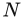

# 索引（Index）：原书第1167—1172页

> 来源：《Real-Time Rendering, Fourth Edition》，PDF物理页1188—1193。保留原书按英文排列的条目顺序、父子层级、全部页码与页码范围。*斜体页码*表示最重要的引用；“见”对应 see，“见……项下”对应 see under，“另见”对应 see also。括号中保留原文术语及交叉引用。

## 原书第1167页（PDF第1188页）

- 内存（memory，续前页；仅列本页续排子条目）
    - 带宽（bandwidth） — 1006
    - 控制器（controller） — 1038
    - 动态随机存取（dynamic random access） — 791
    - 层次结构（hierarchy） — 791
    - 优化（optimization） — 见“优化 → 内存”（see optimization, memory）
    - UMA — 1007
    - 统一内存（unified） — 1007
    - 内存墙（wall） — 791
- 像素合并（merging of pixels） — 24–25
- 合并阶段（merging stage） — *24–25*, 53
- 网格（mesh）
    - 缓存无关（cache-oblivious） — 700–701
    - 参数化（parameterization） — 173
    - 分割（segmentation） — 683
    - 平滑（smoothing） — 694–696
    - 实体性（solidity） — 693–694
    - 三角形网格（triangle） — 691, *699–701*
    - 通用网格（universal） — 700–701
- *Meshlab* — 695, 716
- 中观尺度（mesoscale） — 208–209, 367
- 消息传递架构（message-passing architecture） — 见“多处理 → 消息传递”（see multiprocessing, message-passing）
- 元球（metaball） — 48, 683, 751
- Metal — *40*, 814
- 金属（metal） — 323
- *《合金装备V：原爆点》（Metal Gear Solid V: Ground Zeroes）* — 289
- 同色异谱失配（metameric failure） — 280
- 同色异谱色（metamers） — 273
- 微表面（microfacets） — 331–336
- 微观几何（microgeometry） — *304*, 327–330
    - 遮蔽（masking） — 328
    - 阴影遮挡（shadowing） — 328
- 微多边形（micropolygon） — 26
- 微观尺度（microscale） — 208, 367
- Mie散射（Mie scattering） — 见“散射 → Mie”（see scattering, Mie）
- *《我的世界》（Minecraft）* — 579, 842
- 缩小（minification） — 见“纹理映射”项下（see under texturing）
- mipmap链（mipmap chain） — 184
- mipmap映射（mipmapping） — 见“纹理映射 → 缩小”项下（see under texturing, minification）
- 镜像变换（mirror transform） — 见“变换 → 反射”（see transform, reflection）
- *《镜之边缘：催化剂》（Mirror’s Edge Catalyst）* — 616
- 混合现实（mixed reality） — 917
- MLAA — 见“抗锯齿 → 形态学抗锯齿”（see antialiasing, morphological）
- MMU — 1024
- 模型空间（model space） — 15
- 建模器（modeler） — 682–683
    - 实体建模器（solid） — 682
    - 曲面建模器（surface） — 683
- 改进的蝴蝶细分（modified butterfly subdivision） — 见“曲面 → 细分”（see surfaces, subdivision）
- 改进的Gram-Schmidt正交化（modified Gram-Schmidt） — 344
- 蒙特卡洛积分（Monte Carlo integration） — 385, 418, 419, 423, 444, 451, 459, 507
    - 噪声（noise） — 445, 511
- 摩尔定律（Moore’s Law） — 1042
- 变形目标（morph targets） — 见“变换”项下（see under transform）
- 变形（morphing） — 见“变换”项下（see under transform）
- Morton序列（Morton sequence） — 1018
- 镶嵌（mosaicing） — 见“纹理映射 → 平铺”（see texturing, tiling）
- 运动模糊（motion blur） — *536–542*, 835
- MPEG-4 — 712
- MRT — 50
- MSAA — 见“抗锯齿 → 多重采样”（see antialiasing, multisampling）
- 多视图（multi-view） — 928
- 多核（multicore） — 806
- 多处理（multiprocessing） — 805–814, 1023
    - 动态分配（dynamic assignment） — 810
    - 消息传递（message-passing） — 806
    - 并行（parallel） — 809–810
    - 流水线（pipeline） — 806–809
    - 静态分配（static assignment） — 810
    - 对称式（symmetric） — 806
    - 任务（task） — 811–812
    - 基于任务（task-based） — 806
- 多处理器（multiprocessor） — 1003
    - 共享内存（shared memory） — 806, 1003
    - 流式（streaming） — 见“流式 → 多处理器”（see streaming, multiprocessor）
- 多重采样（multisampling） — 见“抗锯齿”项下（see under antialiasing）
- 多重纹理（multitexturing） — 见“纹理映射”（see texturing）
- 以小容多（multum in parvo） — 183
- 面片（N-patch） — 见“曲面 → PN三角形”（see surfaces, PN triangle）
- 车采样（N-rooks sampling） — 143
- 钉板（nailboard） — 见“替身 → 深度精灵”（see impostor, depth sprite）
- 纳米几何（nanogeometry） — 359
- NDF — 332, *337–346*, 367, 498
    - 各向异性（anisotropic） — 343–346
    - Beckmann — 338
    - Blinn-Phong — 339, 340
    - 滤波（filtering） — 367–372
    - 广义Trowbridge-Reitz（generalized Trowbridge-Reitz） — 见“NDF → GTR”（see NDF, GTR）
    - GGX — 340–342, 369
    - GTR — 342
    - 各向同性（isotropic） — 338–343
    - 形状不变性（shape-invariance） — 339
    - Trowbridge-Reitz — 见“NDF → GGX”（see NDF, GGX）
- 近裁剪平面（near plane） — *93*, 99, 862, 981
- 最近邻（nearest neighbor） — 见“滤波器”、 “纹理映射 → 放大”和“纹理映射 → 缩小”项下（see under filter and texturing, magnification and texturing, minification）
- *《极品飞车》（Need for Speed）* — 616
- Newell公式（Newell’s formula） — 685
- 节点（node） — 819–821
    - 内部节点（internal） — 819
    - 叶节点（leaf） — 819
    - 根节点（root） — 819
- 节点层次结构（node hierarchy） — 828
- 噪声（noise） — 872
- 噪声函数（noise function） — 见“纹理映射 → 噪声”（see texturing, noise）

## 原书第1168页（PDF第1189页）

- 非真实感渲染（non-photorealistic rendering） — 651–673
- 不可交换性（noncommutativity） — 65, 77
- 法线（normal）
    - 法线锥（cone） — 833–835
    - 法向入射（incidence） — 317
    - 法线贴图（map） — 见“凹凸映射”项下（see under bump mapping）
    - 法线变换（transform） — 见“变换 → 法线”（see transform, normal）
- 法线分布函数（normal distribution function） — 见“NDF”（see NDF）
- 法线与遮蔽的独立性（normal-masking independence） — 334
- 归一化设备坐标（normalized device coordinates） — *19*, 94, 98, 100
- NPR — 见“非真实感渲染”（see non-photorealistic rendering）
- *NSight* — 785
- NURBS — 781
- NVIDIA Pascal — 见“硬件”项下（see under hardware）
- 奈奎斯特极限（Nyquist limit） — 见“采样”项下（see under sampling）
- OBB — *945*, 946, 976
- OBB与物体相交（OBB/object intersection） — 见“相交测试”项下的具体物体（see specific objects under intersection testing）
- 基于物体的着色（object-based shading） — 908–912
- 遮蔽度（obscurance） — 449, 450, 454, 457
    - 体积遮蔽度（volumetric） — 459
- 遮挡体（occluder） — 844
- 遮挡能力（occluding power） — 844
- 遮挡剔除（occlusion culling） — 见“剔除 → 遮挡”（see culling, occlusion）
- 占用率（occupancy） — 32, 127, 801, 886, 898, *1005*
- 占用函数（occupancy function） — 459
- 八面体映射（octahedral mapping） — 413
- 倍频程（octave） — 198
- 八叉树（octree） — 见“空间数据结构”项下（see under spatial data structure）
- 八叉树纹理（octree texture） — 190
- Oculus Rift — 915, *916*, 923, 935
- OETF — 见“光电传递函数”（see optical electric transfer function）
- *《大神》（Okami）* — 653
- 不透明度（opacity） — 149
- Open3DGC — 712
- OpenCL — 54
- OpenCTM — 712
- OpenGL — 39–41
    - 扩展（extensions） — 40
- OpenGL ES — *41*, 194
- OpenGL着色语言（OpenGL Shading Language） — 35
- OpenSubdiv — 777–779
- 光电传递函数（optical electric transfer function） — 161
- 光学（optics）
    - 几何光学（geometrical） — 303
    - 物理光学（physical） — 359
    - 波动光学（wave） — 359
- 优化（optimization）
    - 应用阶段（application stage） — 790–793
    - 代码（code） — 790–793
    - 几何处理（geometry processing） — 798–800
    - 光照（lighting） — 798–800
    - 内存（memory） — 791–793
    - 合并（merging） — 805
    - 移动平台（mobile） — 814
    - 流水线（pipeline） — 783–815
    - 像素处理（pixel processing） — 800–804
    - 像素着色器（pixel shader） — 803
    - 光栅化（rasterization） — 800
- *《橙盒》（The Orange Box）* — 288
- *《教团：1886》（The Order: 1886）* — 91, 357, 365, 370, 477, 498, 896
- 普通顶点（ordinary vertex） — 758
- Oren与Nayar模型（Oren and Nayar model） — 354
- 朝向（orientation） — 见“多边形”项下（see under polygon）
- 有向包围盒（oriented bounding box） — 见“OBB”（see OBB）
- 确定摄像机朝向（orienting the camera） — 67
- over算子（over operator） — *150–151*, 856
- 过度模糊（overblurring） — 186
- 超频（overclock） — 787
- 过度绘制（overdraw） — 见“像素”项下（see under pixel）
- 紧凑打包的像素格式（packed pixel format） — 1010
- 填充（padding） — 792
- 画家算法（painter’s algorithm） — 551, 824
- 绘画风格渲染（painterly rendering） — 652
- 摇摄（pan） — 538
- 抛物线（parabola） — 721
- 抛物面映射（parabolic mapping） — 413
- 视差（parallax） — 548
    - 视差映射（mapping） — 167, 214–220
    - 视差遮蔽映射（occlusion mapping） — 见“纹理映射”项下（see under texturing）
- 并行（parallel）
    - 并行架构（architectures） — 1020
    - 并行图形（graphics） — 1019
    - 并行处理（processing） — 见“多处理 → 并行”（see multiprocessing, parallel）
    - 平行投影（projection） — 见“投影 → 正交”（see projection, orthographic）
- 并行性（parallelism） — 810
    - 空间并行性（spatial） — 806
    - 时间并行性（temporal） — 806
- 参数曲线（parametric curves） — 见“曲线 → 参数式”（see curves, parametric）
- 参数曲面（parametric surfaces） — 见“曲面 → 参数式”（see surfaces, parametric）
- 参与介质（participating media） — 310
    - 吸收（absorption） — 590
    - 消光（extinction） — *590*, 593, 595, 610, 616, 624, 639, 643
    - 光学深度（optical depth） — *593*, 595
    - 相函数（phase function） — 590, 623, 626, 638, 644
        - 几何散射（geometric） — 见“散射 → 几何”（see scattering, geometric）
        - Mie散射（Mie） — 见“散射 → Mie”（see scattering, Mie）
        - Rayleigh散射（Rayleigh） — 见“散射 → Rayleigh”（see scattering, Rayleigh）
- 粒子（particle）
    - 软粒子（soft） — 558–559
    - 粒子系统（system） — 567–572
- Pascal — 见“硬件 → NVIDIA Pascal”（see hardware, NVIDIA Pascal）
- 面片（patch） — 736
- 路径追踪（path tracing） — 26, 444, 510, 1043, 1044

## 原书第1169页（PDF第1190页）

- PCF — 见“百分比渐近滤波”（see percentage-closer filtering）
- PCI Express — 1006
- *《珍珠港》（Pearl Harbor）* — 446
- 钢笔与墨水画（pen and ink） — 652
- 待处理缓冲区（pending buffer） — 1013
- 半影（penumbra） — 见“阴影”项下（see under shadow）
- 逐三角形操作（per-triangle operations） — 14
- 逐顶点操作（per-vertex operations） — 14
- 百分比渐近滤波（percentage-closer filtering） — 247–250, 849
- 感知量化器（perceptual quantizer） — 见“PQ”（see PQ）
- 性能测量（performance measurement） — 788–790
- 垂直点积（perp dot product） — *6*, 987, 989
- 余辉持续时间（persistence） — 935
- 透视（perspective）
    - 透视除法（division） — 19
    - 透视投影（projection） — 见“投影 → 透视”（see projection, perspective）
    - 透视扭曲（warping） — 241
- 透视校正插值（perspective-correct interpolation） — 见“插值”（see interpolation）
- 彼得潘现象（Peter Panning） — 238
- Phong光照方程（Phong lighting equation） — 见“BRDF → Phong”（see BRDF, Phong）
- Phong着色（Phong shading） — 118
- Phong曲面细分（Phong tessellation） — 见“曲面”项下（see under surfaces）
- 摄影测量（photogrammetry） — 573, 682
- 光度曲线（photometric curve） — *271*, 273, 278
- 光度学（photometry） — 271
- 明视觉（photopic） — 271
- 真实感渲染（photorealistic rendering） — 545, *651*
- PhyreEngine — 893
- 拾取窗口（pick window） — 见“相交测试 → 拾取”（see intersection testing, picking）
- 拾取（picking） — *942*, 943, 957
- 分段Bézier曲线（piecewise Bézier curves） — 见“曲线 → 分段”（see curves, piecewise）
- 乒乓缓冲区（ping-pong buffers） — *520*, 525
- 流水线（pipeline） — *11–27*, 783–815
    - 应用阶段（application stage） — 12, *13–14*, 783
    - 固定功能（fixed-function） — 27
    - 冲刷（flush） — 1005
    - 功能阶段（functional stages） — 13
    - 几何处理（geometry processing） — 12, *14–21*, 783
    - 并行性（parallelism） — 1003
    - 像素处理（pixel processing） — 12, *22–25*, 783
    - 光栅化（rasterization） — 12, *21–22*, 783, 993–998
    - 软件流水线（software） — 806
    - 加速比（speedup） — 12
    - 阶段（stage） — 12–13
- *《加勒比海盗》（Pirates of the Caribbean）* — 454
- 俯仰（pitch） — *70*, 72
- PIX — 785
- 像素（pixel） — 21
    - 局部存储（local storage） — 1027
    - 过度绘制（overdraw） — 701, 801
    - 像素处理（processing） — 见“流水线”项下（see under pipeline）
    - 像素着色器（shader） — 23, 49–52
    - 同步（synchronization） — 156
- Pixel-Planes — 见“硬件”项下（see under hardware）
- 像素化（pixelation） — 178
- PixelFlow — 1022
- 每英寸像素数（pixels per inch） — 817
- 每秒像素数（pixels per second） — 788
- 平面（plane） — 6
    - 轴对齐平面（axis-aligned） — 8
    - 坐标平面（coordinate） — 8
- 平面掩码（plane masking） — 836
- 平面与物体相交（plane/object intersection） — 见“相交测试”项下的具体物体（see specific objects under intersection testing）
- PLAYSTATION — 见“硬件”项下（see under hardware）
- 点云（point cloud） — 572–578, 683
- 点渲染（point rendering） — 572–578
- 基于点的可见性（point-based visibility） — 842
- 指针间接寻址（pointer indirection） — 792
- 泊松圆盘（Poisson disk） — 249
- *《宝可梦GO》（Pokémon GO）* — 917
- 多立方体映射（polycube maps） — 171
- 多边形（polygon）
    - 蝴蝶结形多边形（bowtie） — 684
    - 整合（consolidation） — 691
    - 轮廓（contour） — 686
    - 凸多边形（convex） — 685
    - 边裂缝（edge cracking） — 见“裂缝 → 多边形边”（see cracking, polygon edge）
    - 边缝合（edge stitching） — 689
    - 沙漏形多边形（hourglass） — 684
    - 环（loop） — 686
    - 合并（merging） — 691
    - 网格（mesh） — 691
    - 朝向（orientation） — 691–693
    - 排序（sorting） — 824
    - 多边形汤（soup） — 691
    - 星形多边形（star-shaped） — 686
    - T形顶点（T-vertex） — 689–690
- 与多边形对齐的BSP树（polygon-aligned BSP tree） — 见“空间数据结构 → BSP树”（see spatial data structure, BSP tree）
- 多边形技术（polygonal techniques） — 853
- 多边形化（polygonalization） — 583, 683
- 多形体引擎（polymorph engine） — 1031
- 多多边形替身（polypostor） — 562
- POM — 217
- 跳变（popping） — 见“细节层次”项下（see under level of detail）
- 端口（port） — 1006
- 门户剔除（portal culling） — 见“剔除 → 门户”（see culling, portal）
- 位姿（pose） — *921*, 924, 938
- 后处理（post-processing） — 514
- 色调分离（posterization） — 652, 1010
- 潜在可见集（potentially visible set） — 831
- 幂形式（power form） — 724
- 电源门控（power gating） — 1028
- PowerTune — 789
- PowerVR — 196
- PQ — 281

## 原书第1170页（PDF第1191页）

- 预光照（pre-lighting） — 892
- 前序遍历（pre-order traversal） — 835
- 精度（precision） — 712–715
    - 颜色精度（color） — 186, 1010
    - 深度精度（depth） — 236
    - 浮点精度（floating point） — 713
    - 移动平台精度（mobile） — 814
    - 亚像素精度（subpixel） — 689
- 预计算辐射传输（precomputed radiance transfer） — 471, 478, 479, 481
    - 局部可变形（local deformable） — 481
- 预测性渲染（predictive rendering） — 280
- 预滤波（prefilter） — 414
- 图元生成器（primitive generator） — 44
- 图元着色器（primitive shader） — 1037
- *《波斯王子》（Prince of Persia）* — 658
- 主成分分析（principal component analysis） — 480, 484
- 几何概率（probability, geometric） — 953–954
- 过程式建模（procedural modeling） — 222, 672, *682*
- 过程式纹理（procedural texturing） — 见“纹理映射 → 过程式”（see texturing, procedural）
- 处理器（processor）
    - 像素处理器（pixel） — 见“像素 → 着色器”（see pixel, shader）
    - 顶点处理器（vertex） — 见“顶点 → 着色器”（see vertex, shader）
- 渐进细化（progressive refinement） — 510, 547
- 投影（projection） — 16–18, 92–102
    - 三维多边形投影到二维（3D polygon to 2D） — 966
    - 三维三角形投影到二维（3D triangle to 2D） — 962
    - 包围体投影（bounding volume） — 861–864
    - 圆柱投影（cylindrical） — 172
    - 正交投影（orthographic） — 17–18, 59, *93–95*
    - 平行投影（parallel） — 见“投影 → 正交”（see projection, orthographic）
    - 透视投影（perspective） — 17, 59, *96–102*, 1014
    - 平面投影（planar） — 172
    - 球面投影（spherical） — 172
- 投影纹理（projective texturing） — 见“纹理映射 → 投影式”（see texturing, projective）
- 代理物体（proxy object） — 819
- PRT — 见“预计算辐射传输”（see precomputed radiance transfer）
- PSM — 见“阴影 → 贴图 → 透视”（see shadow, map, perspective）
- Ptex — 191
- 紫边（purple fringing） — 628
- 紫线（purple line） — 274
- PVRTC — 见“纹理映射 → 压缩”项下（see under texturing, compression）
- PVS — 见“潜在可见集”（see potentially visible set）
- *PxrSurface* — 343, 359, 363, 364
- QEM — 708
- 四像素组（quad） — 51, 801, 994
- 四像素组过度着色（quad overshading） — 787, 853, 863, 910, *994*
- 二次曲线（quadratic curve） — 见“曲线 → 二次”（see curves, quadratic）
- 二次方程（quadratic equation） — 957
- 二次误差度量（quadric error metric） — 708
- 四叉树（quadtree） — 见“空间数据结构”项下（see under spatial data structure）
- *《雷神之锤》（Quake）* — 37, 474
- *《雷神之锤II》（Quake II）* — 474
- *《雷神之锤III》（Quake III）* — 37, 402
- 标量量化（quantization, scalar） — 714
- *《量子破碎》（Quantum Break）* — 496
- 四次曲线（quartic curve） — 见“曲线 → 四次”（see curves, quartic）
- 四元数（quaternion） — 72, 76–84
    - 加法（addition） — 77
    - 共轭（conjugate） — 77, 78
    - 定义（definition） — 76
    - 对偶四元数（dual） — 87
    - 单位元（identity） — 77
    - 虚数单位（imaginary units） — 76
    - 逆（inverse） — 77
    - 乘法法则（laws of multiplication） — 78
    - 对数（logarithm） — 78
    - 矩阵转换（matrix conversion） — 79–81
    - 乘法（multiplication） — 77
    - 范数（norm） — 77, 78
    - 幂（power） — 78
    - 球面线性插值（slerp） — 81–83
    - 球面线性插值（spherical linear interpolation） — 81–82
    - 样条插值（spline interpolation） — 82–83
    - 变换（transforms） — 79–84
    - 单位四元数（unit） — 78, 79
- Quickhull — 950
- 梅花形采样（Quincunx） — 见“抗锯齿 → 梅花形采样”（see antialiasing, Quincunx）
- 五次曲线（quintic curve） — 181
- 辐亮度（radiance） — *269–270*, 273, 425
    - 分布（distribution） — 269
    - 入射辐亮度（incoming） — 315
- 辐射（radiant）
    - 辐射出射度（exitance） — 见“出射度”（see exitance）
    - 辐射通量（flux） — 268
    - 辐射强度（intensity） — 269
- 辐射度学（radiometry） — 267
- 辐射度（radiosity） — 442–443
    - 辐射度法线映射（normal mapping） — 402–404
    - 渐进辐射度（progressive） — 483
- *《狂怒》（RAGE）* — 867
- *《彩虹六号：围攻》（Rainbow Six Siege）* — 887
- 基于距离的雾（range-based fog） — 见“雾”（see fog）
- 光栅引擎（raster engine） — 1031
- 光栅操作（raster operation） — 见“ROP”（see ROP）
- 光栅化（rasterization） — 见“流水线”项下（see under pipeline）
    - 保守光栅化（conservative） — 22, 139, 259, 582, *1001*
        - 内部保守光栅化（inner） — 1001
        - 外部保守光栅化（outer） — 1001
        - 高估式保守光栅化（overestimated） — 1001
        - 低估式保守光栅化（underestimated） — 1001
- 光栅器顺序视图（rasterizer order view） — *52*, 139, 156
- 光栅器阶段（rasterizer stage） — 见“流水线 → 光栅化”（see pipeline, rasterization）
- *《料理鼠王》（Ratatouille）* — 638
- 有理线性插值（rational linear interpolation） — 720

## 原书第1171页（PDF第1192页）

- 光线（ray） — 943–944
    - 光线投射（casting） — 443
        - 光线投射函数（function） — 437
    - 光线步进（marching） — 199, 216–220, 262, 566, 570, *594*, 607, 608, 614, 616, 618, 620–622, 639, 642, 648, 752, 753, 1048
    - 光线追踪（tracing） — 26, 259, 261, *443–445*, 530, 586, 802, 953, 1006, 1044–1047
        - 架构（architecture） — 1039
        - 等值面（isosurface） — 584
        - 体素（voxel） — 580
- 光线与物体相交（ray/object intersection） — 见“相交测试”项下的具体物体（see specific objects under intersection testing）
- Rayleigh散射（Rayleigh scattering） — 见“散射 → Rayleigh”（see scattering, Rayleigh）
- 互易性（reciprocity） — 312
- 重建（reconstruction） — 131, *133–136*
- 归约（reduce） — 245, 896
- 反射率（reflectance）
    - 各向异性（anisotropic） — 328
    - 方向—半球反射率（directional-hemispherical） — 313
    - 反射方程（equation） — 311, 437
    - 半球—方向反射率（hemispherical-directional） — 313
    - 各向同性（isotropic） — 328
    - 光谱反射率（spectral） — 279
- 反射瓣（reflectance lobe） — 见“BRDF”项下（see under BRDF）
- 反射（reflection） — 314, 315, 623, 626, 630
    - 环境映射（environment mapping） — 413
    - 反射方程（equation） — 见“反射率 → 方程”（see reflectance, equation）
    - 外反射（external） — 317
    - 内反射（internal） — 317, 325
        - 全内反射（total） — 326
    - 反射定律（law of） — 504
    - 反射映射（mapping） — 405
    - 平面反射（planar） — 504–505, 839
    - 反射探针（probe） — 499
        - 局部化反射探针（localized） — 500
    - 反射代理（proxy） — 500
    - 屏幕空间反射（screen-space） — 505–509
    - 反射变换（transform） — 见“变换 → 反射”（see transform, reflection）
- 折射（refraction） — 149, 302, *626–630*, 631–633, 638, 639
    - 图像空间折射（image-space） — 630
- 折射率（refractive index） — 298
- 刷新率（refresh rate） — 1
    - 垂直刷新率（vertical） — 1011
- 寄存器组合器（register combiners） — 38
- 寄存器压力（register pressure） — 127, *801*, 904, 1005
- 规则顶点（regular vertex） — 758
- 浮雕纹理映射（relief texture mapping） — 见“纹理映射 → 浮雕”（see texturing, relief）
- 重新光照（relighting） — 547
- 渲染目标（render target） — 50
- *RenderDoc* — 785
- 渲染（rendering）
    - 渲染方程（equation） — 437–438
    - 渲染谱系（spectrum） — 545–546
    - 渲染状态（state） — 794
- *RenderMan* — 37, 39
- 重复线性插值（repeated linear interpolation） — 见“插值 → 重复 → 线性”（see interpolation, repeated, linear）
- 重投影（reprojection） — 143, 522–523, 936
- 重采样（resampling） — 136–137
- 解析（resolve） — 142
- 重拓扑（retopology） — 712
- 垂直回扫（retrace, vertical） — 25, 1012
- 逆反射（retroreflection） — 330
- 反向映射（reverse mapping） — 532
- 反向深度（reversed z） — 100
- Reyes — 908–912
- RGB — 176
    - 颜色立方体（color cube） — 275
    - 颜色模式（color mode） — 见“颜色 → 模式 → 真彩色”（see color, mode, true color）
    - 转换为灰度（to grayscale） — 278
- RGBA — *150*, 159, 1010
    - 纹理（texture） — 176
- RGSS — 见“抗锯齿 → 旋转网格”（see antialiasing, rotated grid）
- 右手定则（right-hand rule） — 692
- 右手系（right-handed） — 92
- 刚体变换（rigid-body transform） — 见“变换 → 刚体”（see transform, rigid-body）
- 振铃（ringing） — 256, 401, 428, 570
- 滚转（roll） — *70*, 72
- ROP — 24, 25, 1010, 1032–1033
- 绳纹伪影（roping） — 165
- 旋转（rotation） — 见“变换”项下（see under transform）
- 粗糙度（roughness） — 304
- ROV — 见“光栅器顺序视图”（see rasterizer order view）
- RSM — 见“阴影 → 贴图 → 反射式”（see shadow, map, reflective）
- S3TC — 192
- 扫视（saccade） — 931
- SAH — 见“表面积启发式”（see surface area heuristic）
- 样本（sample） — 22
- 采样（sampling） — 130–137, 143；另见“抗锯齿”（see also antialiasing）
    - 带限信号（band-limited signal） — 133
    - 质心采样（centroid） — 141
    - 连续信号（continuous signal） — 131
    - 离散化信号（discretized signal） — 131
    - 奈奎斯特极限（Nyquist limit） — *133*, 182, 186
    - 采样模式（pattern） — 143
    - 随机采样（stochastic） — *145*, 149
    - 分层采样（stratified） — 144
    - 采样定理（theorem） — 133
- SAT — 见“相交测试 → 分离轴测试”（see intersection testing, separating axis test）
- 饱和度（saturation） — 276
- SBRDF — 310
- 可扩展链路接口（scalable link interface） — 1013
- 缩放（scaling） — 见“变换”项下（see under transform）
- 扫描转换（scan conversion） — 21
- 扫描线交错（scanline interleave） — 1013
- 散写操作（scatter operation） — 531

## 原书第1172页（PDF第1193页）

- 散射（scattering） — 297, *589–599*
    - 后向散射（backward） — *597*, 598, 599
    - 前向散射（forward） — *597*, 598, 599, 607, 638
    - 几何散射（geometric） — 596, 599
    - Mie散射（Mie） — 298, 596, *597–599*, 614, 620
    - 多重散射（multiple） — 607, 615, 616, *621–622*, 633, 643–646
    - Rayleigh散射（Rayleigh） — 298, *596–597*, 613, 614
    - 单次散射（single） — *589*, 592, 610, 614, 618, 633, 638
    - 次表面散射（subsurface） — 见“次表面散射”（see subsurface scattering）
    - Tyndall散射（Tyndall） — 298
- 场景图（scene graph） — 见“空间数据结构”项下（see under spatial data structure）
- 场景参照（scene-referred） — 283
- Schlick相函数（Schlick phase function） — 599
- 记分牌（scoreboard） — 1031
- 暗视觉（scotopic） — 271
- 屏幕（screen）
    - 屏幕坐标（coordinates） — 20
    - 屏幕映射（mapping） — 20
    - 屏幕空间覆盖范围（space coverage） — 772, *862*
- scRGB — 282
- SDR — 281
- SDSM — 见“阴影 → 贴图 → 样本分布”（see shadow, map, sample distribution）
- 二阶方程（second-order equation） — 957
- 剖切（sectioning） — 19
- 分割（segmentation） — 683
- 半导体（semiconductor） — 324
- 分离轴测试（separating axis test） — 见“相交测试”项下（see under intersection testing）
- 分离超平面定理（separating hyperplane theorem） — 946
- SGI算法（SGI algorithm） — 见“三角形 → 条带”（see triangle, strip）
- 着色树（shade tree） — 37
- 着色器（shader）
    - 着色器核心（cores） — 30
    - 着色器存储缓冲区对象（storage buffer object） — 见“无序访问视图”（see unordered access view）
    - 统一着色器（unified） — 见“统一着色器架构”（see unified shader architecture）
- 着色器模型（Shader Model） — 38
- Shadertoy — 199, 222, 753, 1048
- 着色（shading） — 16
    - 聚簇着色（clustered） — 见“聚簇着色”（see clustered shading）
    - 延迟着色（deferred） — 见“延迟着色”（see deferred shading）
    - 着色方程（equation） — 16
    - 平面着色（flat） — 120
    - 前向着色（forward） — 883
    - Gouraud着色（Gouraud） — 118
    - 硬着色（hard） — 652
    - 着色语言（language） — 35
    - 着色模型（model） — 103–106
        - Lambert着色模型（Lambertian） — 109
    - Phong着色（Phong） — 118
    - 像素着色（pixel） — 23；另见“像素着色器”（see also pixel shader）
    - 分块着色（tiled） — 见“分块 → 着色”（see tiled, shading）
    - 卡通着色（toon） — 652–654
    - 顶点着色（vertex） — 见“顶点 → 着色器”（see vertex, shader）
- 阴影（shadow） — 223–265
    - 阴影痤疮（acne） — 236
    - 反阴影（anti-shadow） — 227
    - 阴影缓冲区（buffer） — 234
    - 接触硬化（contact hardening） — 251
    - 曲面上的阴影（on curved surfaces） — 229–230
    - 深度贴图（depth map） — 234
    - 硬阴影（hard） — 223
    - 阴影贴图（map） — 230, *234–252*, 594, 604
        - 自适应体积阴影贴图（adaptive volumetric） — 258
        - 偏移（bias） — 236–239
        - 级联阴影贴图（cascaded） — 242–247
        - 卷积阴影贴图（convolution） — 255
        - 深度层积阴影贴图（deep） — 257–259, 638
        - 双重阴影贴图（dual） — 238
        - 指数阴影贴图（exponential） — 256–257
        - 滤波阴影贴图（filtered） — 252–257
        - 不完美阴影贴图（imperfect） — 492
        - 不规则阴影贴图（irregular） — 259–264
        - 光空间透视阴影贴图（light space perspective） — 241
        - 最小最大阴影贴图（minmax） — 252
        - 矩阴影贴图（moment） — 256
        - 全向阴影贴图（omnidirectional） — 234
        - 不透明度阴影贴图（opacity） — 257, 612
        - 平行分割阴影贴图（parallel-split） — 242
        - 透视阴影贴图（perspective） — 241
        - 反射阴影贴图（reflective） — 491, 493
        - 样本分布阴影贴图（sample distribution） — 245
        - 次深度阴影贴图（second-depth） — 238
        - 稀疏阴影贴图（sparse） — 246, 263
        - 半透明阴影贴图（translucent） — 639
        - 梯形阴影贴图（trapezoidal） — 241
        - 方差阴影贴图（variance） — 252–255
        - 体积阴影贴图（volumetric） — 644
    - 半影（penumbra） — *224*, 228
    - 百分比渐近软阴影（percentage-closer soft） — 250–252
    - 平面阴影（planar） — 225–229
        - 平面软阴影（soft） — 228–229
    - 阴影投影（projection） — 225–227
    - 屏幕空间阴影（screen-space） — 262
    - 软阴影（soft） — 224–225, 227–229, 247–252, 442
    - 本影（umbra） — 224
    - 阴影体（volume） — 230–233
- 阴影遮挡—遮蔽函数（shadowing-masking function） — 见“遮蔽—阴影遮挡函数”（see masking-shadowing function）
- 形状混合（shape blending） — 见“变换 → 变形目标”（see transform, morph targets）
- 共享内存多处理器（shared memory multiprocessor） — 见“多处理器 → 共享内存”（see multiprocessor, shared memory）
- 错切（shear） — 见“变换”项下（see under transform）
- 壳层（shell） — 646
- 壳层映射（shell mapping） — 220, 659
- 最短弧（shortest arc） — 81
- 浴室玻璃门效应（shower door effect） — 670
- *《怪物史瑞克2》（Shrek 2）* — 491
- 有符号距离场（signed distance field） — 454, 579, 677
