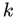
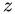
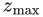

# 索引（Index）：原书1173—1178页

来源：Real-Time Rendering, Fourth Edition；原PDF物理页1194—1199。按原页左栏、右栏及原有父子层级排列。斜体页码表示最重要引用；页码后的 n 保留原书注释定位。中文后保留原索引词，see、see under、see also 关系均保留。

## 原书第1173页（PDF 1194）

- 有符号距离函数（signed distance function） — 577, 750
  - 球面（spherical） — 466
- 轮廓（silhouette） — 765, 773
  - 环（loop） — 667
- SIMD — 31, 1003, 1005, 1035
- SIMD通道（SIMD lane） — 31, 1002
- 简化（simplification） — *706–712*, 853
  - 代价函数（cost function） — 707–709
  - 边折叠（edge collapse） — 706–708
  - 细节层次（level of detail） — 710
  - 最优放置（optimal placement） — 707
  - 可逆性（reversibility） — 706
- SIMT — 1002
- 模拟器晕动症（simulation sickness） — 920
- 单缓冲（single buffer） — 见“缓冲区 › 单”（see buffer, single）
- 骨架子空间变形（skeleton-subspace deformation） — 见“变换 › 顶点混合”（see transform, vertex blending）
- 蒙皮（skinning） — 见“变换 › 顶点混合”（see transform, vertex blending）
- 天空（sky） — 见“大气与云”（see atmosphere and clouds）
- 天空盒（skybox） — *547–549*, 556, 628, 632
- 平板区域（slab） — 945
- slerp — 见下列条目下的子项：“四元数”（see under quaternion）
- SLI — 1013
- 切片图（slicemap） — 581
- SMAA — 见“抗锯齿 › 亚像素形态学”（see antialiasing, subpixel morphological）
- 小批次问题（small batch problem） — 796
- 智能合成（smart composition） — 1028
- Smith遮蔽函数（Smith masking function） — 334, 335, 339, 341–343, 355, 358
- smoothstep — 115, 181
- SMOOTHVISION — 145
- SMP — 806
- Snell定律（Snell’s law） — *302*, 326
- 柔光箱（softbox） — 388, 434
- 软件流水线（software pipelining） — 见“多处理”（see multiprocessing）
- 实体（solid） — 693
- 立体角（solid angle） — 268
  - 微分（differential） — 311
- 排序（sort） — 822
  - 空间（space） — 1020
- 全阶段排序（sort-everywhere） — 1022
- 前端排序（sort-first） — 1020
- 后端排序（sort-last） — 1020, 1033
  - 片元（fragment） — 1021
  - 图像（image） — 1021, 1022
- 中间排序（sort-middle） — 1020, 1024
- 空间划分（space subdivision） — 819
- 空间填充曲线（space-filling curve） — 1018
- 空间扭曲（spacewarp） — 935, 937
- 稀疏纹理（sparse texture） — 见“纹理映射 › 稀疏”（see texturing, sparse）
- 稀疏体素八叉树（sparse voxel octree） — 494, 579
- 空间数据结构（spatial data structure） — 818–830
  - 视象图（aspect graph） — 831
  - 包围体层次结构（bounding volume hierarchy） — 510, *819–821*, 942
  - BSP树（BSP tree） — 819, *822–824*
    - 轴对齐（axis-aligned） — 822–823
    - 多边形对齐（polygon-aligned） — 823–824
  - 缓存感知（cache-aware） — 827–828
  - 缓存无关（cache-oblivious） — 827–828
  - 层次式（hierarchical） — 818
  - 非规则（irregular） — 819
  - -d树（-d tree） — 822–823
  - 松散八叉树（loose octree） — 826–827
  - 八叉树（octree） — 819, *824–827*, 846
  - 四叉树（quadtree） — 825, 874
    - 受限（restricted） — 774, 877
  - 规则（regular） — 819
  - 场景图（scene graph） — *828–830*, 840, 861
    - LOD — 861
- 空间局部性（spatial locality） — 791
- 空间关系（spatial relationship） — 438
- 空间化（spatialization） — 830
- SPD — 见“光谱功率分布”（see spectral power distribution）
- 光谱功率分布（spectral power distribution） — 270, 272
- 光谱（spectrum） — 268, 274
- 镜面反射（specular）
  - 高光（highlight） — 119
  - 波瓣（lobe） — 见下列条目下的子项：“BRDF”（see under BRDF）
  - 项（term） — 306
- 球体（sphere） — 682
  - 公式（formula） — 944, 956
  - 映射（mapping） — 见“环境映射 › 球体”（see environment mapping, sphere）
- 球体与物体的相交（sphere/object intersection） — 见“相交测试”下的具体物体（see specific objects under intersection testing）
- 球面（spherical）
  - 基（basis） — 见“基 › 球面”（see basis, spherical）
  - 坐标（coordinates） — 407, *944*
  - 函数（function） — 392–404
  - Gaussian — 见“基 › 球面 › Gaussian”（see basis, spherical, Gaussian）
  - 谐波（harmonics） — *398–401*, 427–431, 456, 480, 488
    - 梯度（gradients） — 488
  - 线性插值（linear interpolation） — 见下列条目下的子项：“四元数”（see under quaternion）
- SPIR-V — 40
- 泼溅图元（splat） — 573–574
- 样条曲线（spline curves） — 见“曲线 › 样条”（see curves, spline）
- 样条曲面（spline surfaces） — 见“曲面 › 样条”（see surfaces, spline）
- 分割与切块（split and dice） — 774–775
- 《争分夺秒》（*Split/Second*） — 898
- 《孢子》（*Spore*） — 678, 710
- 精灵（sprite） — 531, 550–551；另见“替身图”（see also impostor）
  - 分层（layered） — 550–551
- SRAA — 见“抗锯齿 › 亚像素重建”（see antialiasing, subpixel reconstruction）
- sRGB — *161*, 162, 165, 196, 322, 323
- SSBO — 见“无序访问视图”（see unordered access view）
- SSE — 977–979
- 阶段（stage）
  - 停滞（stalling） — 809
  - 饥饿（starving） — 12, 809

## 原书第1174页（PDF 1195）

- 停滞（stalling） — 809
- 标准动态范围（standard dynamic range） — 见“SDR”（see SDR）
- 《星之海洋4》（*Star Ocean 4*） — 286
- 《星球大战：前线》（*Star Wars Battlefront*） — 647
- 星形多边形（star-shaped polygon） — 686
- 《星际争霸II》（*Starcraft II*） — 459
- 饥饿（starving） — 见下列条目下的子项：“阶段”（see under stage）
- 状态（state）
  - 更改（changes） — 794
  - 排序（sorting） — 807
- 静态缓冲区（static buffer） — 794
- 平稳细分（stationary subdivision） — 见“曲面 › 细分 › 平稳”（see surfaces, subdivision, stationary）
- 模板（stencil） — 759
- 模板缓冲区（stencil buffer） — 见“缓冲区 › 模板”（see buffer, stencil）
- 球面度（steradian） — 268, 269
- 立体渲染（stereo rendering） — 927–931
- 立体视觉（stereo vision） — 922–924
- 立体视（stereopsis） — 922
- Stevens效应（Stevens effect） — 285
- 缝合（stitching） — 689
- 流输出（stream output） — 19, 48–49, 571, 705
- 流式处理（streaming） — 871–872
  - 多处理器（multiprocessor） — 1003, 1029
  - 纹理（texture） — 见“纹理映射 › 流式传输”（see texturing, streaming）
- 步长（stride） — 702
- 条带（strip） — 见“三角形 › 条带”（see triangle, strip）
- 笔划（stroke） — 672
- 风格化渲染（stylized rendering） — 见“非真实感渲染”（see non-photorealistic rendering）
- 细分曲线（subdivision curves） — 见“曲线 › 细分”（see curves, subdivision）
- 细分曲面（subdivision surfaces） — 见“曲面 › 细分”（see surfaces, subdivision）
- 亚像素寻址（subpixel addressing） — 689
- 次表面反照率（subsurface albedo） — 348–349
- 次表面散射（subsurface scattering） — *305–307*, 445, 607
  - 全局（global） — 306, 632–640
  - 局部（local） — 306, 347–355
- 子纹理（subtexture） — 见“纹理映射”（see texturing）
- 区域求和表（summed-area table） — 见下列条目下的子项：“纹理映射 › 缩小”（see under texturing, minification）
- 超标量（superscalar） — 14
- 超级着色器（supershader） — 128
- 表面积启发式（surface area heuristic） — 953
- 表面提取（surface extraction） — 583
- 曲面（surfaces）
  - 痤疮伪影（acne） — 236
  - B样条（B-spline） — *749*, 762
  - Bézier曲面片（Bézier patch） — 735–738
  - Bézier三角形（Bézier triangle） — *740–741*, 745
  - 双二次（biquadratic） — 736
  - 连续性（continuity） — 741–742
  - 显式（explicit） — 944
    - 球体（sphere） — 944
    - 三角形（triangle） — 944, 963
  - 隐式（implicit） — 749–753, 944
    - 混合（blending） — 751
    - 导数（derivatives） — 751
    - 球体（sphere） — 956
  - NURBS — 781
  - 参数化（parametric） — 171, 734–747
  - Phong曲面细分（Phong tessellation） — 735, 740, 748–749
  - PN三角形（PN triangle） — 46, 735, 740, *744–747*, 748, 749
  - 样条（spline） — 689, 761
  - 细分（subdivision） — 756–767
    - 自适应四叉树（adaptive quadtree） — 718, 779–780
    - 逼近型（approximating） — 758
    - Catmull-Clark — 761–763
    - 置换（displaced） — 765–766
    - 特征自适应（feature adaptive） — 777–779
    - 极限位置（limit position） — 760
    - 极限曲面（limit surface） — 760
    - 极限切线（limit tangents） — 760
    - Loop — *758–761*, 763, 765–767
    - 掩模（mask） — 759
    - 改进蝶形（modified butterfly） — 761
    - 平稳（stationary） — 756
    - 模板（stencil） — 759
  - 张量积（tensor product） — 735
  - 曲面细分（tessellation） — 735
- 表面元素（surfel） — 573
- 周围环境（surround） — 285
- SVBRDF — 310
- 交换缓冲区（swap buffer） — 见“缓冲区 › 交换”（see buffer, swap）
- 重排（swizzling） — 1018
- 与显示器同步（synchronization with monitor） — 790, 1012, 1013
- TAM — 见“色调艺术贴图”（see tonal art map）
- 切向（tangent）
  - 标架（frame） — 209
  - 贴图（map） — 344
  - 面片（patch） — 775
  - 空间（space） — 见下列条目下的子项：“基”（see under basis）
  - 向量（vector） — 209, 729
- TBN — 209
- 《军团要塞2》（*Team Fortress 2*） — 654, 677, 678, 940
- 撕裂（tearing） — 1012
- 技术插图（technical illustration） — 651, 673
- 时间（temporal）
  - 走样（aliasing） — 见“走样 › 时间”（see aliasing, temporal）
  - 连贯性（coherence） — 866
  - 延迟（delay） — 1
  - 局部性（locality） — 791
- 临时寄存器（temporary register） — 36
- 张量积曲面（tensor product surfaces） — 735
- 地形分块细节层次（terrain chunked LOD） — 874–877
- 曲面细分（tessellation） — 683–690, 767–780, 853
  - 自适应（adaptive） — 770–775
  - 控制着色器（control shader） — 44

## 原书第1175页（PDF 1196）

- 曲面细分（tessellation，续上页）
  - 域着色器（domain shader） — 44
  - 求值着色器（evaluation shader） — 44
  - 因子（factors） — 45
  - 分数型（fractional） — 768–770, 860
  - 外壳着色器（hull shader） — 44
  - 级别（levels） — 45
  - 阶段（stage） — 18, *44–46*, 677
  - 曲面（surface） — 735
  - 曲面细分器（tessellator） — 44
  - 均匀（uniform） — 767
- 四面体剖分（tetrahedralization） — 489
- 纹素（texel） — 169
- Texram — 189
- 文本（text） — 675–677, 725
- 纹理（texture）
  - 数组（array） — 191
  - 图集（atlas） — 190
  - 带宽（bandwidth） — 1006
  - 缓存（cache） — 见“缓存”（see cache）
  - 坐标（coordinates） — 169
  - 立方体贴图（cube map） — 190
  - 依赖读取（dependent read） — 38, 177, 220, 406
  - 矩阵（matrix） — 174n, 410
  - 周期性（periodicity） — 175
  - 空间（space） — 169
  - 体纹理（volume） — 189–190
  - 体积式（volumetric） — 646
- 纹理处理簇（texture processing cluster） — 1031
- 纹理空间着色（texture-space shading） — 910
- 纹理映射（texturing） — 23, 167–222
  - 反照率颜色贴图（albedo color map） — 201
  - alpha映射（alpha mapping） — 176, 202–208, 551
  - 动画（animation） — *200*, 203
  - 无绑定（bindless） — 192
  - 边框（border） — 174
  - 细胞式（cellular） — 199
  - 图表片区（charts） — 485
  - 钳制（clamp） — 174
  - 裁剪图（clipmap） — 867
  - 压缩（compression） — 192–198, 486, 503
    - ASTC — 196, 1029
    - BC — 192–193
    - DXTC — 192–193
    - EAC — 194
    - ETC — 194–195, 1029
    - 有损（lossy） — 194
    - 法线（normal） — 195
    - PVRTC — 195–196
    - S3TC — 192
  - 对应函数（corresponder function） — *169*, 174–175
  - 贴花（decaling） — 202
  - 细节（detail） — 180
  - 漫反射颜色贴图（diffuse color map） — 201
  - 畸变（distortion） — 687–688
  - 图像（image） — 176–198
  - 图像尺寸（image size） — 177
  - 细节层次偏置（level of detail bias） — 186
  - 光照贴图（light mapping） — 484
  - 放大（magnification） — 177, *178–181*
    - 双线性插值（bilinear interpolation） — 178
    - 三次卷积（cubic convolution） — 178
    - 最近邻（nearest neighbor） — 178
  - 缩小（minification） — 177, *182–189*
    - 各向异性过滤（anisotropic filtering） — 187–188
    - 双线性插值（bilinear interpolation） — 182
    - 椭圆加权平均（Elliptical Weighted Average） — 189
    - 细节层次（level of detail） — 185
    - 多级渐远纹理映射（mipmapping） — 183–186
    - 最近邻（nearest neighbor） — 182
    - 四线性插值（quadrilinear interpolation） — 189
    - 区域求和表（summed-area table） — 186–188
    - 三线性插值（trilinear interpolation） — 186
  - 多级渐远纹理映射（mipmapping） — 485
  - 镜像（mirror） — 174
  - 单次镜像（mirror once） — 175
  - 噪声（noise） — 198, 549
  - 一维（one-dimensional） — 173
  - 视差遮挡映射（parallax occlusion mapping） — 167, 216–220
  - 参数化（parameterization） — 485, 486
  - 流水线（pipeline） — 169–176
  - 程序化（procedural） — 198–200
  - 投影式（projective） — 221, 688
  - 投影函数（projector function） — 169–174
  - 浮雕映射（relief） — *216–220*, 222, 565–566, 630, 646, 853, 854
  - 重复（repeat） — 174
  - 接缝（seams） — 486
  - 壳（shells） — 485
  - 稀疏（sparse） — 246, 263, *867–871*
  - 流式传输（streaming） — 870–871
  - 子纹理（subtexture） — 184
  - 重排（swizzling） — 1018
  - 纹理坐标（texture coordinates） — 169
  - 平铺（tiling） — 795
  - 转码（transcoding） — 870–871
  - 值变换函数（value transform function） — 169
  - 顶点（vertex） — 43, 186
  - 虚拟（virtual） — 867–871
  - 环绕（wrap） — 174
- TFAN — 712
- 《癌症似龙》（*That Dragon, Cancer*） — 121
- 薄膜干涉（thin-film interference） — 见“光 › 干涉 › 薄膜”（see light, interference, thin-film）
- 线程（thread）
  - 分歧（divergence） — 32, 260
  - 组（group） — *54*, 518
  - 着色器（shader） — 31
- 线程级并行（thread-level parallelism） — 1003

## 原书第1176页（PDF 1197）

- *Threading Building Blocks* — 812
- 三平面相交（three plane intersection） — 见“相交测试 › 三个平面”（see intersection testing, three planes）
- 三维打印（three-dimensional printing） — 见“3D打印”（see 3D printing）
- three.js — *41*, 50, 189, 407, 485, 568, 628, 1048
- 阈值化（thresholding） — 656
- 吞吐量（throughput） — 30, 783, 808
- 图块（tile） — 995
  - 局部存储（local storage） — 156
  - 屏幕（screen） — 1007, 1021
  - 表（table） — 1008
  - 纹理（texture） — 795
- 分块（tiled）
  - 缓存（caching） — 1033
  - 延迟着色（deferred shading） — 894, 896, 904, 914
  - 前向着色（forward shading） — 895–896, 903, 904, 914
  - 光栅化（rasterization） — 见“流水线 › 光栅化”（see pipeline, rasterization）
  - 着色（shading） — 893–898
  - 三角形遍历（triangle traversal） — 996
- 平铺（tiling） — 795
- 时间受限渲染（time-critical rendering） — 865
- 计时器查询（timer query） — 785
- 时间扭曲（timewarp） — 935–937
- 计时（timing） — 955
- TIN — 705, 877
- Toksvig映射（Toksvig mapping） — 369
- 《汤姆·克兰西：全境封锁》（*Tom Clancy’s The Division*） — 478
- 《古墓丽影》（2013）（*Tomb Raider (2013)*） — 114, 116
- 《明日之子》（*Tomorrow Children, The*） — 496, 497
- 色调艺术贴图（tonal art map） — 671
- 色调映射（tone mapping） — 283–289
  - 全局（global） — 285
  - 局部（local） — 285
- 卡通渲染（toon rendering） — 见“着色 › 卡通”（see shading, toon）
- 左上规则（top-left rule） — 995
- 拓扑（topology） — 712
- Torrance-Sparrow模型（Torrance-Sparrow model） — 334
- 跟踪（tracking） — 916, 921
- 事务消除（transaction elimination） — 1028
- 转码（transcoding） — 见下列条目下的子项：“纹理映射”（see under texturing）
- 传递函数（transfer function） — 161, 478
  - 体积（volume） — 605
- 变换（transform） — *57*；另见“矩阵”（see also matrix）
  - 仿射（affine） — 58, 68
  - 保角（angle-preserving） — 66
  - 串接（concatenation of） — 65–66
  - 约束（constraining） — 73
  - 分解（decomposition） — 73–74
  - Euler — 70–73
    - 提取参数（extracting parameters） — 72–73
    - 万向节锁（gimbal lock） — 73
  - 反馈（feedback） — 49
  - 逆变换（inverse） — 59, 61–64, 66, *69*, 75
    - 伴随矩阵法（adjoint method） — 69
    - Cramer法则（Cramer’s rule） — 69, 964
    - Gaussian消元（Gaussian elimination） — 69
    - LU分解（LU decomposition） — 69
  - 保长度（length-preserving） — 66
  - 线性（linear） — 57–58
  - 镜像（mirror） — 见“变换 › 反射”（see transform, reflection）
  - 模型（model） — 15–16
  - 变形目标（morph targets） — 89–91
  - 变形（morphing） — 87–91
  - 法线（normal） — 68–69
  - 正交（orthographic） — 见下列条目下的子项：“投影”（see under projection）
  - 透视（perspective） — 见下列条目下的子项：“投影”（see under projection）
  - 四元数（quaternion） — 80
  - 反射（reflection） — 63, 692, 832
  - 刚体（rigid-body） — 60, *66–67*, 74, 84
  - 旋转（rotation） — 60–61
    - 绕任意轴（about an arbitrary axis） — 74–76
    - 从一个向量转到另一个向量（from one vector to another） — 83–84
    - 绕一点（around a point） — 61
  - 缩放（scaling） — 62–63
    - 各向异性（anisotropic） — 62
    - 各向同性（isotropic） — 62
    - 非均匀（nonuniform） — 62
    - 均匀（uniform） — 62
  - 错切（shear） — 63–64
  - 平移（translation） — 59
  - 顶点混合（vertex blending） — *84–87*, 90, 102, 1006
  - 视图（view） — 15–16
  - 保体积（volume-preserving） — 64
- 平移（translation） — 59
- 透明（transparency） — 148–160
  - 顺序无关（order-independent） — 154–159
  - 筛网式（screen-door） — *149*, 858
  - 排序（sorting） — 152, 823
  - 随机（stochastic） — 149
  - 加权平均（weighted average） — 156–158
  - 加权和（weighted sum） — 157
- 透明度自适应抗锯齿（transparency adaptive antialiasing） — 207
- 树（tree）
  - 平衡（balanced） — 820
  - 二叉（binary） — 820
  - 叉树（-ary tree） — 820
- 树木（森林）（trees (forest)） — 202, 559–560
- 三角形（triangle）
  - 扇（fan） — 686, *696–697*
  - 公式（formula） — 944, 963
  - 列表（list） — 696
    - 带索引（indexed） — 703
  - 设置（setup） — 22, 997–998
  - 排序（sorting） — 152–153, 802–803
  - 三角形汤（soup） — 691
  - 条带（strip） — 697–699
    - 带索引（indexed） — 703
    - 顺序（sequential） — 698
  - 遍历（traversal） — 22, 996–997
    - 分块（tiled） — 996

## 原书第1177页（PDF 1198）

- 三角形与物体的相交（triangle/object intersection） — 见“相交测试”下的具体物体（see specific objects under intersection testing）
- 不规则三角网（triangulated irregular network） — 705, 877
- 三角剖分（triangulation） — 683–686
  - Delaunay — 684
- 三向光照（trilight） — 432
- 三线性插值（trilinear interpolation） — 186
- 三缓冲（triple buffer） — 1013
- 三刺激值（tristimulus values） — 273
- 真彩色模式（true color mode） — 见“颜色 › 模式 › 真彩色”（see color, mode, true color）
- TSM — 见“阴影 › 贴图 › 梯形”（see shadow, map, trapezoidal）
- 湍流（turbulence） — 198
- T顶点（T-vertex） — 见下列条目下的子项：“多边形”（see under polygon）
- TXAA — 142
- Tyndall散射（Tyndall scattering） — 298
- UAV — 见“无序访问视图”（see unordered access view）
- 全能着色器（ubershader） — 128
- UBO — 795
- UMA — 见“统一内存架构”（see unified memory architecture）
- 本影（umbra） — 224
- 《神秘海域2》（*Uncharted 2*） — 286, 357
- 《神秘海域3》（*Uncharted 3*） — 879
- 《神秘海域4》（*Uncharted 4*） — 290, 356–359, 492
- 《神秘海域：德雷克船长的宝藏》（*Uncharted: Drake’s Fortune*） — 893
- 下叠算子（under operator） — 153
- 降频（underclock） — 787
- 统一内存架构（unified memory architecture） — 1007
- 统一着色器架构（unified shader architecture） — 35, 786
- uniform缓冲区对象（uniform buffer object） — 795
- 均匀曲面细分（uniform tessellation） — 767
- Unity引擎（Unity engine） — 128, 287, 476, 482, 489, 740, 930
- 无序访问视图（unordered access view） — *51–52*, 87, 155, 192, 896, 1016
- Unreal引擎（Unreal Engine） — 104, 113, 114, 116, 126, 128–130, 143, 287, 325, 364, 383, 493, 495, 556, 572, 611, 740, 899, 930, 1048
- 向上方向（up direction） — 70
- 上采样（upsampling） — 136
- 价数（valence） — 699, 758
- *Valgrind* — 792
- van Emde Boas布局（van Emde Boas layout） — 827–828
- VAO — 703
- 方差映射（variance mapping） — 370
- VDC — 见“视频显示控制器”（see video display controller）
- 向量辐照度（vector irradiance） — *379–380*, 389
- 向量范数（vector norm） — 7
- Vega — 见下列条目下的子项：“硬件”（see under hardware）
- 辐辏（vergence） — 923, 932
- 顶点（vertex）
  - 数组（array） — 见“顶点 › 缓冲区”（see vertex, buffer）
  - 数组对象（array object） — 703
  - 混合（blending） — 见下列条目下的子项：“变换”（see under transform）
  - 缓冲区（buffer） — 701–705, 793
  - 缓存（cache） — 见“缓存 › 顶点”（see cache, vertex）
  - 聚类（clustering） — 709
  - 压缩（compression） — 712–715
  - 对应关系（correspondence） — 87
  - 拉取（pulling） — 703
  - 着色器（shader） — 15–16, *42–43*
    - 动画（animation） — 43
    - 效果（effects） — 43
    - 蒙皮（skinning） — 87
  - 流（stream） — 702
- 垂直刷新率（vertical refresh rate） — 1011
- 垂直回扫（vertical retrace） — 见“回扫 › 垂直”（see retrace, vertical）
- 垂直同步（vertical synchronization） — 见“与显示器同步”（see synchronization with monitor）
- 每秒顶点数（vertices per second） — 788
- VGA — 1011
- 视频显示控制器（video display controller） — 1011
- 视频图形阵列（video graphics array） — 1011
- 显存（video memory） — 1006, 1011
- 视锥体剔除（view frustum culling） — 见“剔除 › 视锥体”（see culling, view frustum）
- 视图空间（view space） — *15*, 26
- 视图变换（view transform） — 见“变换 › 视图”（see transform, view）
- 视点无关渐进网格化（view-independent progressive meshing） — 706
- VIPM — 706
- 虚拟点光源（virtual point light） — 491
- 虚拟现实（virtual reality） — 523, 912, 915–940
  - 合成器（compositor） — 924
  - 光学（optics） — 921–922
- 可见性（visibility）
  - 缓冲区（buffer） — 见“缓冲区 › 可见性”（see buffer, visibility）
  - 锥体（cone） — 470, 471
  - 函数（function） — 446
  - 测试（test） — 843
- 视觉外观（visual appearance） — 103
- Vive — 915, *916*, 917, 922, 925, 934
- von Mises-Fisher分布（von Mises-Fisher distribution） — 397
- Von Neumann瓶颈（Von Neumann bottleneck） — 791
- 体素（voxel） — 578–586
- 体素化（voxelization） — *580–582*, 610–612, 974
- VPL — 见“虚拟点光源”（see virtual point light）
- VSM — 见“阴影 › 贴图 › 方差”（see shadow, map, variance）
- vsync — 见“与显示器同步”（see synchronization with monitor）
- *VTune* — 792
- Vulkan — *40*, 814
- Wang图块（Wang tiles） — 175
- Ward模型（Ward model） — 314
- 线程束（warp） — 31
- 水彩（watercolor） — 652, 665
- 水密模型（watertight model） — 693
- 瓦特（watt） — 268
- 波（wave）
  - 电磁（electromagnetic） — 293
  - 横向（transverse） — 293
- 波前（wavefront） — 31, 1035

## 原书第1178页（PDF 1199）

- 波长（wavelength） — 267, 293
- 小波（wavelets） — 199
- WebGL — *41*, 50, 122, 125, 129, 189, 201, 208, 407, 485, 568, 628, 631, 713, 796, 805, 829, 1048
- 顶点焊接（welding vertices） — 691
- 白点（white point） — 274
- Wii — 见下列条目下的子项：“硬件”（see under hardware）
- 绕向（winding direction） — 692
- 绕数（winding number） — 968
- 窗口坐标（window coordinates） — 20
- 线框（wireframe） — 674, 675
- 《巫师3》（*The Witcher 3*） — 2, 263, 420, 526, 534, 873, 1049
- 世界空间（world space） — 15
- 环绕（wrap） — 见“纹理映射 › 重复”（see texturing, repeat）
- 包裹光照（wrap lighting） — 382, 633
- Xbox — 见下列条目下的子项：“硬件”（see under hardware）
- XR — 915
- Y’CbCr — 892
- 偏航（yaw） — 70n
- YCoCg — *197–198*, 804–805
- 远裁剪距离（yon） — 93n
- 缓冲区（-buffer） — 见下列条目下的子项：“缓冲区”（see under buffer）
- 深度冲突（-fighting） — 1014
- 深度预通道（-prepass） — *803*, 881, 882, 901, 1016
- 深度金字塔（-pyramid） — 846
- 《Zaxxon》（*Zaxxon*） — 17
- 最大深度剔除（-culling） — 见“剔除 › ”（see culling, ）
- 最小深度剔除（-culling） — 见“剔除 › ”（see culling, ）
- 带状谐波（zonal harmonics） — 401, 428, 430, 470
